# Benchmark Report
> Generated by [`@nestia/benchmark`](https://github.com/samchon/nestia)

  - Specifications
    - CPU: AMD Ryzen 9 7940HS w/ Radeon 780M Graphics     
    - RAM: 31 GB
    - NodeJS Version: v20.10.0
    - Backend Server: 1 core / 1 thread
  - Arguments
    - Count: 8,192
    - Threads: 4
    - Simultaneous: 128
  - Time
    - Start: 2024-09-05T04:47:34.535Z
    - Complete: 2024-09-05T04:55:33.426Z
    - Elapsed: 478,891 ms

Type | Count | Success | Mean. | Stdev. | Minimum | Maximum
----|----|----|----|----|----|----
Total | 22,483 | 22,413 | 1,156.44 | 2,163.96 | 6 | 108,481

> Unit: milliseconds

## Memory Consumptions

```mermaid
xychart-beta
  x-axis "Time (second)"
  y-axis "Memory (MB)"
  line "Resident Set Size" [394, 396, 412, 413, 407, 412, 417, 419, 439, 442, 526, 615, 719, 939, 1057, 1234, 1385, 922, 1012, 1123, 1322, 1348, 1090, 1103, 1282, 1153, 1205, 1210, 1203, 1506, 1516, 1540, 1641, 1697, 1360, 1395, 1391, 1405, 1506, 1576, 1628, 1733, 1809, 1577, 1613, 1646, 1657, 1792, 1911, 1966, 1525, 1544, 1523, 1536, 1567, 1587, 1638, 1737, 1833, 1905, 1647, 1631, 1624, 1648, 1686, 1885, 1793, 1798, 1839, 1856, 1654, 1760, 1798, 1815, 1837, 1889, 1925, 1714, 1708, 1686, 1871, 1862, 1892, 1917, 1929, 1930, 1926, 1974, 1998, 2063, 2085, 1972, 1883, 1900, 1914, 1937, 1942, 1933, 1613, 1654, 1670, 1727, 1721, 1769, 1778, 1713, 1740, 1777, 1796, 1810, 1830, 1845, 1846, 1891, 1880, 1907, 1929, 1990, 2027, 1965, 1765, 1759, 1795, 1804, 1831, 1637, 1643, 1752, 1846, 1859, 1885, 1912, 1903, 1721, 1721, 1740, 1740, 1760, 1775, 1765, 1470, 1527, 1502, 1553, 1492, 1394, 1392, 1408, 1434, 1441, 1454, 1436, 1446, 1460, 1506, 1500, 1485, 1506, 1563, 1570, 1561, 1549, 1564, 1580, 1609, 1647, 1455, 1476, 1491, 1516, 1515, 1496, 1516, 1547, 1560, 1609, 1450, 1471, 1476, 1497, 1489, 1487, 1488, 1521, 1527, 1524, 1429, 1466, 1477, 1487, 1309, 1283, 1305, 1326, 1321, 1316, 1338, 1045, 1061, 1052, 1100, 1154, 1168, 1171, 1171, 1225, 1231, 1226, 1232, 1249, 1263, 1270, 1294, 1339, 1350, 1358, 1379, 1406, 1415, 1429, 1455, 1480, 1502, 1386, 1127, 1149, 1150, 1175, 1184, 1272, 1299, 1304, 1305, 1309, 1325, 1383, 1396, 1405, 1397, 1409, 1425, 1433, 1485, 1487, 1227, 1238, 1250, 1258, 1261, 1304, 1328, 1338, 1408, 1418, 1426, 1436, 1445, 1462, 1473, 1485, 1485, 1491, 1519, 1571, 1649, 1273, 1286, 1298, 1307, 1319, 1342, 1344, 1361, 1379, 1379, 1396, 1410, 1458, 1489, 1502, 1504, 1517, 1549, 1617, 1724, 1801, 1876, 1933, 1960, 2093, 2167, 2213, 2290, 2318, 2407, 1754, 1783, 1855, 1459, 1449, 1488, 1520, 1544, 1558, 1564, 1600, 1667, 1688, 1754, 1772, 1839, 1867, 1909, 1946, 2036, 2122, 2143, 2173, 2264, 1925, 1956, 1991, 2002, 2041, 1452, 1482, 1500, 1604, 1619, 1632, 1763, 1780, 1789, 1856, 1878, 1944, 2007, 2088, 1727, 1728, 1729, 1730, 1736, 1736, 1756, 1813, 1825, 1875, 1897, 2013, 2019, 2043, 2163, 2189, 1874, 1916, 1944, 1979, 2010, 2054, 2072, 2079, 2136, 2162, 2208, 2277, 1696, 1751, 1807, 1820, 1865, 1553, 1560, 1560, 1566, 1566, 1568, 1576, 1574, 1606, 1448, 1448, 1506, 1564, 1562, 1618, 1667, 1673, 1323, 1324, 1327, 1330, 1297, 1295, 1298, 1304, 1312, 1371, 1342, 1391, 1447, 1453, 1504, 1262, 1263, 1266, 1269, 1269, 1273, 1282, 1287, 1353, 1350, 1400, 1459, 1464, 1512, 1313, 1286, 1288, 1290, 1295, 1300, 1291]
  line "Heap Total" [312, 312, 312, 313, 313, 313, 313, 315, 323, 324, 324, 324, 326, 331, 332, 333, 337, 344, 352, 354, 367, 373, 374, 376, 385, 394, 390, 412, 419, 430, 412, 426, 429, 435, 439, 449, 459, 472, 480, 501, 529, 542, 573, 603, 627, 660, 679, 719, 735, 783, 634, 636, 646, 641, 645, 653, 657, 667, 676, 684, 692, 705, 705, 714, 721, 754, 787, 799, 832, 862, 730, 731, 739, 749, 766, 774, 776, 783, 779, 779, 782, 802, 823, 833, 835, 843, 852, 880, 918, 936, 789, 803, 812, 833, 842, 857, 859, 862, 693, 702, 706, 708, 711, 713, 721, 738, 743, 760, 763, 766, 776, 798, 812, 853, 877, 899, 910, 956, 977, 812, 812, 813, 826, 826, 836, 646, 654, 662, 667, 676, 680, 688, 688, 694, 706, 721, 717, 719, 728, 730, 738, 783, 790, 825, 719, 727, 722, 738, 739, 743, 750, 758, 762, 764, 771, 772, 773, 786, 783, 784, 785, 786, 793, 793, 797, 805, 695, 703, 704, 707, 716, 715, 724, 736, 737, 737, 739, 749, 750, 751, 752, 765, 764, 773, 773, 777, 780, 801, 798, 807, 681, 689, 689, 690, 690, 702, 705, 544, 551, 555, 556, 557, 565, 578, 578, 588, 592, 602, 604, 611, 623, 641, 662, 669, 681, 702, 715, 731, 739, 765, 775, 796, 828, 848, 645, 653, 664, 679, 679, 687, 695, 696, 697, 699, 710, 716, 731, 737, 732, 741, 749, 752, 784, 786, 615, 616, 624, 625, 628, 637, 661, 672, 681, 691, 699, 708, 718, 733, 744, 754, 755, 762, 772, 779, 828, 649, 650, 663, 667, 675, 694, 696, 696, 712, 716, 723, 734, 744, 772, 784, 781, 796, 820, 841, 883, 941, 970, 1016, 1042, 1100, 1132, 1168, 1193, 1218, 1253, 698, 711, 718, 719, 735, 759, 780, 794, 808, 815, 824, 831, 849, 868, 872, 884, 893, 893, 928, 966, 988, 1015, 1044, 1078, 1112, 1140, 1171, 1181, 1215, 709, 722, 732, 746, 759, 767, 783, 798, 802, 816, 826, 839, 857, 896, 894, 894, 894, 894, 895, 895, 895, 895, 898, 899, 913, 926, 931, 947, 959, 985, 1012, 1051, 1079, 1113, 1141, 1183, 1199, 1204, 1215, 1230, 1231, 1243, 730, 733, 730, 733, 730, 730, 733, 731, 733, 730, 731, 733, 731, 731, 517, 517, 517, 519, 517, 517, 520, 517, 517, 517, 518, 517, 481, 479, 478, 481, 479, 481, 444, 445, 444, 447, 445, 447, 445, 444, 447, 445, 445, 451, 454, 464, 455, 453, 455, 453, 453, 453, 425, 425, 425, 429, 434, 426]
  line "Heap Used + External" [266, 268, 284, 285, 286, 293, 304, 303, 295, 297, 305, 303, 313, 296, 305, 309, 319, 320, 315, 326, 351, 320, 332, 343, 367, 383, 325, 375, 400, 420, 350, 385, 411, 348, 365, 411, 445, 471, 486, 519, 550, 571, 600, 627, 658, 699, 726, 759, 783, 830, 340, 355, 399, 413, 423, 451, 493, 527, 570, 614, 657, 686, 696, 719, 754, 797, 831, 845, 876, 911, 369, 392, 433, 477, 530, 552, 571, 587, 599, 622, 639, 670, 715, 735, 761, 814, 854, 918, 961, 986, 371, 428, 471, 532, 564, 599, 619, 663, 389, 405, 441, 455, 476, 509, 532, 580, 624, 657, 687, 709, 749, 810, 838, 884, 909, 939, 954, 1005, 1026, 415, 371, 410, 452, 466, 506, 357, 388, 438, 457, 493, 517, 537, 548, 587, 616, 657, 658, 678, 697, 738, 765, 815, 820, 863, 352, 381, 386, 426, 433, 454, 475, 509, 519, 540, 569, 591, 608, 647, 650, 651, 678, 685, 708, 723, 749, 784, 362, 372, 397, 418, 447, 455, 475, 501, 519, 543, 550, 582, 596, 612, 623, 646, 664, 691, 703, 725, 739, 791, 791, 810, 359, 370, 377, 403, 415, 456, 479, 342, 356, 369, 399, 413, 427, 467, 471, 525, 536, 562, 589, 609, 629, 647, 675, 682, 688, 718, 740, 752, 757, 784, 808, 827, 856, 872, 347, 378, 396, 428, 445, 483, 493, 517, 530, 545, 571, 587, 620, 631, 633, 646, 660, 686, 730, 748, 347, 360, 375, 385, 388, 437, 479, 502, 531, 552, 571, 587, 606, 638, 657, 689, 697, 729, 761, 785, 839, 343, 358, 379, 399, 416, 465, 485, 506, 551, 567, 593, 621, 658, 705, 739, 749, 788, 823, 845, 890, 950, 981, 1030, 1063, 1124, 1158, 1189, 1217, 1244, 1279, 323, 367, 398, 424, 457, 501, 558, 598, 622, 643, 679, 707, 743, 794, 805, 853, 887, 894, 935, 966, 997, 1014, 1047, 1085, 1119, 1144, 1171, 1186, 1229, 328, 357, 398, 432, 452, 488, 526, 561, 579, 602, 629, 667, 696, 766, 781, 786, 789, 808, 816, 819, 845, 851, 873, 884, 897, 899, 909, 921, 947, 964, 990, 1028, 1066, 1089, 1119, 1160, 1173, 1179, 1190, 1207, 1206, 1225, 316, 330, 336, 348, 345, 363, 375, 376, 391, 394, 406, 416, 421, 431, 318, 324, 337, 349, 355, 367, 375, 372, 384, 395, 407, 409, 331, 331, 341, 358, 360, 377, 315, 328, 333, 348, 348, 360, 366, 376, 387, 383, 400, 413, 414, 429, 336, 338, 355, 356, 361, 373, 325, 341, 343, 362, 384, 339]
  line "Heap Used Only" [251, 253, 269, 270, 272, 278, 289, 288, 280, 282, 290, 288, 298, 281, 289, 293, 302, 301, 296, 307, 330, 300, 311, 320, 342, 356, 300, 347, 369, 385, 322, 351, 372, 322, 335, 375, 403, 428, 441, 468, 496, 513, 539, 564, 589, 627, 650, 679, 700, 742, 316, 329, 368, 377, 384, 410, 446, 477, 516, 555, 594, 621, 630, 651, 681, 719, 751, 764, 792, 825, 341, 363, 399, 438, 487, 508, 525, 539, 550, 570, 585, 613, 655, 672, 695, 742, 779, 840, 879, 901, 341, 391, 429, 487, 515, 548, 566, 603, 363, 376, 408, 419, 439, 469, 490, 535, 573, 605, 630, 650, 686, 744, 770, 812, 833, 861, 874, 921, 939, 326, 342, 376, 415, 425, 461, 333, 361, 407, 423, 456, 477, 495, 504, 540, 567, 604, 603, 620, 637, 672, 698, 743, 747, 786, 334, 361, 364, 402, 407, 426, 445, 476, 485, 503, 529, 549, 564, 600, 602, 601, 626, 631, 652, 664, 687, 719, 342, 351, 373, 392, 418, 426, 444, 466, 482, 503, 510, 538, 551, 564, 575, 597, 611, 636, 647, 666, 679, 726, 724, 743, 338, 347, 353, 376, 386, 424, 444, 323, 336, 347, 373, 386, 397, 434, 437, 486, 496, 520, 545, 565, 583, 599, 624, 631, 636, 665, 684, 694, 699, 723, 744, 761, 788, 802, 329, 356, 372, 403, 420, 454, 463, 485, 498, 512, 537, 553, 585, 596, 597, 610, 624, 647, 688, 706, 330, 341, 355, 365, 366, 411, 453, 476, 503, 524, 543, 559, 577, 608, 624, 655, 660, 690, 719, 742, 792, 329, 343, 364, 383, 399, 445, 463, 481, 523, 537, 562, 589, 625, 671, 704, 711, 747, 781, 797, 841, 897, 928, 971, 1002, 1058, 1089, 1118, 1145, 1170, 1202, 307, 346, 374, 400, 433, 473, 525, 565, 589, 610, 643, 668, 701, 751, 763, 811, 842, 848, 890, 920, 951, 969, 1000, 1036, 1067, 1092, 1119, 1133, 1177, 313, 342, 380, 414, 434, 470, 508, 540, 561, 584, 611, 648, 678, 744, 759, 765, 767, 787, 795, 798, 824, 829, 851, 859, 875, 877, 886, 897, 921, 939, 965, 1003, 1040, 1063, 1093, 1135, 1147, 1154, 1164, 1182, 1180, 1199, 301, 313, 321, 334, 330, 349, 361, 361, 376, 380, 391, 402, 404, 416, 303, 308, 322, 334, 341, 351, 361, 357, 369, 380, 393, 394, 317, 316, 326, 343, 345, 362, 300, 313, 319, 333, 333, 345, 351, 362, 372, 369, 385, 399, 399, 414, 318, 318, 337, 338, 343, 355, 310, 323, 328, 347, 370, 325]
```

> - 🟦 Resident Set Size
> - 🟢 Heap Total
> - 🔴 Heap Used + External
> - 🟡 Heap Used Only

## Endpoints
Type | Count | Success | Mean. | Stdev. | Minimum | Maximum
----|----|----|----|----|----|----
POST /hub/customers/orders/initial | 1 | 1 | 108,481 | 0 | 108,481 | 108,481
PATCH /hub/customers/orders/:id/discountable | 8 | 8 | 36,299 | 4,847.95 | 28,517 | 44,527
PATCH /hub/customers/carts/:cartId/commodities/discountable | 7 | 7 | 36,053.57 | 9,127.28 | 20,218 | 53,273
POST /studio/customers/repositories/:accountCode/:repositoryCode/commits/workflows/standalone | 11 | 11 | 24,281 | 23,329.82 | 2,051 | 55,462
PATCH /hub/customers/sales/recommendations | 6 | 6 | 23,548.33 | 14,437.02 | 7,777 | 40,409
POST /hub/customers/orders/:orderId/goods/:goodId/snapshots/:id/proceed | 1 | 1 | 16,612 | 0 | 16,612 | 16,612
POST /studio/customers/repositories/:accountCode/:repositoryCode/commits/:commitId/workflows/:id/compile | 9 | 9 | 13,160.88 | 9,541.59 | 2,506 | 25,371
GET /studio/customers/repositories/:accountCode/:repositoryCode/commits/:commitId/buckets/:id | 8 | 8 | 12,309.25 | 9,018.65 | 1,345 | 24,715
PATCH /hub/customers/orders/:orderId/goods/:goodId/snapshots | 4 | 4 | 10,518 | 6,032.14 | 3,872 | 18,492
PUT /studio/customers/accounts/:accountCode/widgets/:widgetCode/tiles | 1 | 1 | 9,665 | 0 | 9,665 | 9,665
POST /studio/customers/repositories/:accountCode/:repositoryCode/commits/:commitId/workflows/:id/execute | 55 | 55 | 9,063.89 | 5,381.23 | 5,403 | 44,056
GET /hub/customers/sales/collections/:id | 1 | 1 | 8,981 | 0 | 8,981 | 8,981
PATCH /hub/admins/coupons | 27 | 27 | 7,246.4 | 4,261.51 | 668 | 18,260
POST /hub/customers/orders/:orderId/goods/:goodId/snapshots/:id/execute | 50 | 50 | 7,005.34 | 2,277.15 | 3,676 | 11,395
PATCH /hub/sellers/sales | 1 | 1 | 6,815 | 0 | 6,815 | 6,815
POST /studio/customers/repositories/:accountCode/:repositoryCode/releases/:releaseId/nodes/:id/execute | 14 | 14 | 6,674.28 | 1,752 | 4,460 | 10,784
POST /studio/customers/repositories/:accountCode/:repositoryCode/commits/:commitId/workflows/:id/proceed | 2 | 2 | 6,364.5 | 20.5 | 6,344 | 6,385
POST /studio/chat/:accountCode/:repositoryCode/build/new-session | 23 | 23 | 6,274.65 | 1,960.18 | 3,914 | 10,826
POST /hub/admins/sales/collections | 10 | 10 | 5,292.9 | 4,107.76 | 803 | 13,966
POST /studio/customers/repositories/:accountCode/:repositoryCode/releases | 209 | 207 | 4,625.65 | 6,108.78 | 677 | 25,397
POST /studio/customers/repositories/:accountCode/:repositoryCode/commits/:id/fork | 3 | 3 | 4,567 | 428.05 | 4,023 | 5,069
PATCH /hub/customers/sales | 23 | 23 | 4,244.08 | 6,911.54 | 345 | 33,655
PATCH /hub/customers/orders/:orderId/goods/:goodId/snapshots/:id/workflow | 1 | 1 | 3,770 | 0 | 3,770 | 3,770
PATCH /hub/customers/carts/:cartId/commodities | 45 | 45 | 3,609.55 | 2,551.67 | 103 | 9,925
POST /studio/chat/:accountCode/:repositoryCode/commits/:commitId/chatbot/:workflowId/autofill/:statementId | 2 | 2 | 3,592.5 | 275.5 | 3,317 | 3,868
POST /studio/customers/repositories/:accountCode/:repositoryCode/commits | 378 | 378 | 3,535.76 | 5,583.66 | 342 | 30,910
PUT /hub/sellers/sales/:id | 30 | 30 | 3,283.06 | 475.24 | 2,156 | 3,905
PATCH /hub/customers/orders/:id/discount | 1 | 1 | 3,262 | 0 | 3,262 | 3,262
POST /studio/chat/:accountCode/:repositoryCode/commits/:commitId/chatbot/:workflowId/new-session | 1 | 1 | 3,254 | 0 | 3,254 | 3,254
PATCH /hub/customers/orders | 23 | 23 | 3,139.91 | 2,069.17 | 150 | 6,214
POST /studio/chat/:accountCode/:repositoryCode/releases/:releaseId/nodes/:id | 3 | 3 | 3,137.66 | 149.68 | 2,985 | 3,341
PATCH /studio/customers/shelves/releases/workflows | 21 | 21 | 3,135.19 | 3,526.96 | 1,523 | 18,750
PUT /studio/customers/repositories/:accountCode/:repositoryCode/commits/workflows/standalone | 1 | 1 | 3,056 | 0 | 3,056 | 3,056
POST /hub/customers/sales/:saleId/bookmark | 1 | 1 | 2,970 | 0 | 2,970 | 2,970
POST /hub/admins/push-messages/csv | 3 | 3 | 2,821.66 | 1,286.27 | 1,801 | 4,636
POST /studio/chat/:accountCode/:repositoryCode/send-message | 23 | 23 | 2,793.52 | 457.82 | 2,122 | 3,936
PUT /studio/customers/accounts/:accountCode/schedules/:id/resume | 4 | 4 | 2,783 | 77.41 | 2,659 | 2,872
POST /studio/customers/repositories/:accountCode/:repositoryCode/commits/workflows/standalone/accumulate | 1 | 1 | 2,736 | 0 | 2,736 | 2,736
GET /hub/sellers/sales/:saleId/snapshots/:id | 6 | 6 | 2,690.33 | 563.84 | 1,868 | 3,524
POST /hub/customers/authenticate/sso/sync | 3 | 3 | 2,658.33 | 668.75 | 1,726 | 3,262
PUT /hub/customers/authenticate/password/change | 8 | 8 | 2,536.5 | 685.68 | 1,852 | 3,610
PUT /hub/customers/authenticate/sso | 2 | 2 | 2,486 | 192 | 2,294 | 2,678
POST /hub/customers/carts/:cartId/commodities | 427 | 426 | 2,476.78 | 1,608.91 | 158 | 5,950
POST /studio/chat/:accountCode/:repositoryCode/get-presigned-url | 2 | 0 | 2,394.5 | 855.5 | 1,539 | 3,250
PUT /studio/customers/accounts/:accountCode/schedules/:id/pause | 7 | 7 | 2,175.71 | 266 | 1,695 | 2,439
GET /hub/sellers/sales/:id/replica | 19 | 19 | 2,170.84 | 438.63 | 1,060 | 2,876
POST /hub/customers/orders | 298 | 298 | 2,167.15 | 1,669.76 | 164 | 8,818
POST /studio/customers/accounts/:accountCode/secrets/:secretId/values | 2 | 2 | 2,162 | 937 | 1,225 | 3,099
POST /hub/customers/orders/:orderId/goods/:goodId/issues/:issueId/fees/:id | 2 | 2 | 2,022.5 | 417.5 | 1,605 | 2,440
POST /hub/admins/deposits/donations | 9 | 9 | 2,014 | 620.88 | 1,509 | 3,695
PUT /studio/customers/repositories/:accountCode/:repositoryCode/commits/:id | 8 | 8 | 1,961.37 | 663.21 | 1,097 | 2,864
GET /hub/customers/orders/:id | 11 | 11 | 1,751.9 | 677.19 | 236 | 2,365
POST /studio/customers/accounts/:accountCode/widgets/:widgetCode/tiles | 239 | 239 | 1,751.84 | 354.06 | 710 | 2,657
PATCH /studio/customers/repositories/:accountCode/:repositoryCode/commits/:commitId/workflows/:workflowId/histories | 17 | 17 | 1,733.05 | 371.99 | 834 | 2,468
PUT /studio/customers/meta/chat/sessions/:id/unpin | 3 | 3 | 1,730.66 | 1,053.86 | 247 | 2,595
PUT /studio/customers/accounts/:id | 1 | 1 | 1,714 | 0 | 1,714 | 1,714
POST /hub/customers/authenticate/join | 1,990 | 1,984 | 1,669.45 | 1,065.55 | 8 | 5,390
PATCH /studio/customers/repositories/:accountCode/:repositoryCode/commits/:commitId/workflows/:workflowId/histories/details | 4 | 4 | 1,663.75 | 203.38 | 1,439 | 1,872
GET /hub/admins/systematic/channels/:id | 1 | 1 | 1,654 | 0 | 1,654 | 1,654
PATCH /hub/customers/coupons | 2 | 2 | 1,617.5 | 616.5 | 1,001 | 2,234
POST /hub/sellers/sales | 786 | 786 | 1,590.42 | 1,085.96 | 56 | 4,424
PATCH /studio/customers/repositories/:accountCode/:repositoryCode/releases/:releaseId/nodes/:nodeId/histories | 8 | 8 | 1,584.5 | 244.93 | 1,267 | 2,042
GET /studio/customers/accounts/:accountCode/secrets/:id | 4 | 4 | 1,557.5 | 849.37 | 693 | 2,753
PATCH /hub/customers/authenticate/sso | 5 | 5 | 1,553.2 | 563.02 | 879 | 2,452
GET /studio/chat/:accountCode/:repositoryCode/get-session | 9 | 9 | 1,501.77 | 221.87 | 1,074 | 1,766
POST /hub/customers/authenticate/external | 6 | 6 | 1,473.16 | 299.29 | 964 | 1,938
PATCH /hub/customers/orders/:orderId/goods/:goodId/issues/:issueId/fees | 3 | 3 | 1,462.33 | 392.68 | 907 | 1,742
DELETE /hub/customers/sales/:saleId/questions/:inquiryId/comments/:id | 1 | 1 | 1,455 | 0 | 1,455 | 1,455
PATCH /studio/customers/accounts/:accountCode/widgets/:widgetCode/tiles | 6 | 6 | 1,448.33 | 479.78 | 893 | 2,376
PUT /studio/customers/enterprises/:accountCode/employees/:id | 15 | 15 | 1,448.13 | 504.78 | 625 | 2,131
DELETE /studio/customers/meta/chat/sessions/:sessionId/connections/:id/disconnect | 1 | 1 | 1,423 | 0 | 1,423 | 1,423
PATCH /studio/customers/repositories/:accountCode/:repositoryCode/commits/workflows/standalone/get | 1 | 1 | 1,408 | 0 | 1,408 | 1,408
PUT /studio/customers/enterprises/:id | 1 | 1 | 1,392 | 0 | 1,392 | 1,392
PATCH /hub/sellers/sales/:saleId/audits/:auditId/comments | 1 | 1 | 1,383 | 0 | 1,383 | 1,383
PATCH /hub/admins/authenticate/login | 240 | 182 | 1,375.83 | 671.98 | 278 | 2,890
POST /hub/admins/coupons | 214 | 214 | 1,355.46 | 912.83 | 251 | 4,546
GET /studio/customers/repositories/:accountCode/:repositoryCode/releases/:releaseId/nodes/:nodeId/histories/:id | 2 | 2 | 1,328 | 91 | 1,237 | 1,419
POST /hub/sellers/orders/:orderId/goods/:goodId/issues/:issueId/fees | 5 | 5 | 1,319.2 | 101.68 | 1,236 | 1,465
PATCH /hub/admins/systematic/sections | 1 | 1 | 1,314 | 0 | 1,314 | 1,314
GET /studio/customers/repositories/:accountCode/:repositoryCode/commits/:commitId/workflows/:workflowId/histories/:id | 26 | 25 | 1,302.96 | 665.03 | 678 | 4,322
PATCH /studio/customers/enterprises/:accountCode/teams | 24 | 24 | 1,287.66 | 261.97 | 809 | 2,082
PUT /hub/customers/authenticate/activate | 14 | 14 | 1,279.07 | 424.88 | 618 | 2,048
POST /hub/sellers/coupons | 168 | 168 | 1,275.2 | 1,298.75 | 65 | 4,517
PUT /studio/customers/repositories/:accountCode/:id | 5 | 5 | 1,270.59 | 333.39 | 857 | 1,671
PUT /hub/sellers/sales/:saleId/questions/:inquiryId/comments/:id | 3 | 3 | 1,267.33 | 222.54 | 982 | 1,525
POST /studio/customers/accounts/:accountCode/schedules | 189 | 189 | 1,265.39 | 428.19 | 152 | 3,249
PUT /studio/customers/enterprises/:accountCode/teams/:id | 12 | 12 | 1,256.16 | 268.92 | 782 | 1,748
PATCH /hub/customers/orders/:orderId/goods/:goodId/snapshots/:id/openai | 2 | 2 | 1,243.5 | 44.5 | 1,199 | 1,288
PATCH /studio/customers/repositories/:accountCode/:repositoryCode/commits/:commitId/buckets | 71 | 71 | 1,242.28 | 328.49 | 551 | 2,272
GET /hub/admins/orders/:id | 6 | 6 | 1,237 | 826.92 | 328 | 2,428
GET /hub/customers/orders/:orderId/goods/:goodId/issues/:issueId/comments/:id | 2 | 2 | 1,230 | 90 | 1,140 | 1,320
PUT /hub/admins/systematic/channels/:id | 1 | 1 | 1,216 | 0 | 1,216 | 1,216
DELETE /studio/customers/enterprises/:id | 3 | 3 | 1,197 | 340.91 | 928 | 1,678
GET /studio/customers/enterprises/:accountCode/teams/:id | 10 | 10 | 1,188.2 | 365.8 | 766 | 1,679
DELETE /studio/customers/enterprises/:accountCode/teams/:id | 8 | 8 | 1,181.75 | 445.12 | 479 | 1,913
GET /studio/customers/repositories/:accountCode/:repositoryCode/commits/:id | 9 | 9 | 1,180.33 | 428.35 | 668 | 2,064
PUT /hub/admins/sales/:saleId/audits/:auditId/comments/:id | 3 | 3 | 1,166.33 | 205.96 | 956 | 1,446
GET /studio/customers/accounts/:accountCode/widgets/:widgetCode/tiles/:id | 9 | 9 | 1,157.44 | 157.81 | 823 | 1,339
PATCH /studio/customers/repositories/:accountCode/:repositoryCode/commits | 35 | 35 | 1,155.48 | 544.7 | 533 | 3,247
PUT /hub/customers/orders/:id/publish/open | 1 | 1 | 1,153 | 0 | 1,153 | 1,153
PATCH /hub/customers/orders/:orderId/goods/:goodId/issues/:issueId/comments | 2 | 2 | 1,152 | 244 | 908 | 1,396
POST /studio/customers/repositories/:accountCode/:repositoryCode/commits/:id/archive | 351 | 351 | 1,150.4 | 809.9 | 9 | 3,804
PATCH /hub/customers/push-messages/histories | 24 | 24 | 1,113.37 | 566.76 | 601 | 3,246
PATCH /studio/customers/accounts/:accountCode/widgets/:widgetCode/tiles/minimap | 11 | 11 | 1,108.81 | 252.59 | 586 | 1,482
PATCH /hub/customers/orders/:orderId/goods/:goodId/issues | 5 | 5 | 1,103.2 | 219.72 | 737 | 1,404
PATCH /studio/customers/accounts/:accountCode/schedules | 130 | 130 | 1,093.43 | 273.55 | 479 | 1,830
PUT /hub/sellers/orders/:orderId/goods/:goodId/issues/:issueId/comments/:id | 3 | 3 | 1,091.66 | 74.51 | 991 | 1,169
PATCH /studio/customers/accounts/:accountCode/secrets/values | 45 | 45 | 1,089.57 | 274.85 | 569 | 1,970
GET /hub/sellers/orders/:id | 8 | 8 | 1,081.37 | 737.34 | 211 | 2,334
PATCH /studio/customers/accounts/:accountCode/secrets | 34 | 34 | 1,080.79 | 259.11 | 693 | 1,729
DELETE /studio/customers/accounts/:id | 3 | 3 | 1,040.66 | 281.29 | 698 | 1,387
PATCH /hub/sellers/sales/:saleId/snapshots/:snapshotId/units/:unitId/parameters | 5 | 5 | 1,026.59 | 138.14 | 918 | 1,289
GET /studio/customers/repositories/:accountCode/:repositoryCode/releases/:id/swagger | 2 | 2 | 1,025.5 | 249.5 | 776 | 1,275
PUT /studio/customers/repositories/:accountCode/:repositoryCode/accesses/:id | 18 | 18 | 1,009.55 | 588.05 | 309 | 2,231
DELETE /studio/customers/accounts/:accountCode/widgets/:widgetCode/tiles/:id | 50 | 50 | 1,002.42 | 250.99 | 510 | 1,514
GET /studio/customers/accounts/:code/get | 11 | 11 | 1,002.36 | 754.65 | 384 | 2,590
DELETE /studio/customers/accounts/:accountCode/secrets/:secretId/values/:id | 2 | 2 | 990 | 84 | 906 | 1,074
PUT /studio/customers/accounts/:accountCode/schedules/:id | 6 | 6 | 985.83 | 107.86 | 784 | 1,153
POST /hub/admins/sales/:saleId/audits/:id/approve | 737 | 737 | 977.12 | 616.41 | 18 | 2,599
GET /hub/customers/coupons/:id | 2 | 2 | 974.5 | 145.5 | 829 | 1,120
DELETE /studio/customers/enterprises/:accountCode/employees/:id | 88 | 88 | 969.44 | 483.74 | 263 | 2,133
PUT /hub/customers/sales/:saleId/reviews/:id | 3 | 3 | 962.33 | 234.99 | 630 | 1,130
GET /hub/sellers/sales/:saleId/audits/:auditId/comments/:id | 2 | 2 | 961 | 15 | 946 | 976
POST /studio/customers/meta/chat/sessions | 7 | 7 | 958.42 | 605.37 | 522 | 2,393
PATCH /hub/customers/statistics/sales/calls/rankings | 1 | 1 | 956 | 0 | 956 | 956
PUT /hub/sellers/sales/:saleId/audits/:auditId/comments/:id | 3 | 3 | 942.66 | 422.22 | 522 | 1,520
POST /hub/customers/coupons/tickets | 1 | 1 | 930 | 0 | 930 | 930
DELETE /hub/customers/sales/:saleId/reviews/:inquiryId/comments/:id | 1 | 1 | 930 | 0 | 930 | 930
PUT /hub/admins/systematic/sections/:id | 1 | 1 | 929 | 0 | 929 | 929
PUT /hub/customers/orders/:orderId/goods/:goodId/issues/:issueId/comments/:id | 3 | 3 | 926.33 | 190.44 | 661 | 1,099
POST /studio/customers/accounts/:accountCode/secrets | 122 | 122 | 920.22 | 282.5 | 511 | 2,448
PATCH /studio/admins/enterprises | 18 | 18 | 919.05 | 200.8 | 514 | 1,213
POST /studio/customers/accounts | 527 | 527 | 906.87 | 530.92 | 9 | 2,597
POST /studio/customers/enterprises/:accountCode/teams | 162 | 162 | 898.14 | 392.62 | 84 | 1,885
PATCH /hub/sellers/systematic/channels/hierarchical | 799 | 799 | 897.99 | 689.51 | 8 | 3,065
POST /studio/customers/repositories/:accountCode | 450 | 450 | 896.92 | 639.56 | 16 | 3,266
GET /hub/customers/sales/:id | 52 | 52 | 896.59 | 609.87 | 124 | 2,849
PUT /hub/customers/orders/:id/publish/close | 2 | 2 | 896 | 24 | 872 | 920
POST /hub/customers/sales/:saleId/questions/:inquiryId/comments | 30 | 30 | 894.8 | 258.3 | 335 | 1,369
DELETE /studio/customers/repositories/:accountCode/:repositoryCode/accesses/:id | 24 | 24 | 888.95 | 355.99 | 358 | 1,750
GET /studio/customers/accounts/:id | 8 | 8 | 882.87 | 387.92 | 503 | 1,759
POST /hub/sellers/sales/:saleId/audits/:auditId/comments | 14 | 14 | 880.35 | 198.07 | 585 | 1,214
POST /studio/customers/enterprises | 184 | 184 | 874.21 | 508 | 106 | 4,114
POST /hub/admins/push-messages | 32 | 32 | 869.9 | 453.59 | 410 | 2,362
POST /hub/customers/sales/:saleId/questions | 18 | 18 | 869 | 211.39 | 600 | 1,261
POST /hub/sellers/orders/:orderId/goods/:goodId/issues | 25 | 25 | 867.08 | 247.77 | 443 | 1,559
POST /admin/access/elite | 16 | 16 | 867 | 318.9 | 406 | 1,587
DELETE /hub/admins/systematic/sections/merge | 8 | 8 | 860.37 | 398.57 | 267 | 1,540
DELETE /studio/customers/meta/chat/sessions/:id/disconnect | 1 | 1 | 850 | 0 | 850 | 850
GET /studio/customers/enterprises/:accountCode/get | 7 | 7 | 849.57 | 261.56 | 423 | 1,238
GET /studio/customers/repositories/:accountCode/:repositoryCode/releases/:version/get | 1 | 1 | 849 | 0 | 849 | 849
POST /hub/sellers/sales/:saleId/questions/:inquiryId/comments | 25 | 25 | 842.24 | 252.76 | 426 | 1,569
GET /studio/admins/accounts/:id | 1 | 1 | 837 | 0 | 837 | 837
GET /hub/customers/coupons/tickets/:id | 1 | 1 | 836 | 0 | 836 | 836
POST /hub/customers/orders/:orderId/goods/:goodId/issues | 35 | 35 | 833.88 | 276.9 | 452 | 1,508
POST /hub/customers/authenticate | 4,864 | 4,864 | 833.77 | 689.7 | 7 | 4,431
POST /hub/sellers/orders/:orderId/goods/:goodId/issues/:issueId/comments | 15 | 15 | 833.06 | 210.94 | 491 | 1,141
PATCH /hub/admins/push-messages | 31 | 31 | 832.8 | 250.16 | 441 | 1,399
GET /studio/customers/meta/chat/sessions/:id | 4 | 4 | 832.25 | 436.91 | 429 | 1,536
GET /studio/customers/repositories/:accountCode/:code/get | 9 | 9 | 831.33 | 381.14 | 360 | 1,574
GET /studio/customers/repositories/:accountCode/:repositoryCode/releases/:id | 1 | 1 | 828 | 0 | 828 | 828
PATCH /hub/admins/sales/:saleId/snapshots/audits | 7 | 7 | 817.14 | 291.86 | 345 | 1,197
DELETE /hub/customers/sales/:saleId/reviews/:id | 3 | 3 | 816.66 | 154.06 | 599 | 934
POST /hub/customers/sales/:saleId/reviews/:inquiryId/comments | 14 | 14 | 815.42 | 160.82 | 484 | 1,156
POST /hub/admins/sales/:saleId/audits/:auditId/comments | 13 | 13 | 813.23 | 208.8 | 482 | 1,226
PATCH /studio/customers/meta/chat/sessions | 9 | 9 | 812.55 | 233.1 | 424 | 1,143
GET /studio/customers/repositories/:accountCode/:id | 12 | 12 | 809 | 229.23 | 355 | 1,150
GET /studio/customers/accounts/:accountCode/schedules/:id | 7 | 7 | 807.85 | 296.99 | 481 | 1,346
PATCH /hub/customers/orders/:orderId/goods/:goodId/snapshots/:id/swagger | 24 | 24 | 807.12 | 401.36 | 160 | 1,846
GET /studio/customers/repositories/:accountCode/:repositoryCode/commits/workflows/standalone/:workflowId | 3 | 3 | 806 | 223.66 | 546 | 1,092
GET /studio/chat/:accountCode/build/get-sessions | 2 | 2 | 806 | 140 | 666 | 946
PATCH /studio/customers/meta/chat/sessions/:sessionId/connections | 7 | 7 | 804.71 | 271.31 | 327 | 1,251
GET /studio/customers/enterprises/:id | 9 | 9 | 804.66 | 261.45 | 468 | 1,468
PATCH /studio/customers/repositories/:accountCode/:repositoryCode/releases | 9 | 9 | 803.55 | 271.3 | 413 | 1,318
POST /hub/sellers/sales/:saleId/reviews/:inquiryId/comments | 12 | 12 | 787.5 | 249.66 | 421 | 1,250
POST /hub/customers/orders/:orderId/goods/:goodId/issues/:issueId/comments | 18 | 18 | 786.27 | 268.39 | 346 | 1,339
PATCH /studio/customers/shelves/commits/workflows | 221 | 221 | 784.37 | 1,313.67 | 80 | 7,640
PATCH /hub/admins/sales | 29 | 29 | 782.75 | 996.26 | 93 | 2,657
PATCH /hub/customers/sales/:saleId/questions/:inquiryId/comments | 6 | 6 | 768.5 | 144.9 | 564 | 963
PUT /studio/customers/meta/chat/sessions/:id/pin | 14 | 14 | 768.07 | 262.25 | 417 | 1,503
PATCH /hub/sellers/orders/:orderId/goods/:goodId/issues/:issueId/fees | 3 | 3 | 765.66 | 144.01 | 562 | 868
POST /hub/sellers/sales/:saleId/snapshots/:snapshotId/units/:unitId/parameters | 17 | 17 | 764.64 | 252.71 | 157 | 1,146
GET /studio/chat/:accountCode/:repositoryCode/get-message | 14 | 14 | 760.28 | 199.1 | 391 | 1,099
GET /studio/customers/accounts/:accountCode/secrets/:key/get | 2 | 2 | 758.5 | 45.5 | 713 | 804
DELETE /studio/customers/enterprises/:accountCode/teams/:teamCode/companions/:id | 24 | 24 | 757.7 | 335.62 | 301 | 1,545
DELETE /hub/sellers/sales/:id/suspend | 2 | 2 | 748 | 47 | 701 | 795
PATCH /studio/customers/accounts/:accountCode/widgets/:widgetCode/tiles/trashes | 2 | 2 | 740.5 | 243.5 | 497 | 984
POST /hub/admins/sales/:saleId/audits | 792 | 792 | 735.1 | 514.22 | 15 | 2,343
GET /hub/sellers/sales/:saleId/audits/:id | 3 | 3 | 728.66 | 69.87 | 656 | 823
POST /hub/admins/systematic/channels | 57 | 57 | 724.1 | 360.27 | 253 | 2,467
PUT /hub/sellers/sales/:saleId/snapshots/:id/version/description | 6 | 6 | 723.33 | 177.97 | 424 | 940
PATCH /hub/customers/sales/:saleId/questions | 2 | 2 | 723 | 105 | 618 | 828
POST /admin/access/villain | 12 | 12 | 721.5 | 241.28 | 443 | 1,311
PATCH /studio/customers/enterprises/:accountCode/employees | 69 | 69 | 719.59 | 447.63 | 223 | 3,325
DELETE /hub/sellers/sales/:id/pause | 2 | 2 | 718 | 215 | 503 | 933
GET /hub/customers/sales/:saleId/reviews/:id | 4 | 4 | 716.25 | 211.67 | 402 | 944
PATCH /hub/admins/systematic/channels | 12 | 12 | 700.75 | 175.42 | 301 | 888
GET /hub/customers/sales/:saleId/questions/:inquiryId/comments/:id | 3 | 3 | 696.33 | 173.14 | 476 | 899
GET /hub/admins/systematic/sections/:id | 1 | 1 | 690 | 0 | 690 | 690
GET /hub/sellers/orders/:orderId/goods/:goodId/issues/:id | 2 | 2 | 672 | 0 | 672 | 672
GET /studio/customers/repositories/:accountCode/:repositoryCode/accesses/:id | 21 | 21 | 661.42 | 258.34 | 225 | 1,212
DELETE /hub/customers/orders/:id | 2 | 2 | 660.5 | 95.5 | 565 | 756
GET /studio/customers/shelves/commits/workflows/:id | 2 | 2 | 641 | 24 | 617 | 665
GET /hub/customers/sales/:saleId/questions/:id | 5 | 5 | 632 | 148.77 | 380 | 813
DELETE /hub/admins/push-messages/:id | 12 | 12 | 630.41 | 115.7 | 358 | 818
GET /studio/customers/enterprises/:accountCode/employees/:id | 75 | 75 | 611.1 | 363.53 | 185 | 1,804
POST /studio/customers/repositories/:accountCode/:repositoryCode/accesses | 234 | 234 | 610.81 | 378.9 | 30 | 2,024
GET /hub/admins/coupons/:id | 2 | 2 | 606 | 0 | 606 | 606
POST /hub/customers/sales/:saleId/reviews | 81 | 81 | 583.9 | 346.55 | 144 | 1,614
PATCH /hub/customers/sales/:saleId/reviews/:inquiryId/comments | 2 | 2 | 580 | 24 | 556 | 604
PATCH /studio/customers/accounts | 20 | 20 | 578.2 | 185.51 | 215 | 969
POST /hub/admins/systematic/sections | 18 | 18 | 576.11 | 180.11 | 164 | 986
GET /studio/customers/shelves/releases/workflows/categories/:purpose | 1 | 1 | 576 | 0 | 576 | 576
GET /studio/admins/accounts/:code/get | 1 | 1 | 563 | 0 | 563 | 563
PATCH /studio/customers/repositories/:accountCode | 36 | 36 | 562.16 | 161.39 | 144 | 1,066
POST /hub/customers/orders/:id/publish | 252 | 252 | 545.93 | 427.72 | 9 | 2,004
PATCH /hub/customers/authenticate/login | 2,536 | 2,536 | 520.01 | 387.31 | 62 | 2,661
PATCH /hub/customers/commons/check/privacy | 1 | 1 | 520 | 0 | 520 | 520
DELETE /studio/customers/repositories/:accountCode/:id | 1 | 1 | 515 | 0 | 515 | 515
PUT /studio/customers/repositories/:accountCode/:repositoryCode/accesses/:id/approve | 174 | 174 | 514.39 | 283.94 | 82 | 1,516
DELETE /hub/admins/coupons/:id | 1 | 1 | 510 | 0 | 510 | 510
PUT /hub/customers/sales/:saleId/questions/:inquiryId/comments/:id | 3 | 3 | 508 | 47.46 | 461 | 573
GET /hub/customers/orders/:orderId/goods/:goodId/histories/:id | 3 | 3 | 507.33 | 544.94 | 121 | 1,278
GET /hub/customers/sales/:saleId/reviews/:inquiryId/comments/:id | 1 | 1 | 502 | 0 | 502 | 502
GET /studio/sellers/repositories/:accountCode/:repositoryCode/releases/:id/swagger | 12 | 12 | 476.41 | 279.41 | 107 | 1,001
GET /hub/customers/orders/:orderId/goods/:goodId/issues/:id | 2 | 2 | 472 | 86 | 386 | 558
PATCH /hub/customers/authenticate/refresh | 3 | 3 | 470.66 | 187.07 | 283 | 726
POST /studio/customers/enterprises/:accountCode/employees | 408 | 408 | 465.11 | 408.24 | 11 | 1,642
PUT /studio/customers/enterprises/:accountCode/employees/approve | 393 | 393 | 462.82 | 393.13 | 21 | 1,991
PATCH /studio/customers/enterprises/:accountCode/teams/:teamCode/companions | 13 | 13 | 455.76 | 129.28 | 279 | 703
GET /hub/customers/authenticate | 8 | 8 | 443.75 | 168.66 | 202 | 675
POST /studio/customers/enterprises/:accountCode/teams/:teamCode/companions | 335 | 335 | 441.11 | 428.87 | 15 | 1,953
GET /studio/customers/enterprises/:accountCode/teams/:teamCode/companions/:id | 124 | 124 | 436.94 | 442.5 | 15 | 1,744
POST /hub/sellers/sales/:saleId/reviews/:reviewId | 23 | 23 | 417.86 | 254.25 | 90 | 963
POST /hub/sellers/authenticate/login | 31 | 31 | 402.67 | 626.12 | 67 | 2,790
DELETE /hub/admins/coupons/:id/destroy | 284 | 284 | 369.46 | 216.74 | 44 | 1,095
POST /hub/sellers/authenticate/join | 571 | 571 | 365.96 | 323.25 | 6 | 2,038
PATCH /hub/customers/orders/:orderId/goods/:goodId/histories | 2 | 2 | 354 | 6 | 348 | 360
PATCH /admin/aggregate | 10 | 10 | 351.8 | 88.36 | 139 | 463
PATCH /studio/customers/meta/chat/sessions/:sessionId/messages | 11 | 11 | 350.45 | 149.38 | 154 | 698
PATCH /studio/customers/repositories/:accountCode/:repositoryCode/accesses | 58 | 58 | 307.89 | 100.48 | 128 | 551
PATCH /hub/customers/shelves/orders/goods | 26 | 26 | 271.96 | 35.69 | 215 | 356
PUT /studio/customers/enterprises/:accountCode/teams/:teamCode/companions/:id | 160 | 160 | 262.04 | 356.36 | 20 | 1,965
PATCH /hub/customers/sales/:saleId/reviews | 13 | 13 | 126.53 | 51.28 | 38 | 212
GET /_health | 1 | 1 | 93 | 0 | 93 | 93
PATCH /hub/customers/sales/collections | 3 | 3 | 92 | 51.14 | 20 | 134
PATCH /hub/customers/statistics/orders/goods/calls | 6 | 6 | 53.83 | 28.39 | 12 | 80
PATCH /hub/customers/statistics/orders/goods/calls/entire | 1 | 1 | 22 | 0 | 22 | 22
POST /hub/admins/sales/:saleId/audits/:id/reject | 25 | 25 | 12.04 | 2 | 10 | 18

> Unit: milliseconds

## Failures
Method | Path | Count | Failures
-------|------|-------|----------
POST | /hub/customers/authenticate/join | 1,990 | 6
POST | /hub/customers/carts/:cartId/commodities | 427 | 1
PATCH | /hub/admins/authenticate/login | 240 | 58
POST | /studio/customers/repositories/:accountCode/:repositoryCode/releases | 209 | 2
GET | /studio/customers/repositories/:accountCode/:repositoryCode/commits/:commitId/workflows/:workflowId/histories/:id | 26 | 1
POST | /studio/chat/:accountCode/:repositoryCode/get-presigned-url | 2 | 2