# Benchmark Report
> Generated by [`@nestia/benchmark`](https://github.com/samchon/nestia)

  - Specifications
    - CPU: AMD Ryzen 9 7940HS w/ Radeon 780M Graphics     
    - RAM: 31 GB
    - NodeJS Version: v20.10.0
    - Backend Server: 1 core / 1 thread
  - Arguments
    - Count: 10,000
    - Threads: 4
    - Simultaneous: 128
  - Time
    - Start: 2024-07-26T07:50:50.664Z
    - Complete: 2024-07-26T07:59:33.378Z
    - Elapsed: 522,714 ms

Type | Count | Success | Mean. | Stdev. | Minimum | Maximum
----|----|----|----|----|----|----
Total | 27,037 | 27,004 | 1,273.45 | 1,616.29 | 7 | 64,865

> Unit: milliseconds

## Memory Consumptions

```mermaid
xychart-beta
  x-axis "Time (second)"
  y-axis "Memory (MB)"
  line "Resident Set Size" [458, 458, 487, 510, 539, 550, 574, 664, 698, 715, 818, 959, 1087, 1284, 1352, 1449, 1729, 1967, 2120, 2101, 1536, 1545, 1579, 1781, 1919, 2013, 2023, 2104, 1785, 1799, 1478, 1505, 1524, 1562, 1584, 1482, 1397, 1402, 1416, 1182, 1204, 1198, 1203, 1260, 1332, 1411, 1455, 1463, 1452, 1520, 1771, 1468, 1448, 1452, 1495, 1454, 1476, 1469, 1467, 1528, 1543, 1560, 1555, 1607, 1609, 1757, 1802, 1835, 1898, 1509, 1565, 1574, 1571, 1655, 1670, 1728, 1765, 1781, 1828, 1861, 1966, 1987, 1999, 2088, 2184, 2231, 2263, 2269, 2270, 1942, 1974, 2001, 1932, 1919, 1926, 1989, 2006, 2037, 2083, 2113, 2250, 2281, 2344, 2441, 2168, 2178, 2198, 2219, 2217, 2257, 2285, 1776, 1803, 1845, 1851, 1848, 1856, 1912, 1920, 1907, 1965, 1963, 1971, 1972, 2018, 2034, 2078, 2098, 2144, 2204, 2195, 2253, 2253, 2252, 2256, 2306, 1842, 1847, 1863, 1871, 1873, 1881, 1892, 1892, 1943, 1944, 1949, 1952, 1963, 1976, 1743, 1721, 1725, 1797, 1803, 1804, 1798, 1804, 1794, 1794, 1796, 1797, 1808, 1813, 1820, 1848, 1862, 1879, 1886, 1895, 1922, 1938, 1610, 1626, 1631, 1637, 1638, 1651, 1651, 1660, 1586, 1587, 1589, 1589, 1223, 1226, 1248, 1250, 1250, 1251, 1256, 1121, 1122, 1126, 1132, 1129, 1137, 1148, 1148, 1151, 1154, 1163, 1173, 1169, 1177, 1177, 1181, 1182, 1187, 1188, 1189, 1108, 1114, 1126, 1122, 1125, 1127, 1130, 1139, 1143, 1145, 1077, 1075, 1077, 1086, 1090, 1094, 1096, 1106, 1113, 1109, 1110, 1110, 1110, 1111, 1112, 1113, 1123, 1068, 1085, 1085, 1020, 1020, 1024, 1027, 1028, 1031, 1036, 1043, 1044, 1048, 1054, 1049, 1030, 1033, 1040, 1051, 1052, 1060, 1012, 1018, 1019, 1021, 1015, 1021, 1025, 1035, 1045, 1044, 1005, 1009, 1014, 1014, 1015, 1025, 977, 982, 977, 983, 982, 983, 986, 990, 992, 993, 994, 1002, 1008, 1017, 1177, 1148, 1147, 1155, 1161, 1161, 1176, 1181, 1189, 1199, 1203, 1211, 1217, 1230, 1247, 1261, 1274, 1293, 1303, 1317, 1341, 1361, 1384, 1245, 1254, 1266, 1261, 1270, 1278, 1291, 1304, 1305, 1307, 1311, 1314, 1314, 1315, 1314, 1314, 1318, 1318, 1325, 1333, 1355, 1384, 1403, 1419, 1438, 1464, 1479, 1494, 1517, 1528, 1552, 1572, 1592, 1598, 1624, 1645, 1671, 1686, 1708, 1716, 1727, 1735, 1742, 1751, 1756, 1763, 1768, 1774, 1779, 1796, 1827, 1842, 1861, 1878, 1902, 1908, 1925, 1952, 1969, 1986, 2013, 2024, 2032, 2032, 2037, 2042, 2046, 2048, 2052, 2055, 2084, 2104, 2126, 2147, 2167, 2183, 2198, 2219, 2230, 2248, 2269, 2284, 2300, 2302, 2304, 2303, 2304, 2306, 2308, 2311, 2313, 2318, 1352, 1353, 1081, 1094, 1092, 1102, 1100, 1100, 1115, 1130, 1137, 1153, 1171, 1172, 1174, 1176, 1176, 1178, 1180, 1181, 1182, 1183, 1226, 1243, 1276, 1292, 1325, 1348, 1109, 1109, 1109, 1109, 1109, 1109, 1109, 1109, 997, 1001, 1155, 1134, 1210, 1165]
  line "Heap Total" [376, 376, 394, 413, 442, 457, 480, 564, 596, 613, 678, 717, 750, 768, 805, 845, 935, 1006, 1070, 877, 884, 889, 892, 899, 918, 928, 930, 931, 932, 947, 753, 759, 766, 773, 779, 656, 666, 667, 613, 615, 623, 624, 628, 631, 634, 634, 612, 613, 613, 614, 618, 625, 635, 637, 658, 652, 659, 661, 661, 670, 672, 673, 675, 678, 679, 695, 717, 728, 738, 773, 811, 820, 846, 874, 886, 917, 928, 947, 958, 983, 991, 1002, 1025, 1044, 1057, 1070, 1094, 1105, 1120, 1140, 1157, 1173, 1212, 1226, 1232, 1249, 1260, 1270, 1289, 1303, 1338, 1349, 1370, 1377, 1397, 1405, 1420, 1428, 1442, 1463, 1490, 1075, 1085, 1084, 1089, 1092, 1093, 1094, 1101, 1102, 1110, 1111, 1118, 1119, 1120, 1127, 1127, 1134, 1135, 1146, 1149, 1160, 1160, 1161, 1163, 1165, 1173, 1176, 1178, 1187, 1189, 1194, 1203, 1203, 1210, 1211, 1217, 1219, 1229, 1229, 1230, 1231, 1232, 1233, 1239, 1239, 1240, 1245, 1245, 1246, 1247, 1248, 1263, 1274, 1282, 1309, 1322, 1335, 1345, 1354, 1385, 1398, 1119, 1119, 1120, 1121, 1123, 1133, 1133, 1142, 1137, 1137, 1138, 1138, 805, 806, 812, 813, 812, 813, 814, 676, 677, 678, 684, 684, 690, 699, 699, 701, 702, 709, 720, 717, 723, 724, 727, 727, 735, 735, 737, 654, 662, 676, 674, 675, 676, 680, 687, 694, 694, 622, 622, 622, 629, 632, 637, 638, 650, 657, 657, 658, 660, 660, 660, 662, 663, 670, 614, 627, 622, 559, 559, 561, 567, 568, 569, 572, 579, 580, 582, 592, 586, 567, 569, 576, 585, 586, 594, 544, 550, 550, 551, 552, 559, 561, 570, 580, 579, 538, 542, 549, 550, 551, 561, 511, 517, 512, 519, 520, 521, 524, 526, 529, 529, 530, 538, 544, 553, 565, 566, 567, 568, 576, 576, 590, 594, 602, 610, 612, 619, 623, 639, 655, 668, 684, 703, 713, 727, 753, 769, 797, 662, 670, 681, 678, 685, 696, 710, 724, 725, 726, 734, 741, 742, 743, 744, 744, 748, 748, 756, 762, 780, 807, 826, 840, 858, 882, 899, 915, 934, 951, 972, 986, 1008, 1019, 1042, 1069, 1098, 1109, 1130, 1139, 1152, 1162, 1169, 1178, 1183, 1190, 1195, 1201, 1206, 1220, 1247, 1260, 1279, 1297, 1320, 1322, 1340, 1367, 1384, 1402, 1426, 1441, 1451, 1455, 1460, 1468, 1471, 1474, 1478, 1480, 1491, 1512, 1532, 1552, 1571, 1585, 1602, 1622, 1635, 1651, 1672, 1687, 1703, 1705, 1707, 1710, 1713, 1715, 1717, 1720, 1722, 1725, 756, 757, 485, 495, 492, 503, 503, 504, 517, 529, 540, 554, 571, 572, 574, 576, 578, 580, 582, 583, 584, 584, 626, 642, 676, 692, 725, 748, 509, 509, 509, 509, 509, 509, 509, 509, 397, 397, 397, 504, 582, 538]
  line "Heap Used + External" [358, 359, 375, 404, 425, 437, 462, 547, 578, 596, 656, 700, 735, 755, 787, 826, 917, 993, 1051, 410, 432, 458, 486, 519, 554, 589, 606, 683, 731, 768, 453, 479, 502, 528, 563, 421, 462, 515, 411, 431, 456, 470, 509, 550, 585, 598, 408, 452, 477, 495, 518, 556, 602, 624, 649, 426, 456, 485, 516, 557, 584, 599, 618, 650, 655, 696, 719, 738, 738, 784, 823, 834, 855, 893, 899, 928, 949, 958, 971, 994, 1005, 1024, 1040, 1068, 1081, 1089, 1117, 1130, 1134, 1159, 1178, 1190, 1241, 1243, 1261, 1270, 1284, 1297, 1320, 1328, 1362, 1373, 1393, 1408, 1430, 1440, 1444, 1459, 1471, 1488, 1523, 411, 435, 441, 466, 479, 492, 513, 543, 549, 576, 588, 603, 616, 630, 652, 668, 700, 723, 748, 758, 782, 816, 821, 838, 849, 871, 888, 904, 922, 934, 960, 970, 986, 997, 1010, 1032, 1049, 1068, 1083, 1094, 1096, 1113, 1118, 1140, 1141, 1156, 1181, 1190, 1199, 1213, 1228, 1242, 1248, 1263, 1291, 1303, 1307, 1321, 1333, 1362, 1380, 427, 435, 450, 455, 462, 485, 492, 507, 509, 511, 527, 533, 424, 434, 450, 457, 460, 464, 489, 441, 442, 451, 464, 472, 497, 513, 514, 533, 536, 553, 577, 570, 593, 597, 609, 614, 629, 632, 645, 432, 444, 472, 471, 486, 496, 503, 523, 535, 544, 431, 449, 459, 469, 481, 489, 502, 521, 537, 552, 562, 562, 565, 577, 581, 588, 610, 430, 447, 457, 424, 429, 443, 457, 460, 481, 489, 502, 515, 525, 550, 543, 413, 428, 450, 461, 471, 497, 417, 431, 439, 456, 467, 481, 489, 509, 532, 536, 401, 417, 429, 441, 453, 475, 406, 421, 431, 446, 445, 454, 468, 486, 484, 492, 506, 511, 522, 528, 542, 415, 430, 446, 466, 478, 498, 520, 541, 559, 570, 584, 596, 613, 628, 646, 661, 678, 691, 704, 724, 748, 773, 451, 469, 501, 507, 519, 541, 574, 594, 609, 621, 643, 664, 671, 680, 686, 694, 702, 711, 723, 735, 759, 780, 803, 817, 835, 857, 866, 887, 905, 925, 938, 954, 978, 991, 1013, 1046, 1065, 1078, 1105, 1106, 1127, 1137, 1140, 1142, 1149, 1153, 1164, 1171, 1179, 1192, 1219, 1234, 1242, 1265, 1290, 1288, 1312, 1341, 1352, 1362, 1396, 1407, 1411, 1423, 1426, 1429, 1440, 1444, 1441, 1446, 1452, 1476, 1490, 1513, 1538, 1545, 1562, 1591, 1595, 1614, 1640, 1646, 1663, 1664, 1665, 1668, 1671, 1683, 1684, 1686, 1688, 1688, 426, 439, 413, 437, 432, 454, 460, 468, 493, 505, 515, 530, 541, 548, 549, 550, 550, 551, 551, 556, 561, 564, 597, 616, 647, 665, 696, 724, 425, 426, 427, 427, 427, 427, 427, 427, 393, 392, 392, 487, 553, 504]
  line "Heap Used Only" [345, 345, 362, 390, 411, 423, 449, 534, 564, 583, 642, 686, 720, 739, 771, 810, 899, 973, 1029, 392, 411, 439, 464, 496, 529, 562, 578, 650, 694, 731, 431, 456, 478, 503, 536, 402, 441, 491, 386, 412, 435, 447, 484, 521, 553, 564, 388, 428, 450, 467, 488, 523, 567, 586, 608, 406, 435, 461, 490, 527, 553, 567, 586, 615, 618, 656, 678, 696, 696, 739, 776, 787, 807, 842, 847, 875, 895, 904, 916, 937, 947, 966, 982, 1008, 1019, 1026, 1054, 1067, 1071, 1095, 1112, 1123, 1173, 1175, 1193, 1199, 1213, 1225, 1248, 1256, 1289, 1300, 1319, 1333, 1356, 1365, 1368, 1383, 1395, 1412, 1447, 398, 422, 428, 452, 465, 477, 498, 527, 534, 561, 572, 587, 600, 613, 635, 650, 681, 704, 729, 738, 762, 795, 800, 817, 828, 850, 867, 883, 901, 913, 938, 948, 964, 975, 988, 1010, 1027, 1046, 1061, 1072, 1073, 1090, 1095, 1117, 1118, 1133, 1158, 1167, 1176, 1190, 1205, 1219, 1225, 1240, 1268, 1280, 1283, 1297, 1309, 1339, 1357, 413, 422, 436, 441, 448, 471, 478, 494, 495, 497, 513, 519, 411, 421, 437, 444, 447, 450, 476, 428, 429, 437, 450, 459, 484, 499, 501, 520, 522, 540, 563, 556, 579, 583, 595, 600, 615, 618, 630, 419, 431, 458, 457, 473, 482, 489, 510, 521, 531, 418, 435, 445, 456, 468, 475, 489, 507, 524, 539, 548, 548, 551, 563, 567, 575, 596, 416, 434, 443, 411, 416, 429, 444, 446, 468, 476, 489, 502, 512, 536, 530, 400, 415, 436, 447, 457, 483, 404, 417, 426, 442, 454, 468, 476, 495, 519, 522, 387, 403, 416, 428, 440, 462, 393, 408, 417, 433, 431, 440, 455, 472, 471, 478, 493, 497, 509, 514, 528, 401, 417, 432, 453, 464, 484, 506, 527, 545, 557, 570, 582, 599, 614, 632, 647, 664, 677, 690, 710, 734, 759, 438, 456, 487, 494, 505, 527, 560, 580, 596, 607, 629, 650, 657, 666, 672, 680, 688, 697, 709, 721, 745, 766, 789, 803, 821, 843, 852, 872, 891, 910, 923, 939, 963, 976, 999, 1031, 1050, 1063, 1090, 1091, 1112, 1122, 1125, 1127, 1134, 1138, 1150, 1157, 1164, 1177, 1204, 1219, 1227, 1250, 1275, 1273, 1297, 1326, 1337, 1347, 1381, 1392, 1396, 1407, 1411, 1414, 1424, 1429, 1425, 1430, 1437, 1461, 1474, 1497, 1522, 1529, 1546, 1575, 1579, 1598, 1624, 1630, 1647, 1648, 1649, 1652, 1655, 1667, 1668, 1669, 1672, 1672, 413, 426, 400, 424, 419, 441, 446, 455, 480, 491, 501, 516, 528, 535, 536, 537, 536, 538, 537, 543, 548, 550, 583, 602, 633, 651, 682, 710, 412, 413, 414, 414, 414, 414, 414, 414, 379, 379, 379, 474, 540, 490]
```

> - 🟦 Resident Set Size
> - 🟢 Heap Total
> - 🔴 Heap Used + External
> - 🟡 Heap Used Only

## Endpoints
Type | Count | Success | Mean. | Stdev. | Minimum | Maximum
----|----|----|----|----|----|----
PATCH /hub/customers/carts/:cartId/commodities/discountable | 10 | 10 | 27,866.6 | 17,702.09 | 3,056 | 62,977
PATCH /hub/customers/sales/recommendations | 2 | 2 | 25,924 | 17,347 | 8,577 | 43,271
PATCH /hub/customers/orders/:id/discountable | 7 | 7 | 25,886.42 | 20,186.01 | 3,134 | 64,865
PATCH /hub/customers/orders/:orderId/goods/:goodId/snapshots | 9 | 9 | 17,239.55 | 7,856 | 5,863 | 26,184
POST /hub/customers/orders/:orderId/goods/:goodId/snapshots/:id/proceed | 5 | 5 | 16,807.2 | 944.05 | 15,665 | 18,204
GET /hub/customers/sales/collections/:id | 2 | 2 | 15,116 | 1,871 | 13,245 | 16,987
POST /hub/customers/orders/:orderId/goods/:goodId/snapshots/:id/execute | 4 | 4 | 12,371.5 | 482.85 | 11,543 | 12,702
PUT /studio/customers/accounts/:accountCode/widgets/:widgetCode/tiles | 1 | 1 | 11,583 | 0 | 11,583 | 11,583
POST /studio/customers/repositories/:accountCode/:repositoryCode/commits/:commitId/workflows/:id/execute | 19 | 19 | 10,703.36 | 7,973 | 5,650 | 41,858
PATCH /hub/sellers/sales | 1 | 1 | 8,567 | 0 | 8,567 | 8,567
PATCH /hub/admins/coupons | 30 | 30 | 7,891.63 | 5,837.32 | 701 | 22,008
POST /studio/customers/repositories/:accountCode/:repositoryCode/commits/:commitId/workflows/:id/proceed | 2 | 2 | 7,700 | 201 | 7,499 | 7,901
DELETE /hub/admins/systematic/channels/:channelCode/categories/merge | 1 | 1 | 7,642 | 0 | 7,642 | 7,642
POST /hub/admins/sales/collections | 12 | 12 | 7,501 | 5,407.44 | 698 | 16,559
POST /studio/customers/repositories/:accountCode/:repositoryCode/releases/:releaseId/nodes/:id/execute | 54 | 54 | 7,079.74 | 1,718.85 | 4,262 | 12,121
POST /studio/chat/:accountCode/:repositoryCode/build/new-session | 36 | 36 | 6,333.16 | 1,332.7 | 4,213 | 10,533
POST /studio/customers/repositories/:accountCode/:repositoryCode/commits/:commitId/workflows/:id/compile | 5 | 5 | 5,988.2 | 3,125.32 | 2,808 | 10,453
GET /hub/admins/sales/collections/:id | 2 | 2 | 5,283.5 | 5,109.5 | 174 | 10,393
PATCH /hub/customers/sales | 43 | 43 | 4,906.48 | 4,726.93 | 444 | 19,767
PATCH /hub/customers/carts/:cartId/commodities | 56 | 56 | 4,410.71 | 3,719.96 | 138 | 11,888
POST /studio/customers/repositories/:accountCode/:repositoryCode/commits/:id/fork | 21 | 21 | 4,306.57 | 1,521.27 | 499 | 6,115
POST /studio/customers/accounts/:accountCode/secrets/emplace | 6 | 6 | 4,098.5 | 1,000.58 | 2,808 | 5,592
PUT /hub/sellers/sales/:id | 42 | 42 | 4,000.3 | 507.23 | 2,383 | 5,127
POST /hub/customers/authenticate/sso/sync | 3 | 3 | 3,995 | 1,682.51 | 1,863 | 5,976
POST /studio/chat/:accountCode/:repositoryCode/commits/:commitId/chatbot/:workflowId/autofill/:statementId | 1 | 1 | 3,898 | 0 | 3,898 | 3,898
GET /studio/customers/repositories/:accountCode/:repositoryCode/commits/:commitId/buckets/:id | 10 | 10 | 3,858.6 | 2,003.48 | 1,127 | 6,198
PUT /studio/customers/accounts/:accountCode/secrets/:id | 1 | 1 | 3,568 | 0 | 3,568 | 3,568
PUT /hub/customers/authenticate/sso | 4 | 4 | 3,540.25 | 1,157.2 | 1,909 | 5,111
POST /studio/customers/repositories/:accountCode/:repositoryCode/commits | 172 | 172 | 3,524.87 | 4,761.71 | 746 | 32,520
POST /studio/customers/repositories/:accountCode/:repositoryCode/releases | 102 | 94 | 3,463.56 | 1,312.02 | 1,003 | 9,008
POST /studio/customers/repositories/:accountCode/:repositoryCode/commits/workflows/standalone | 7 | 7 | 3,403.57 | 827.77 | 2,595 | 5,283
PATCH /studio/customers/shelves/releases/workflows | 21 | 21 | 3,341.9 | 3,764.56 | 1,542 | 19,991
POST /hub/customers/carts/:cartId/commodities | 498 | 496 | 3,281.86 | 1,939.74 | 180 | 7,785
POST /studio/chat/:accountCode/:repositoryCode/commits/:commitId/chatbot/:workflowId/new-session | 4 | 4 | 3,272.75 | 564.1 | 2,347 | 3,874
PATCH /hub/customers/orders | 12 | 12 | 3,196.83 | 3,001.83 | 144 | 7,960
POST /studio/chat/:accountCode/:repositoryCode/send-message | 38 | 38 | 3,072.97 | 730.1 | 1,437 | 5,488
POST /hub/customers/orders/:orderId/goods/:goodId/issues/:issueId/fees/:id | 1 | 1 | 3,008 | 0 | 3,008 | 3,008
POST /hub/admins/systematic/channels/:channelCode/categories | 31 | 31 | 2,979.58 | 740.12 | 1,335 | 5,164
GET /hub/sellers/sales/:saleId/snapshots/:id | 4 | 4 | 2,883.5 | 416.95 | 2,445 | 3,568
POST /hub/customers/orders | 377 | 377 | 2,841.2 | 1,840.2 | 164 | 10,880
GET /hub/admins/sales/:id | 5 | 5 | 2,838.8 | 233.21 | 2,440 | 3,133
PATCH /hub/admins/sales | 9 | 9 | 2,817.66 | 335.89 | 2,484 | 3,608
PATCH /studio/customers/repositories/:accountCode/:repositoryCode/commits/:commitId/workflows/:workflowId/histories/details | 4 | 4 | 2,747 | 842.44 | 1,977 | 4,163
GET /hub/customers/orders/:id | 11 | 11 | 2,693.72 | 482.17 | 2,136 | 3,806
GET /hub/sellers/sales/:id/replica | 40 | 40 | 2,691.9 | 510.31 | 1,537 | 3,828
PATCH /hub/admins/systematic/channels/:channelCode/categories | 3 | 3 | 2,652.33 | 263.94 | 2,297 | 2,929
PUT /studio/customers/repositories/:accountCode/:repositoryCode/commits/:id | 12 | 12 | 2,581.25 | 612.33 | 1,560 | 3,307
PUT /studio/customers/accounts/:accountCode/schedules/:id/pause | 3 | 3 | 2,523.66 | 279.3 | 2,135 | 2,779
GET /hub/customers/carts/:cartId/commodities/:id | 2 | 2 | 2,514 | 322 | 2,192 | 2,836
POST /hub/customers/sales/:saleId/bookmark | 3 | 3 | 2,512.33 | 581.29 | 1,729 | 3,120
POST /hub/admins/deposits/donations | 11 | 11 | 2,479.45 | 912.19 | 1,067 | 4,675
GET /hub/sellers/sales/:id | 4 | 4 | 2,445.5 | 445.05 | 2,116 | 3,209
GET /hub/customers/orders/:orderId/goods/:id | 6 | 6 | 2,307.66 | 188.42 | 2,111 | 2,674
POST /hub/customers/authenticate/keys | 13 | 13 | 2,275 | 601.62 | 1,648 | 4,024
DELETE /studio/customers/repositories/:accountCode/:id | 3 | 3 | 2,244 | 283.31 | 1,938 | 2,621
GET /studio/customers/repositories/:accountCode/:repositoryCode/commits/:commitId/workflows/:workflowId/histories/:id | 5 | 4 | 2,213.19 | 1,037.34 | 1,011 | 4,146
POST /hub/sellers/sales | 823 | 823 | 2,163.66 | 1,249.05 | 102 | 6,366
POST /studio/customers/accounts/:accountCode/widgets/:widgetCode/tiles | 163 | 163 | 2,091.2 | 347.76 | 986 | 3,099
PUT /hub/admins/systematic/channels/:channelCode/categories/:id | 2 | 2 | 2,016 | 149 | 1,867 | 2,165
PATCH /studio/customers/repositories/:accountCode/:repositoryCode/commits/:commitId/workflows/:workflowId/histories | 8 | 8 | 2,010.87 | 362.05 | 1,248 | 2,521
POST /hub/customers/authenticate/join | 2,537 | 2,532 | 1,969.38 | 1,097.93 | 8 | 5,372
PATCH /hub/customers/commons/blockwords/find/all | 2 | 2 | 1,966.5 | 636.5 | 1,330 | 2,603
PUT /hub/customers/authenticate/password/change | 10 | 10 | 1,924.3 | 827.54 | 903 | 3,631
PATCH /studio/customers/repositories/:accountCode/:repositoryCode/releases/:releaseId/nodes/:nodeId/histories | 36 | 36 | 1,810.36 | 400.58 | 999 | 2,452
POST /studio/customers/repositories/:accountCode/:repositoryCode/commits/:id/archive | 164 | 164 | 1,810.34 | 503.1 | 543 | 3,752
GET /studio/chat/:accountCode/:repositoryCode/get-session | 8 | 8 | 1,714.12 | 316.68 | 1,352 | 2,309
PATCH /hub/customers/coupons | 3 | 3 | 1,699 | 1,287.84 | 586 | 3,504
PATCH /hub/customers/authenticate/sso | 7 | 7 | 1,667.85 | 788.77 | 823 | 3,222
PATCH /studio/customers/accounts/:accountCode/widgets/:widgetCode/tiles/trashes | 6 | 6 | 1,621.66 | 212.27 | 1,163 | 1,806
POST /hub/sellers/coupons | 168 | 168 | 1,614.66 | 1,642.34 | 91 | 6,998
POST /studio/customers/accounts/:accountCode/schedules | 65 | 65 | 1,585.67 | 500.9 | 716 | 3,482
POST /studio/customers/accounts/:accountCode/secrets/:secretId/values | 1 | 1 | 1,571 | 0 | 1,571 | 1,571
PUT /hub/customers/authenticate/activate | 13 | 13 | 1,540 | 457.32 | 855 | 2,644
POST /hub/admins/push-messages/csv | 1 | 1 | 1,519 | 0 | 1,519 | 1,519
PATCH /studio/customers/accounts/:accountCode/widgets/:widgetCode/tiles | 4 | 4 | 1,504.75 | 260.58 | 1,153 | 1,812
DELETE /studio/customers/enterprises/:id | 1 | 1 | 1,498 | 0 | 1,498 | 1,498
POST /hub/admins/coupons | 179 | 179 | 1,485.18 | 981.84 | 176 | 5,379
PUT /studio/customers/enterprises/:accountCode/employees/:id | 60 | 60 | 1,472.96 | 549.25 | 576 | 2,789
DELETE /studio/customers/accounts/:accountCode/schedules/:id | 1 | 1 | 1,468 | 0 | 1,468 | 1,468
PUT /hub/admins/push-messages/:id | 2 | 2 | 1,460.5 | 110.5 | 1,350 | 1,571
PUT /studio/customers/accounts/:accountCode/schedules/:id | 9 | 9 | 1,460.44 | 293.1 | 975 | 1,898
GET /hub/sellers/sales/:saleId/audits/:auditId/comments/:id | 2 | 2 | 1,458.5 | 39.5 | 1,419 | 1,498
GET /studio/customers/enterprises/:accountCode/teams/:id | 6 | 6 | 1,451.16 | 567.92 | 672 | 2,457
PATCH /studio/customers/repositories/:accountCode/:repositoryCode/commits/:commitId/buckets | 67 | 67 | 1,434.59 | 382.06 | 538 | 2,667
POST /studio/customers/accounts/:accountCode/widgets/:widgetCode/tiles/trashes | 4 | 4 | 1,410.75 | 173.27 | 1,135 | 1,561
PATCH /studio/customers/enterprises/:accountCode/teams | 45 | 45 | 1,409.77 | 345.55 | 633 | 1,998
GET /hub/admins/orders/:id | 9 | 9 | 1,407.11 | 774.51 | 781 | 2,729
POST /hub/admins/sales/:saleId/audits/:id/reject | 4 | 4 | 1,399.25 | 285.71 | 924 | 1,686
PUT /hub/customers/orders/:orderId/goods/:goodId/issues/:issueId/comments/:id | 3 | 3 | 1,398 | 289.66 | 1,000 | 1,681
GET /hub/sellers/orders/:id | 9 | 9 | 1,360.33 | 965.08 | 532 | 2,974
GET /studio/customers/repositories/:accountCode/:repositoryCode/commits/:id | 8 | 8 | 1,352.75 | 559.62 | 763 | 2,599
PUT /studio/customers/enterprises/:accountCode/teams/:id | 12 | 12 | 1,341.16 | 281.14 | 995 | 1,769
GET /studio/customers/accounts/:accountCode/widgets/:widgetCode/tiles/:id | 7 | 7 | 1,330.71 | 179.21 | 1,170 | 1,717
PATCH /hub/sellers/systematic/channels/hierarchical | 825 | 825 | 1,327.85 | 943.38 | 12 | 4,850
GET /hub/admins/systematic/channels/:id | 2 | 2 | 1,325.5 | 164.5 | 1,161 | 1,490
POST /studio/customers/repositories/:accountCode | 290 | 290 | 1,312.22 | 515.56 | 441 | 3,636
POST /hub/customers/authenticate/external | 6 | 6 | 1,289.16 | 425.13 | 740 | 1,962
PATCH /hub/admins/authenticate/login | 324 | 308 | 1,288.12 | 647.11 | 252 | 3,600
PATCH /hub/customers/orders/:orderId/goods/:goodId/issues/:issueId/fees | 3 | 3 | 1,282.33 | 335.24 | 986 | 1,751
PUT /hub/sellers/orders/:orderId/goods/:goodId/issues/:issueId/comments/:id | 3 | 3 | 1,272 | 186.12 | 1,091 | 1,528
PATCH /studio/customers/accounts/:accountCode/secrets/values | 48 | 48 | 1,269.29 | 309.81 | 567 | 1,968
DELETE /studio/customers/enterprises/:accountCode/employees/:id | 110 | 110 | 1,267.46 | 636.57 | 228 | 2,768
PUT /hub/sellers/sales/:saleId/questions/:inquiryId/comments/:id | 6 | 6 | 1,266.33 | 320.59 | 839 | 1,636
POST /hub/admins/sales/:saleId/audits/:id/approve | 827 | 827 | 1,259.66 | 705.36 | 20 | 4,080
GET /hub/customers/sales/:id | 41 | 41 | 1,253.92 | 777.23 | 537 | 3,405
PATCH /studio/customers/repositories/:accountCode/:repositoryCode/commits | 17 | 17 | 1,253.88 | 415.26 | 623 | 2,208
POST /studio/customers/repositories/:accountCode/:repositoryCode/commits/:commitId/workflows/:id/simulate | 2 | 2 | 1,253.5 | 46.5 | 1,207 | 1,300
PATCH /hub/customers/orders/:orderId/goods/:goodId/issues | 15 | 15 | 1,248.53 | 274.38 | 819 | 1,672
PATCH /studio/customers/accounts/:accountCode/widgets/:widgetCode/tiles/minimap | 5 | 5 | 1,245 | 112.53 | 1,130 | 1,422
DELETE /studio/customers/repositories/:accountCode/:repositoryCode/accesses/:id | 12 | 12 | 1,238.66 | 431.39 | 531 | 2,246
PUT /hub/customers/orders/:id/publish/close | 1 | 1 | 1,236 | 0 | 1,236 | 1,236
GET /studio/customers/repositories/:accountCode/:repositoryCode/commits/workflows/standalone/:workflowId | 2 | 2 | 1,234.5 | 257.5 | 977 | 1,492
PATCH /hub/sellers/orders/:orderId/goods/:goodId/issues/:issueId/fees | 3 | 3 | 1,231.33 | 264.76 | 915 | 1,563
POST /hub/customers/coupons/tickets | 12 | 12 | 1,226.41 | 281.51 | 661 | 1,633
PATCH /studio/customers/repositories/:accountCode/:repositoryCode/releases | 8 | 8 | 1,225.5 | 98.21 | 1,073 | 1,393
PATCH /hub/customers/statistics/sales/calls/rankings | 1 | 1 | 1,223 | 0 | 1,223 | 1,223
PATCH /hub/customers/push-messages/histories | 28 | 28 | 1,222.35 | 575.53 | 619 | 3,432
PATCH /studio/customers/meta/chat/sessions/:sessionId/connections | 17 | 17 | 1,213.64 | 309.9 | 703 | 1,748
PATCH /hub/sellers/sales/:saleId/audits/:auditId/comments | 1 | 1 | 1,208 | 0 | 1,208 | 1,208
PUT /hub/sellers/sales/:saleId/reviews/:inquiryId/comments/:id | 9 | 9 | 1,204.88 | 304.27 | 713 | 1,871
PUT /hub/sellers/sales/:saleId/audits/:auditId/comments/:id | 3 | 3 | 1,201.66 | 101.24 | 1,078 | 1,326
DELETE /hub/customers/authenticate/keys/:id | 3 | 3 | 1,193.66 | 243.4 | 915 | 1,508
PUT /hub/admins/sales/:saleId/audits/:auditId/comments/:id | 3 | 3 | 1,188.66 | 229.51 | 956 | 1,501
PATCH /studio/customers/accounts/:accountCode/secrets | 18 | 18 | 1,186.33 | 362.74 | 553 | 1,830
PATCH /hub/customers/orders/:orderId/goods/:goodId/issues/:issueId/comments | 29 | 29 | 1,185.58 | 311.93 | 550 | 1,754
GET /hub/customers/authenticate/keys/:id | 3 | 3 | 1,185.33 | 735.42 | 641 | 2,225
POST /studio/customers/accounts | 343 | 342 | 1,184.3 | 404.19 | 316 | 3,164
DELETE /studio/customers/accounts/:accountCode/widgets/:widgetCode/tiles/:id | 45 | 45 | 1,176.26 | 327.69 | 392 | 1,878
POST /studio/customers/enterprises/:accountCode/teams | 217 | 217 | 1,166.75 | 451.3 | 149 | 3,084
GET /studio/customers/repositories/:accountCode/:id | 14 | 14 | 1,158.21 | 496.31 | 381 | 2,522
PATCH /hub/sellers/sales/:saleId/snapshots/:snapshotId/units/:unitId/parameters | 20 | 20 | 1,152.55 | 259.53 | 677 | 1,620
PATCH /studio/customers/shelves/commits/workflows | 227 | 227 | 1,141.44 | 1,918.69 | 73 | 10,367
PATCH /studio/customers/meta/chat/sessions/:sessionId/messages | 6 | 6 | 1,123.33 | 110.52 | 937 | 1,257
GET /studio/customers/accounts/:accountCode/secrets/:id | 10 | 10 | 1,107.59 | 515.09 | 770 | 2,553
POST /studio/customers/accounts/:accountCode/secrets | 76 | 76 | 1,094.75 | 412.7 | 303 | 2,615
GET /hub/customers/orders/:orderId/goods/:goodId/issues/:issueId/comments/:id | 2 | 2 | 1,094 | 139 | 955 | 1,233
GET /studio/customers/repositories/:accountCode/:code/get | 11 | 11 | 1,080.72 | 475.81 | 378 | 2,307
DELETE /studio/customers/accounts/:id | 2 | 2 | 1,080 | 51 | 1,029 | 1,131
PATCH /hub/admins/systematic/sections | 1 | 1 | 1,079 | 0 | 1,079 | 1,079
PUT /hub/customers/sales/:saleId/reviews/:id | 3 | 3 | 1,079 | 248.77 | 873 | 1,429
GET /studio/customers/accounts/:code/get | 10 | 10 | 1,068.7 | 431.65 | 395 | 1,711
POST /hub/admins/sales/:saleId/audits | 834 | 834 | 1,058.21 | 615.82 | 28 | 2,603
PATCH /hub/customers/orders/:orderId/goods/:goodId/snapshots/:id/swagger | 40 | 40 | 1,055.7 | 460.97 | 132 | 2,029
DELETE /hub/sellers/sales/:id/pause | 2 | 2 | 1,048 | 132 | 916 | 1,180
PATCH /hub/admins/systematic/channels | 18 | 18 | 1,047.5 | 177.25 | 626 | 1,398
PATCH /hub/customers/sales/:saleId/questions/:inquiryId/comments | 7 | 7 | 1,047.28 | 252.64 | 662 | 1,478
PUT /studio/customers/repositories/:accountCode/:id | 2 | 2 | 1,044.5 | 299.5 | 745 | 1,344
GET /hub/customers/coupons/tickets/:id | 4 | 4 | 1,042.25 | 160.13 | 789 | 1,211
GET /studio/customers/accounts/:accountCode/schedules/:id | 11 | 11 | 1,041.9 | 392.6 | 416 | 1,734
GET /studio/chat/:accountCode/build/get-sessions | 5 | 5 | 1,027.59 | 471.21 | 566 | 1,907
POST /hub/admins/sales/:saleId/audits/:auditId/comments | 2 | 2 | 1,026 | 555 | 471 | 1,581
GET /studio/customers/shelves/releases/workflows/:id | 4 | 4 | 1,021.25 | 259.63 | 673 | 1,390
POST /hub/customers/authenticate | 6,656 | 6,656 | 1,020.95 | 820.4 | 7 | 4,355
POST /studio/customers/enterprises | 195 | 195 | 1,020.1 | 421.92 | 129 | 2,227
POST /hub/sellers/orders/:orderId/goods/:goodId/issues | 72 | 72 | 1,019.66 | 307.58 | 344 | 1,771
PATCH /hub/customers/orders/:orderId/goods/:goodId/snapshots/:id/openai | 4 | 4 | 1,018.75 | 89.6 | 937 | 1,168
PATCH /studio/customers/accounts/:accountCode/schedules | 60 | 60 | 1,017.83 | 260.7 | 505 | 1,531
POST /hub/sellers/orders/:orderId/goods/:goodId/issues/:issueId/fees | 4 | 4 | 1,010.5 | 368.32 | 708 | 1,621
POST /hub/customers/orders/:orderId/goods/:goodId/issues | 94 | 94 | 997.35 | 285.46 | 350 | 1,627
POST /hub/customers/orders/:orderId/goods/:goodId/issues/:issueId/comments | 93 | 93 | 990.55 | 306.18 | 353 | 1,625
PUT /hub/customers/sales/:saleId/reviews/:inquiryId/comments/:id | 9 | 9 | 987.88 | 171.48 | 687 | 1,306
PUT /hub/customers/sales/:saleId/questions/:inquiryId/comments/:id | 6 | 6 | 979.33 | 304.27 | 552 | 1,573
PATCH /studio/customers/accounts | 6 | 6 | 977.16 | 383.6 | 398 | 1,458
PATCH /studio/customers/meta/chat/sessions | 10 | 10 | 975.7 | 331.28 | 457 | 1,649
DELETE /hub/admins/push-messages/:id | 5 | 5 | 962.2 | 193.52 | 720 | 1,211
GET /studio/customers/accounts/:accountCode/secrets/:key/get | 4 | 4 | 957 | 285.19 | 585 | 1,259
DELETE /hub/sellers/sales/:id/suspend | 1 | 1 | 954 | 0 | 954 | 954
GET /studio/customers/enterprises/:id | 11 | 11 | 952.81 | 647.53 | 488 | 2,879
GET /studio/admins/accounts/:id | 1 | 1 | 949 | 0 | 949 | 949
PUT /studio/customers/enterprises/:id | 4 | 4 | 947.5 | 114.04 | 828 | 1,089
POST /hub/sellers/orders/:orderId/goods/:goodId/issues/:issueId/comments | 87 | 87 | 941.54 | 284.34 | 332 | 1,760
POST /hub/admins/push-messages | 17 | 17 | 939.82 | 672.88 | 246 | 2,875
POST /hub/sellers/sales/:saleId/questions/:inquiryId/comments | 28 | 28 | 936.42 | 262.01 | 489 | 1,491
PATCH /studio/customers/enterprises/:accountCode/employees | 116 | 116 | 936.12 | 387.34 | 226 | 2,615
PATCH /studio/admins/enterprises | 19 | 19 | 931 | 389.97 | 350 | 1,558
DELETE /hub/customers/orders/:id | 4 | 4 | 929.25 | 263.24 | 650 | 1,359
GET /_health | 2 | 2 | 929 | 850 | 79 | 1,779
GET /studio/customers/repositories/:accountCode/:repositoryCode/releases/:id | 2 | 2 | 911.5 | 177.5 | 734 | 1,089
GET /hub/customers/push-messages/histories/:id | 10 | 10 | 910.9 | 319.71 | 489 | 1,385
DELETE /studio/customers/enterprises/:accountCode/teams/:teamCode/companions/:id | 72 | 72 | 910.62 | 392.65 | 260 | 2,011
PUT /hub/admins/systematic/channels/:id | 2 | 2 | 909 | 48 | 861 | 957
POST /hub/customers/sales/:saleId/questions | 80 | 80 | 908.4 | 333.95 | 337 | 1,934
PATCH /studio/admins/repositories/:accountCode/:repositoryCode/commits/:commitId/workflows/:workflowId/histories | 1 | 1 | 906 | 0 | 906 | 906
PUT /hub/customers/orders/:orderId/goods/:id/open | 10 | 10 | 898.5 | 354.33 | 553 | 1,494
PATCH /hub/admins/push-messages | 9 | 9 | 894 | 345.73 | 405 | 1,405
POST /hub/sellers/sales/:saleId/audits/:auditId/comments | 2 | 2 | 892 | 44 | 848 | 936
GET /hub/sellers/orders/:orderId/goods/:id | 48 | 48 | 889.18 | 614.77 | 254 | 2,697
PUT /studio/customers/repositories/:accountCode/:repositoryCode/accesses/:id | 36 | 36 | 888.66 | 493.77 | 214 | 2,477
POST /hub/sellers/sales/:saleId/reviews/:inquiryId/comments | 50 | 50 | 885.24 | 289.27 | 171 | 1,557
GET /studio/customers/enterprises/:accountCode/employees/:id | 108 | 108 | 884.79 | 471.21 | 142 | 2,344
POST /hub/admins/systematic/channels | 87 | 87 | 883.14 | 470.61 | 228 | 2,896
PUT /hub/admins/systematic/sections/:id | 2 | 2 | 881.5 | 31.5 | 850 | 913
GET /hub/admins/systematic/sections/:id | 4 | 4 | 876.75 | 181.04 | 726 | 1,184
PATCH /hub/customers/sales/:saleId/reviews/:inquiryId/comments | 6 | 6 | 876 | 269.08 | 458 | 1,300
PUT /hub/customers/orders/:id/publish/open | 1 | 1 | 876 | 0 | 876 | 876
GET /studio/customers/enterprises/:accountCode/get | 6 | 6 | 875 | 552.73 | 595 | 2,109
DELETE /studio/customers/accounts/:accountCode/secrets/:id | 1 | 1 | 872 | 0 | 872 | 872
POST /hub/customers/sales/:saleId/questions/:inquiryId/comments | 31 | 31 | 861.7 | 343.37 | 208 | 1,786
PUT /studio/customers/accounts/:id | 2 | 2 | 861 | 215 | 646 | 1,076
DELETE /hub/admins/coupons/:id | 4 | 4 | 859.5 | 330.28 | 406 | 1,279
POST /hub/customers/sales/:saleId/reviews/:inquiryId/comments | 56 | 56 | 859.16 | 300.26 | 329 | 1,871
DELETE /hub/customers/sales/:saleId/questions/:inquiryId/comments/:id | 1 | 1 | 856 | 0 | 856 | 856
POST /hub/sellers/sales/:saleId/questions/:questionId | 23 | 23 | 854.86 | 319.64 | 437 | 1,699
GET /hub/customers/orders/:orderId/goods/:goodId/histories/:id | 5 | 5 | 845.4 | 194.74 | 469 | 980
GET /studio/customers/repositories/:accountCode/:repositoryCode/releases/:id/swagger | 4 | 4 | 837 | 101.56 | 724 | 987
GET /hub/customers/sales/:saleId/reviews/:inquiryId/comments/:id | 6 | 6 | 822.66 | 205.36 | 582 | 1,174
POST /hub/sellers/sales/:saleId/snapshots/:snapshotId/units/:unitId/parameters | 30 | 30 | 809.43 | 311.41 | 149 | 1,358
DELETE /hub/admins/systematic/sections/merge | 1 | 1 | 809 | 0 | 809 | 809
POST /admin/access/villain | 48 | 48 | 770.14 | 376.67 | 165 | 1,874
POST /hub/admins/systematic/sections | 14 | 14 | 766.92 | 236.81 | 443 | 1,245
DELETE /hub/admins/sales/collections/:id | 1 | 1 | 765 | 0 | 765 | 765
POST /admin/access/elite | 55 | 55 | 757.4 | 440.08 | 145 | 1,816
PUT /hub/sellers/sales/:saleId/snapshots/:id/version/description | 4 | 4 | 746.5 | 377.82 | 509 | 1,400
GET /hub/customers/orders/:orderId/goods/:goodId/issues/:id | 1 | 1 | 745 | 0 | 745 | 745
GET /hub/customers/sales/:saleId/reviews/:id | 4 | 4 | 744 | 139.47 | 589 | 886
PATCH /hub/customers/sales/:saleId/questions | 21 | 21 | 740.14 | 240.61 | 344 | 1,353
GET /studio/chat/:accountCode/:repositoryCode/get-message | 12 | 12 | 729.25 | 290.48 | 292 | 1,444
GET /hub/sellers/sales/:saleId/audits/:id | 5 | 5 | 728.8 | 180.87 | 408 | 903
POST /hub/customers/orders/:id/publish | 349 | 349 | 723.53 | 466.14 | 9 | 1,995
POST /hub/sellers/authenticate/login | 60 | 60 | 713.01 | 519.47 | 67 | 2,184
GET /hub/customers/coupons/:id | 4 | 4 | 689 | 186.66 | 424 | 940
GET /hub/customers/sales/:saleId/questions/:inquiryId/comments/:id | 5 | 5 | 682.8 | 246.3 | 344 | 901
GET /studio/customers/accounts/:id | 5 | 5 | 682.6 | 220.84 | 318 | 888
PATCH /studio/customers/repositories/:accountCode | 43 | 43 | 679.67 | 257.2 | 171 | 1,393
POST /hub/customers/sales/:saleId/reviews | 202 | 202 | 670.69 | 394.01 | 75 | 1,829
POST /studio/customers/repositories/:accountCode/:repositoryCode/accesses | 233 | 233 | 665.43 | 451.8 | 20 | 1,692
GET /studio/customers/repositories/:accountCode/:repositoryCode/accesses/:id | 42 | 42 | 661.47 | 296.84 | 109 | 1,194
POST /studio/customers/enterprises/:accountCode/employees | 703 | 703 | 660.75 | 513.37 | 10 | 2,462
PUT /studio/customers/repositories/:accountCode/:repositoryCode/accesses/:id/approve | 143 | 143 | 648.49 | 373.51 | 42 | 1,785
GET /studio/customers/repositories/:accountCode/:repositoryCode/releases/:version/get | 2 | 2 | 641 | 1 | 640 | 642
PATCH /hub/customers/authenticate/keys | 1 | 1 | 637 | 0 | 637 | 637
PATCH /hub/customers/commons/check/privacy | 4 | 4 | 622 | 130.36 | 476 | 822
PUT /studio/customers/enterprises/:accountCode/employees/approve | 623 | 623 | 620.43 | 493.12 | 21 | 2,063
PATCH /hub/customers/authenticate/login | 3,589 | 3,589 | 610.72 | 471.77 | 63 | 3,073
GET /studio/customers/enterprises/:accountCode/teams/:teamCode/companions/:id | 198 | 198 | 596.76 | 552.57 | 13 | 2,500
GET /studio/admins/accounts/:code/get | 1 | 1 | 593 | 0 | 593 | 593
GET /hub/customers/authenticate | 14 | 14 | 571.71 | 183.5 | 230 | 873
PATCH /hub/customers/statistics/orders/goods/calls | 6 | 6 | 549 | 692.93 | 26 | 1,776
POST /hub/sellers/authenticate/join | 509 | 509 | 540.69 | 325.5 | 37 | 2,110
POST /hub/sellers/sales/:saleId/reviews/:reviewId | 77 | 77 | 497.75 | 352.66 | 43 | 1,582
GET /hub/admins/push-messages/:id | 4 | 4 | 495 | 132.35 | 375 | 714
GET /studio/customers/shelves/releases/workflows/categories/:purpose | 1 | 1 | 491 | 0 | 491 | 491
PATCH /hub/customers/authenticate/refresh | 3 | 3 | 479 | 202.09 | 267 | 751
POST /studio/customers/enterprises/:accountCode/teams/:teamCode/companions | 412 | 412 | 470.74 | 494.21 | 13 | 2,116
GET /hub/customers/sales/:saleId/questions/:id | 4 | 4 | 464.5 | 200.08 | 186 | 687
GET /hub/sellers/orders/:orderId/goods/:goodId/issues/:id | 1 | 1 | 431 | 0 | 431 | 431
DELETE /hub/admins/coupons/:id/destroy | 245 | 245 | 420.84 | 267.67 | 47 | 1,301
PATCH /studio/customers/repositories/:accountCode/:repositoryCode/accesses | 25 | 25 | 405.72 | 136.47 | 109 | 643
GET /hub/admins/coupons/:id | 1 | 1 | 404 | 0 | 404 | 404
PATCH /admin/aggregate | 40 | 40 | 331.57 | 119.04 | 81 | 671
PUT /studio/customers/enterprises/:accountCode/teams/:teamCode/companions/:id | 240 | 240 | 317.81 | 393.49 | 20 | 2,049
PATCH /hub/customers/sales/:saleId/reviews | 39 | 39 | 198.05 | 87.96 | 39 | 398
PATCH /hub/customers/sales/collections | 3 | 3 | 84.33 | 86.79 | 19 | 207
PATCH /hub/customers/statistics/orders/goods/calls/entire | 1 | 1 | 16 | 0 | 16 | 16

> Unit: milliseconds

## Failures
Method | Path | Count | Failures
-------|------|-------|----------
POST | /hub/customers/authenticate/join | 2,537 | 5
POST | /hub/customers/carts/:cartId/commodities | 498 | 2
POST | /studio/customers/accounts | 343 | 1
PATCH | /hub/admins/authenticate/login | 324 | 16
POST | /studio/customers/repositories/:accountCode/:repositoryCode/releases | 102 | 8
GET | /studio/customers/repositories/:accountCode/:repositoryCode/commits/:commitId/workflows/:workflowId/histories/:id | 5 | 1