# Benchmark Report
> Generated by [`@nestia/benchmark`](https://github.com/samchon/nestia)

  - Specifications
    - CPU: AMD Ryzen 9 7940HS w/ Radeon 780M Graphics     
    - RAM: 31 GB
    - NodeJS Version: v20.10.0
    - Backend Server: 1 core / 1 thread
  - Arguments
    - Count: 10,000
    - Threads: 4
    - Simultaneous: 128
  - Time
    - Start: 2024-07-26T07:30:45.813Z
    - Complete: 2024-07-26T07:38:00.112Z
    - Elapsed: 434,299 ms

Type | Count | Success | Mean. | Stdev. | Minimum | Maximum
----|----|----|----|----|----|----
Total | 23,063 | 22,989 | 1,345.73 | 1,870.66 | 6 | 171,966

> Unit: milliseconds

## Memory Consumptions

```mermaid
xychart-beta
  x-axis "Time (second)"
  y-axis "Memory (MB)"
  line "Resident Set Size" [464, 469, 512, 516, 556, 596, 607, 702, 760, 878, 1214, 1513, 1799, 2202, 2288, 2589, 2525, 2516, 2536, 2605, 2673, 2873, 2873, 2880, 2867, 2921, 2338, 2339, 2433, 2503, 2520, 1940, 1948, 1990, 2080, 2158, 2206, 2152, 2061, 2137, 2095, 2111, 2114, 2107, 2268, 2264, 2352, 2434, 2472, 2542, 2654, 2734, 2336, 2369, 2404, 2477, 2609, 2713, 2480, 2591, 2652, 2641, 2661, 2632, 2782, 2936, 2964, 2694, 2476, 2258, 2243, 2244, 2254, 2261, 2341, 2387, 2465, 2543, 2652, 2673, 2705, 2843, 2642, 2351, 2369, 2383, 2413, 2386, 2398, 2413, 2262, 2194, 2237, 2236, 2305, 2458, 2164, 2217, 2307, 2363, 2382, 2429, 2397, 2431, 2171, 2195, 2182, 2252, 2247, 2411, 2094, 2110, 2160, 2336, 2491, 2465, 2609, 2657, 2782, 2864, 2905, 3005, 3109, 2276, 2339, 2110, 2108, 2105, 2152, 2184, 2173, 2263, 2331, 2531, 2587, 2606, 2435, 2615, 2684, 2214, 2246, 2225, 2252, 2278, 2329, 2378, 2395, 2479, 2487, 2290, 2338, 2380, 2395, 2510, 2509, 2585, 2272, 1974, 1985, 2041, 2033, 2076, 2088, 2090, 2101, 2098, 1994, 1980, 2013, 2015, 2016, 2028, 2017, 2018, 2016, 2005, 2007, 2017, 2005, 2006, 2021, 1735, 1744, 1753, 1660, 1649, 1647, 1650, 1660, 1651, 1653, 1625, 1638, 1640, 1651, 1644, 1494, 1486, 1490, 1492, 1505, 1493, 1480, 1494, 1495, 1508, 1496, 1498, 1497, 1498, 1512, 1500, 1501, 1501, 1496, 1502, 1437, 1428, 1430, 1416, 1430, 1440, 1432, 1433, 1428, 1434, 1436, 1422, 1422, 1431, 1438, 1386, 1372, 1375, 1389, 1392, 1378, 1379, 1381, 1382, 1383, 1383, 1384, 1385, 1385, 1386, 1345, 1346, 1347, 1346, 1351, 1352, 1354, 1355, 1359, 1359, 1317, 1316, 1318, 1319, 1319, 1320, 1322, 1322, 1323, 1325, 1325, 1327, 1329, 1337, 1317, 1318, 1319, 1321, 1322, 1322, 1326, 1329, 1330, 1332, 1334, 1336, 1339, 1342, 1344, 1352, 1364, 1379, 1394, 1408, 1420, 1431, 1446, 1462, 1402, 1408, 1409, 1416, 1419, 1424, 1422, 1424, 1431, 1430, 1432, 1435, 1437, 1439, 1444, 1444, 1446, 1451, 1466, 1498, 1408, 1411, 1411, 1413, 1414, 1415, 1417, 1345, 1352, 1358, 1360, 1360, 1360, 1360, 1360, 1360, 1187, 1168, 1164, 1164, 1164, 1164, 1164, 1164, 1164, 1164, 1164, 1164, 1164, 1164, 1165, 1165, 1165, 1165, 1164, 1164, 1164, 1164, 1164, 1164, 1164, 1164, 1164, 1164, 1164, 1163, 1163, 1164, 1164, 1164, 1164, 1164, 1164]
  line "Heap Total" [373, 377, 409, 413, 459, 494, 505, 591, 649, 657, 682, 725, 791, 841, 915, 1021, 839, 839, 842, 843, 846, 847, 849, 851, 853, 854, 856, 856, 860, 860, 861, 864, 865, 867, 885, 922, 942, 907, 911, 912, 913, 915, 919, 920, 922, 936, 944, 953, 954, 961, 963, 842, 849, 864, 869, 883, 897, 900, 902, 903, 929, 930, 931, 941, 955, 981, 1007, 1019, 1031, 957, 962, 964, 967, 968, 970, 969, 972, 974, 975, 976, 981, 982, 985, 988, 996, 997, 1000, 1002, 1003, 1005, 912, 912, 915, 917, 921, 921, 924, 925, 928, 929, 931, 932, 933, 934, 935, 936, 937, 938, 939, 940, 947, 957, 958, 961, 963, 964, 968, 975, 977, 986, 987, 988, 1012, 1024, 1079, 990, 992, 994, 995, 995, 999, 1001, 1004, 1006, 1013, 1019, 1020, 1022, 1024, 1027, 1033, 1029, 1029, 1036, 1037, 1037, 1067, 1078, 1087, 1093, 1117, 1125, 1153, 1174, 1183, 1191, 1086, 1087, 1087, 1088, 1089, 1091, 1091, 1091, 1093, 1093, 1093, 1093, 1095, 1095, 1095, 1096, 1096, 1097, 1098, 1098, 1099, 1100, 1100, 1100, 1101, 868, 868, 868, 869, 870, 870, 871, 871, 872, 872, 872, 872, 873, 874, 874, 723, 724, 724, 724, 725, 725, 726, 727, 727, 727, 728, 728, 730, 729, 730, 731, 732, 732, 732, 733, 658, 658, 659, 660, 661, 661, 661, 662, 663, 663, 664, 664, 664, 665, 666, 613, 613, 615, 617, 618, 618, 619, 620, 621, 621, 622, 622, 623, 624, 624, 583, 584, 584, 584, 586, 587, 588, 588, 589, 590, 547, 548, 550, 551, 551, 551, 553, 554, 555, 557, 557, 559, 561, 569, 548, 549, 550, 551, 553, 553, 555, 558, 560, 561, 564, 566, 568, 570, 571, 578, 591, 606, 621, 635, 647, 658, 673, 688, 628, 632, 633, 641, 644, 648, 646, 648, 653, 654, 657, 658, 660, 663, 667, 667, 669, 673, 689, 720, 631, 633, 633, 635, 636, 638, 639, 566, 574, 579, 581, 581, 581, 581, 581, 581, 448, 390, 386, 386, 387, 387, 387, 387, 387, 387, 387, 387, 387, 387, 387, 387, 387, 387, 386, 386, 386, 386, 386, 386, 386, 386, 386, 386, 386, 386, 386, 386, 386, 386, 386, 386, 386]
  line "Heap Used + External" [353, 362, 390, 400, 448, 477, 495, 570, 628, 638, 666, 701, 772, 818, 897, 1006, 384, 392, 412, 428, 450, 472, 520, 541, 557, 581, 619, 631, 666, 699, 753, 781, 837, 856, 911, 954, 978, 415, 447, 482, 507, 532, 569, 626, 676, 718, 747, 770, 824, 856, 896, 493, 536, 614, 651, 698, 745, 797, 807, 867, 913, 926, 937, 976, 983, 1020, 1046, 1065, 1070, 432, 470, 494, 534, 568, 579, 593, 619, 654, 676, 711, 744, 760, 796, 840, 860, 882, 924, 939, 950, 968, 421, 451, 470, 487, 538, 546, 574, 613, 629, 634, 650, 664, 678, 687, 705, 719, 724, 739, 752, 769, 790, 811, 825, 848, 858, 875, 906, 927, 939, 963, 988, 1006, 1035, 1055, 1106, 419, 484, 503, 549, 553, 623, 633, 670, 703, 757, 803, 831, 845, 897, 910, 920, 966, 980, 1009, 1034, 1048, 1102, 1118, 1121, 1128, 1159, 1162, 1191, 1214, 1224, 1233, 435, 439, 447, 447, 463, 469, 487, 495, 494, 508, 513, 522, 531, 534, 537, 544, 555, 567, 576, 581, 585, 591, 600, 609, 621, 406, 405, 415, 420, 433, 435, 442, 449, 454, 453, 461, 468, 475, 478, 488, 405, 413, 408, 417, 426, 422, 433, 443, 442, 457, 455, 462, 472, 481, 485, 486, 496, 493, 504, 501, 398, 400, 411, 411, 425, 422, 430, 438, 450, 451, 465, 470, 472, 475, 480, 407, 411, 422, 419, 436, 432, 444, 453, 459, 454, 459, 474, 473, 476, 484, 401, 406, 412, 413, 423, 439, 434, 444, 449, 469, 396, 411, 410, 421, 434, 434, 446, 450, 455, 469, 469, 479, 486, 507, 409, 411, 420, 427, 433, 451, 457, 475, 478, 490, 507, 504, 525, 530, 541, 557, 566, 587, 595, 605, 628, 627, 647, 667, 405, 424, 427, 449, 467, 486, 494, 511, 524, 540, 543, 556, 569, 581, 599, 615, 619, 641, 662, 698, 399, 422, 441, 456, 463, 478, 501, 411, 445, 462, 473, 473, 473, 473, 473, 474, 386, 387, 386, 386, 386, 386, 386, 386, 386, 386, 386, 386, 386, 386, 387, 387, 387, 387, 386, 386, 386, 386, 386, 386, 387, 387, 387, 387, 387, 386, 387, 387, 387, 387, 387, 387, 387]
  line "Heap Used Only" [340, 349, 377, 386, 434, 463, 481, 556, 614, 624, 652, 686, 757, 801, 877, 982, 367, 375, 392, 406, 427, 445, 490, 508, 522, 543, 578, 586, 619, 649, 698, 724, 775, 790, 841, 880, 902, 392, 421, 450, 471, 492, 527, 578, 624, 662, 687, 706, 754, 783, 817, 460, 499, 572, 605, 650, 695, 743, 749, 804, 848, 858, 868, 905, 910, 942, 965, 981, 984, 412, 448, 469, 505, 535, 545, 557, 579, 610, 629, 660, 691, 706, 738, 778, 795, 815, 854, 867, 878, 893, 403, 431, 449, 465, 513, 519, 544, 581, 594, 599, 614, 628, 642, 650, 666, 678, 683, 697, 709, 725, 746, 764, 777, 799, 808, 822, 850, 869, 879, 901, 924, 939, 964, 982, 1029, 396, 456, 473, 514, 516, 581, 590, 624, 653, 703, 747, 772, 785, 833, 845, 855, 895, 909, 937, 959, 973, 1023, 1037, 1040, 1046, 1075, 1077, 1105, 1127, 1136, 1145, 420, 424, 432, 432, 448, 453, 471, 478, 478, 492, 497, 505, 515, 516, 520, 527, 537, 549, 558, 564, 567, 572, 582, 590, 602, 392, 392, 401, 406, 419, 421, 428, 435, 439, 439, 447, 453, 460, 463, 473, 392, 399, 395, 403, 412, 409, 418, 429, 427, 443, 441, 447, 457, 466, 470, 471, 481, 478, 489, 487, 384, 386, 397, 398, 411, 408, 416, 424, 436, 437, 450, 455, 457, 460, 466, 393, 397, 408, 405, 422, 419, 430, 439, 445, 440, 445, 460, 459, 462, 470, 387, 393, 399, 400, 410, 425, 420, 431, 436, 455, 383, 398, 397, 408, 421, 421, 433, 436, 441, 456, 456, 465, 473, 494, 396, 397, 406, 413, 419, 437, 443, 461, 464, 477, 493, 491, 511, 517, 527, 543, 552, 573, 580, 591, 613, 613, 633, 652, 392, 411, 414, 436, 453, 472, 480, 497, 510, 526, 530, 542, 555, 567, 586, 602, 606, 627, 648, 684, 386, 409, 428, 443, 449, 465, 488, 398, 432, 449, 460, 460, 460, 460, 460, 460, 373, 373, 373, 373, 373, 373, 373, 373, 373, 373, 373, 373, 373, 373, 373, 373, 373, 373, 373, 373, 373, 373, 373, 373, 373, 373, 373, 373, 373, 373, 373, 373, 373, 373, 374, 374, 374]
```

> - 🟦 Resident Set Size
> - 🟢 Heap Total
> - 🔴 Heap Used + External
> - 🟡 Heap Used Only

## Endpoints
Type | Count | Success | Mean. | Stdev. | Minimum | Maximum
----|----|----|----|----|----|----
POST /hub/customers/orders/initial | 1 | 1 | 171,966 | 0 | 171,966 | 171,966
POST /hub/customers/orders/:orderId/goods/:goodId/snapshots/:id/proceed | 4 | 4 | 16,751 | 960.34 | 15,091 | 17,404
PATCH /hub/customers/orders/:orderId/goods/:goodId/snapshots | 3 | 3 | 11,527 | 8,851.51 | 4,136 | 23,972
POST /studio/customers/repositories/:accountCode/:repositoryCode/commits/:commitId/workflows/:id/execute | 113 | 113 | 9,496.42 | 5,081.8 | 5,798 | 38,562
POST /hub/customers/orders/:orderId/goods/:goodId/snapshots/:id/execute | 52 | 52 | 8,910.23 | 2,471.27 | 4,924 | 12,824
POST /studio/customers/repositories/:accountCode/:repositoryCode/commits/:commitId/workflows/:id/proceed | 4 | 4 | 8,148.75 | 1,682.23 | 6,254 | 9,992
GET /hub/admins/sales/collections/:id | 4 | 4 | 7,829 | 7,992.17 | 477 | 19,962
DELETE /hub/admins/systematic/channels/merge | 1 | 1 | 6,864 | 0 | 6,864 | 6,864
POST /studio/customers/repositories/:accountCode/:repositoryCode/releases/:releaseId/nodes/:id/execute | 53 | 53 | 6,851.11 | 1,520.07 | 4,267 | 12,242
DELETE /hub/admins/systematic/channels/:channelCode/categories/merge | 3 | 3 | 6,435.66 | 1,521.9 | 4,837 | 8,483
POST /hub/admins/sales/collections | 29 | 29 | 6,200.1 | 5,486.43 | 220 | 18,348
POST /studio/chat/:accountCode/:repositoryCode/build/new-session | 58 | 58 | 6,112.55 | 1,179.55 | 4,601 | 10,951
POST /studio/chat/:accountCode/:repositoryCode/releases/:releaseId/nodes/:id | 2 | 2 | 5,346 | 1 | 5,345 | 5,347
POST /hub/customers/authenticate/sso/sync | 1 | 1 | 4,836 | 0 | 4,836 | 4,836
POST /studio/customers/repositories/:accountCode/:repositoryCode/commits/:id/fork | 26 | 26 | 4,790.3 | 759.18 | 3,350 | 5,956
PATCH /hub/customers/sales | 32 | 32 | 4,362.25 | 8,154.74 | 157 | 44,483
PATCH /hub/sellers/orders/:orderId/goods | 8 | 8 | 4,238.5 | 293.8 | 3,924 | 4,846
POST /studio/customers/accounts/:accountCode/secrets/emplace | 6 | 6 | 4,180.83 | 1,472.51 | 2,576 | 6,821
GET /studio/customers/repositories/:accountCode/:repositoryCode/commits/:commitId/buckets/:id | 7 | 7 | 3,906 | 1,963.27 | 1,129 | 6,009
PATCH /studio/customers/shelves/releases/workflows | 21 | 21 | 3,838.14 | 3,882.69 | 2,170 | 21,083
PATCH /hub/customers/carts/:cartId/commodities | 16 | 16 | 3,717.43 | 1,507.15 | 635 | 6,399
POST /studio/chat/:accountCode/:repositoryCode/commits/:commitId/chatbot/:workflowId/new-session | 1 | 1 | 3,664 | 0 | 3,664 | 3,664
PUT /hub/sellers/sales/:id | 24 | 24 | 3,512.12 | 453.28 | 2,455 | 4,447
POST /studio/customers/repositories/:accountCode/:repositoryCode/commits/workflows/standalone | 7 | 7 | 3,421.85 | 907.1 | 2,531 | 5,308
POST /studio/customers/repositories/:accountCode/:repositoryCode/releases | 126 | 115 | 3,398.76 | 1,416.04 | 1,112 | 10,464
PUT /studio/customers/repositories/:accountCode/:repositoryCode/commits/workflows/standalone | 1 | 1 | 3,295 | 0 | 3,295 | 3,295
POST /studio/customers/repositories/:accountCode/:repositoryCode/commits/workflows/standalone/accumulate | 1 | 1 | 3,087 | 0 | 3,087 | 3,087
POST /studio/customers/repositories/:accountCode/:repositoryCode/commits/:commitId/workflows/:id/compile | 8 | 8 | 3,077.25 | 1,536.15 | 2,127 | 7,089
POST /studio/customers/repositories/:accountCode/:repositoryCode/commits | 299 | 299 | 3,055.43 | 3,909.7 | 878 | 29,832
POST /studio/chat/:accountCode/:repositoryCode/send-message | 57 | 57 | 2,805.52 | 305.69 | 2,220 | 3,565
PATCH /hub/admins/sales | 11 | 11 | 2,659.09 | 396.8 | 2,020 | 3,368
POST /hub/customers/carts/:cartId/commodities | 471 | 469 | 2,639.9 | 1,845.42 | 52 | 6,308
GET /hub/sellers/sales/:saleId/snapshots/:id | 2 | 2 | 2,608.5 | 555.5 | 2,053 | 3,164
POST /hub/customers/orders/:orderId/goods/:goodId/issues/:issueId/fees/:id | 3 | 3 | 2,600 | 94.06 | 2,467 | 2,669
PUT /hub/admins/systematic/channels/:channelCode/categories/:id | 1 | 1 | 2,583 | 0 | 2,583 | 2,583
GET /hub/customers/sales/:id | 3 | 3 | 2,574 | 763.9 | 1,583 | 3,442
POST /hub/admins/systematic/channels/:channelCode/categories | 75 | 75 | 2,509.19 | 416.02 | 1,322 | 3,276
PATCH /studio/customers/repositories/:accountCode/:repositoryCode/commits/:commitId/workflows/:workflowId/histories/details | 8 | 8 | 2,508.12 | 712.38 | 1,833 | 3,666
PUT /studio/customers/accounts/:accountCode/schedules/:id/resume | 1 | 1 | 2,438 | 0 | 2,438 | 2,438
POST /hub/customers/sales/:saleId/bookmark | 2 | 2 | 2,390.5 | 505.5 | 1,885 | 2,896
PUT /hub/customers/authenticate/password/change | 14 | 14 | 2,365.85 | 787.74 | 1,335 | 4,118
GET /hub/customers/orders/:id | 20 | 20 | 2,358.6 | 327.91 | 1,884 | 3,018
POST /hub/customers/orders | 407 | 407 | 2,347.03 | 1,759.86 | 46 | 6,491
POST /hub/customers/authenticate/keys | 11 | 11 | 2,320.27 | 522.46 | 1,773 | 3,414
GET /hub/sellers/sales/:id/replica | 14 | 14 | 2,318.64 | 321.08 | 1,528 | 2,840
POST /hub/admins/push-messages/csv | 2 | 2 | 2,309 | 162 | 2,147 | 2,471
PUT /studio/customers/accounts/:accountCode/schedules/:id/pause | 3 | 3 | 2,236 | 299.11 | 2,022 | 2,659
POST /hub/admins/deposits/donations | 19 | 19 | 2,217.15 | 520.48 | 1,547 | 3,468
PUT /hub/customers/authenticate/sso | 2 | 2 | 2,179.5 | 493.5 | 1,686 | 2,673
POST /studio/customers/accounts/:accountCode/secrets/:secretId/values | 5 | 5 | 2,127.8 | 943.41 | 1,288 | 3,955
PUT /studio/customers/accounts/:accountCode/secrets/:id | 3 | 3 | 2,109.66 | 479.88 | 1,433 | 2,493
PATCH /hub/customers/authenticate/sso | 5 | 5 | 2,105 | 1,352.72 | 922 | 4,704
PUT /hub/customers/authenticate/activate | 5 | 5 | 2,026.2 | 919.96 | 1,043 | 3,339
POST /hub/customers/authenticate/join | 2,134 | 2,126 | 2,000.98 | 1,114.47 | 6 | 5,322
POST /studio/chat/:accountCode/:repositoryCode/get-presigned-url | 3 | 0 | 1,999.66 | 929.43 | 706 | 2,848
GET /studio/customers/repositories/:accountCode/:repositoryCode/releases/:id | 1 | 1 | 1,985 | 0 | 1,985 | 1,985
POST /hub/customers/authenticate/external | 6 | 6 | 1,976.66 | 891.4 | 838 | 3,486
PUT /studio/customers/accounts/:id | 2 | 2 | 1,942 | 778 | 1,164 | 2,720
POST /studio/customers/accounts/:accountCode/widgets/:widgetCode/tiles | 183 | 183 | 1,867.69 | 344.2 | 800 | 2,758
PUT /hub/admins/systematic/channels/:id | 1 | 1 | 1,853 | 0 | 1,853 | 1,853
PATCH /studio/customers/repositories/:accountCode/:repositoryCode/commits/:commitId/workflows/:workflowId/histories | 37 | 37 | 1,791 | 320.45 | 863 | 2,406
POST /hub/sellers/sales | 900 | 900 | 1,778.13 | 1,219.06 | 85 | 5,841
GET /hub/sellers/orders/:id | 24 | 24 | 1,710.33 | 800.63 | 555 | 2,897
POST /studio/customers/repositories/:accountCode/:repositoryCode/commits/:id/archive | 231 | 231 | 1,691.09 | 650.99 | 510 | 4,491
PATCH /hub/admins/systematic/channels/:channelCode/categories | 4 | 4 | 1,672.25 | 232.3 | 1,389 | 1,974
GET /hub/admins/systematic/channels/:id | 4 | 4 | 1,658.25 | 662.96 | 1,060 | 2,741
GET /studio/chat/:accountCode/:repositoryCode/get-session | 4 | 4 | 1,655.25 | 58.82 | 1,580 | 1,719
POST /studio/customers/accounts/:accountCode/schedules | 101 | 101 | 1,594.85 | 511.14 | 564 | 3,432
PATCH /studio/customers/accounts/:accountCode/widgets/:widgetCode/tiles/trashes | 4 | 4 | 1,580.75 | 194.87 | 1,271 | 1,793
PATCH /studio/customers/repositories/:accountCode/:repositoryCode/releases/:releaseId/nodes/:nodeId/histories | 36 | 36 | 1,552.38 | 393.7 | 910 | 2,637
POST /hub/admins/sales/:saleId/audits/:id/reject | 3 | 3 | 1,536.33 | 115.14 | 1,394 | 1,676
PATCH /hub/admins/authenticate/login | 287 | 242 | 1,531.36 | 818.97 | 387 | 3,752
PATCH /hub/customers/coupons | 3 | 3 | 1,522.66 | 583.03 | 1,014 | 2,339
PATCH /studio/customers/accounts/:accountCode/widgets/:widgetCode/tiles | 4 | 4 | 1,510.5 | 117.76 | 1,423 | 1,713
GET /hub/admins/sales/:id | 3 | 3 | 1,495 | 360.6 | 1,181 | 2,000
POST /hub/sellers/coupons | 112 | 112 | 1,465.15 | 1,438.84 | 71 | 5,221
GET /hub/sellers/sales/:id | 1 | 1 | 1,464 | 0 | 1,464 | 1,464
PATCH /studio/admins/repositories/:accountCode/:repositoryCode/commits/:commitId/workflows/:workflowId/histories | 1 | 1 | 1,455 | 0 | 1,455 | 1,455
GET /hub/admins/orders/:id | 16 | 16 | 1,421.18 | 825.47 | 436 | 2,798
PATCH /studio/customers/repositories/:accountCode/:repositoryCode/commits/:commitId/buckets | 80 | 80 | 1,421.01 | 319.04 | 828 | 2,934
DELETE /studio/customers/accounts/:id | 7 | 7 | 1,407.57 | 711.85 | 831 | 2,706
PATCH /hub/customers/orders/:orderId/goods/:goodId/snapshots/:id/openai | 4 | 4 | 1,406.75 | 368.19 | 972 | 1,957
PATCH /studio/customers/enterprises/:accountCode/teams | 42 | 42 | 1,366.26 | 256.58 | 705 | 1,842
GET /studio/customers/repositories/:accountCode/:repositoryCode/commits/:commitId/workflows/:workflowId/histories/:id | 57 | 54 | 1,357.4 | 614.11 | 491 | 4,419
POST /studio/customers/repositories/:accountCode | 354 | 354 | 1,334.84 | 583.48 | 417 | 4,105
PUT /studio/customers/accounts/:accountCode/schedules/:id | 9 | 9 | 1,318.66 | 172.84 | 991 | 1,552
GET /hub/customers/authenticate/keys/:id | 1 | 1 | 1,313 | 0 | 1,313 | 1,313
PATCH /hub/customers/orders/:orderId/goods/:goodId/snapshots/:id/swagger | 20 | 20 | 1,302 | 274.14 | 807 | 1,733
PUT /hub/sellers/sales/:saleId/snapshots/:id/version/description | 2 | 2 | 1,265.5 | 13.5 | 1,252 | 1,279
PATCH /hub/sellers/sales/:saleId/audits/:auditId/comments | 6 | 6 | 1,256.5 | 291.53 | 703 | 1,583
PUT /hub/customers/orders/:orderId/goods/:goodId/issues/:issueId/comments/:id | 6 | 6 | 1,255.5 | 163.58 | 942 | 1,464
PATCH /studio/customers/accounts/:accountCode/widgets/:widgetCode/tiles/minimap | 5 | 5 | 1,246.2 | 258.17 | 804 | 1,537
DELETE /studio/customers/enterprises/:id | 3 | 3 | 1,239 | 135.27 | 1,048 | 1,344
GET /studio/customers/accounts/:accountCode/secrets/:key/get | 3 | 3 | 1,237.33 | 377.63 | 774 | 1,699
POST /studio/customers/enterprises/:accountCode/teams | 188 | 188 | 1,232.97 | 529.42 | 270 | 2,870
GET /studio/customers/enterprises/:accountCode/teams/:id | 10 | 10 | 1,228.7 | 251.17 | 887 | 1,706
PUT /studio/customers/accounts/:accountCode/secrets/:secretId/values/:id | 3 | 3 | 1,216 | 128.83 | 1,053 | 1,368
GET /studio/customers/accounts/:accountCode/widgets/:widgetCode/tiles/:id | 3 | 3 | 1,209.33 | 234.04 | 961 | 1,523
DELETE /studio/customers/accounts/:accountCode/secrets/:secretId/values/:id | 1 | 1 | 1,206 | 0 | 1,206 | 1,206
PUT /studio/customers/enterprises/:accountCode/teams/:id | 12 | 12 | 1,204.66 | 268.92 | 725 | 1,618
POST /studio/customers/repositories/:accountCode/:repositoryCode/commits/:commitId/workflows/:id/simulate | 10 | 10 | 1,196.2 | 240.69 | 688 | 1,525
PATCH /hub/customers/orders/:orderId/goods/:goodId/issues | 7 | 7 | 1,195 | 198.72 | 829 | 1,401
PATCH /studio/customers/meta/chat/sessions/:sessionId/messages | 22 | 22 | 1,190.27 | 217.44 | 828 | 1,609
PATCH /hub/customers/push-messages/histories | 24 | 24 | 1,188.41 | 711.55 | 583 | 4,231
PUT /studio/customers/repositories/:accountCode/:id | 2 | 2 | 1,169 | 99 | 1,070 | 1,268
PATCH /hub/customers/orders/:orderId/goods/:goodId/issues/:issueId/comments | 22 | 22 | 1,167.27 | 356.91 | 679 | 1,892
PATCH /hub/sellers/sales/:saleId/snapshots/:snapshotId/units/:unitId/parameters | 5 | 5 | 1,165.4 | 49.35 | 1,091 | 1,224
PATCH /studio/customers/repositories/:accountCode/:repositoryCode/releases | 15 | 15 | 1,161.73 | 221.84 | 764 | 1,581
PUT /studio/customers/enterprises/:id | 3 | 3 | 1,152.66 | 29.53 | 1,111 | 1,176
PATCH /studio/customers/accounts/:accountCode/secrets | 60 | 60 | 1,151.43 | 276.9 | 643 | 1,941
PUT /studio/customers/enterprises/:accountCode/employees/:id | 15 | 15 | 1,142.66 | 398.32 | 599 | 2,183
GET /hub/customers/coupons/:id | 1 | 1 | 1,136 | 0 | 1,136 | 1,136
DELETE /hub/customers/sales/:saleId/questions/:id | 2 | 2 | 1,125 | 216 | 909 | 1,341
GET /studio/customers/enterprises/:accountCode/teams/:code/get | 4 | 4 | 1,125 | 137.9 | 912 | 1,288
PATCH /studio/customers/meta/chat/sessions/:sessionId/connections | 9 | 9 | 1,124.77 | 127.93 | 821 | 1,270
GET /hub/customers/coupons/tickets/:id | 1 | 1 | 1,124 | 0 | 1,124 | 1,124
POST /hub/customers/authenticate | 4,861 | 4,859 | 1,102.84 | 719.08 | 8 | 4,827
PATCH /studio/customers/accounts/:accountCode/secrets/values | 42 | 42 | 1,102.76 | 242.2 | 662 | 1,710
POST /studio/customers/accounts | 448 | 448 | 1,101.91 | 359.1 | 292 | 3,270
POST /hub/customers/coupons/tickets | 12 | 12 | 1,101.16 | 419.85 | 405 | 1,765
GET /studio/customers/repositories/:accountCode/:id | 11 | 11 | 1,100.9 | 861.42 | 603 | 3,722
DELETE /hub/customers/authenticate/keys/:id | 1 | 1 | 1,100 | 0 | 1,100 | 1,100
PATCH /studio/customers/accounts/:accountCode/schedules | 15 | 15 | 1,092.46 | 313.01 | 441 | 1,493
DELETE /studio/customers/accounts/:accountCode/widgets/:widgetCode/tiles/:id | 30 | 30 | 1,088.2 | 255.12 | 426 | 1,569
PUT /hub/sellers/sales/:saleId/reviews/:inquiryId/comments/:id | 3 | 3 | 1,087 | 272.45 | 747 | 1,414
GET /studio/customers/shelves/releases/workflows/:id | 8 | 8 | 1,079.62 | 230.06 | 630 | 1,476
PATCH /studio/customers/repositories/:accountCode/:repositoryCode/commits/workflows/standalone/get | 1 | 1 | 1,078 | 0 | 1,078 | 1,078
GET /studio/customers/enterprises/:accountCode/teams/:teamCode/companions/:id | 32 | 32 | 1,060.65 | 504.73 | 274 | 2,093
PUT /hub/admins/push-messages/:id | 3 | 3 | 1,058 | 66.28 | 967 | 1,123
PUT /hub/sellers/orders/:orderId/goods/:goodId/issues/:issueId/comments/:id | 6 | 6 | 1,056.16 | 289.62 | 664 | 1,528
PATCH /studio/customers/repositories/:accountCode/:repositoryCode/commits | 26 | 26 | 1,045.19 | 454.54 | 542 | 2,806
POST /hub/sellers/sales/:saleId/snapshots/:snapshotId/units/:unitId/parameters | 12 | 12 | 1,045.16 | 120.17 | 872 | 1,295
DELETE /studio/customers/enterprises/:accountCode/employees/:id | 110 | 110 | 1,041.7 | 524.61 | 244 | 2,186
POST /hub/sellers/orders/:orderId/goods/:goodId/issues/:issueId/fees | 4 | 4 | 1,041.5 | 196.23 | 786 | 1,338
POST /studio/customers/enterprises | 224 | 224 | 1,033.75 | 443.08 | 143 | 2,421
POST /hub/admins/sales/:saleId/audits/:id/approve | 869 | 869 | 1,028.5 | 722.48 | 16 | 3,047
PATCH /hub/customers/orders/:orderId/goods/:goodId/issues/:issueId/fees | 1 | 1 | 1,027 | 0 | 1,027 | 1,027
PUT /hub/sellers/sales/:saleId/questions/:inquiryId/comments/:id | 6 | 6 | 1,025.5 | 404.68 | 723 | 1,748
PUT /hub/customers/sales/:saleId/reviews/:id | 9 | 9 | 1,018.11 | 151.24 | 762 | 1,299
DELETE /studio/customers/accounts/:accountCode/schedules/:id | 1 | 1 | 1,009 | 0 | 1,009 | 1,009
GET /studio/customers/repositories/:accountCode/:repositoryCode/releases/:version/get | 1 | 1 | 1,005 | 0 | 1,005 | 1,005
GET /studio/customers/accounts/:accountCode/secrets/:id | 14 | 14 | 1,004.14 | 328.21 | 615 | 1,935
DELETE /studio/customers/enterprises/:accountCode/teams/:teamCode/companions/:id | 24 | 24 | 1,001.79 | 525.42 | 166 | 1,819
PATCH /hub/sellers/systematic/channels/hierarchical | 911 | 911 | 1,001.7 | 766.6 | 10 | 3,744
PUT /hub/customers/sales/:saleId/reviews/:inquiryId/comments/:id | 3 | 3 | 995 | 176.02 | 776 | 1,207
PUT /hub/customers/orders/:id/publish/close | 4 | 4 | 993.75 | 138.09 | 770 | 1,132
GET /studio/customers/repositories/:accountCode/:repositoryCode/releases/:id/swagger | 1 | 1 | 989 | 0 | 989 | 989
GET /studio/customers/repositories/:accountCode/:repositoryCode/commits/:id | 8 | 8 | 987 | 164.46 | 740 | 1,237
GET /studio/customers/repositories/:accountCode/:repositoryCode/commits/workflows/standalone/:workflowId | 4 | 4 | 986 | 328.27 | 624 | 1,334
POST /hub/customers/sales/:saleId/reviews/:inquiryId/comments | 32 | 32 | 981.53 | 220.67 | 552 | 1,710
PATCH /hub/admins/sales/:saleId/snapshots/audits | 7 | 7 | 978 | 82.51 | 832 | 1,049
DELETE /hub/customers/sales/:saleId/questions/:inquiryId/comments/:id | 1 | 1 | 977 | 0 | 977 | 977
POST /studio/customers/accounts/:accountCode/secrets | 204 | 204 | 962.95 | 303.5 | 259 | 2,705
POST /hub/customers/sales/:saleId/questions | 24 | 24 | 962.08 | 255.16 | 496 | 1,461
POST /hub/sellers/orders/:orderId/goods/:goodId/issues | 38 | 38 | 957.76 | 191.23 | 500 | 1,321
POST /hub/customers/sales/:saleId/questions/:inquiryId/comments | 16 | 16 | 954.62 | 193.02 | 500 | 1,248
GET /studio/customers/accounts/:id | 10 | 10 | 950.5 | 544.93 | 451 | 2,080
PATCH /studio/customers/meta/chat/sessions | 12 | 12 | 946.83 | 184.1 | 626 | 1,249
POST /hub/customers/orders/:orderId/goods/:goodId/issues/:issueId/comments | 75 | 75 | 946.14 | 191.91 | 454 | 1,443
GET /hub/customers/orders/:orderId/goods/:goodId/issues/:issueId/comments/:id | 4 | 4 | 944.25 | 315.34 | 705 | 1,484
PATCH /studio/admins/enterprises | 27 | 27 | 943.85 | 206.01 | 582 | 1,287
PUT /hub/customers/sales/:saleId/questions/:id | 6 | 6 | 943.5 | 218.39 | 683 | 1,208
POST /admin/access/elite | 16 | 16 | 934.37 | 312.7 | 446 | 1,612
POST /hub/admins/sales/:saleId/audits/:auditId/comments | 31 | 31 | 931.48 | 247.39 | 495 | 1,434
POST /admin/access/villain | 11 | 11 | 928.54 | 391.13 | 349 | 1,555
PATCH /hub/customers/authenticate/keys | 1 | 1 | 925 | 0 | 925 | 925
POST /hub/customers/orders/:orderId/goods/:goodId/issues | 50 | 50 | 923.78 | 174.44 | 504 | 1,557
PATCH /hub/admins/push-messages | 52 | 52 | 923.71 | 230.56 | 433 | 1,497
PUT /studio/customers/repositories/:accountCode/:repositoryCode/accesses/:id | 54 | 54 | 919.83 | 529.23 | 133 | 2,549
GET /studio/customers/accounts/:accountCode/schedules/:id | 12 | 12 | 919.75 | 136.67 | 631 | 1,222
PATCH /hub/admins/systematic/sections | 12 | 12 | 918.41 | 227.28 | 554 | 1,450
POST /hub/sellers/sales/:saleId/questions/:inquiryId/comments | 18 | 18 | 909.22 | 242.68 | 506 | 1,385
GET /hub/customers/push-messages/histories/:id | 30 | 30 | 899.6 | 260.88 | 333 | 1,536
POST /hub/sellers/orders/:orderId/goods/:goodId/issues/:issueId/comments | 54 | 54 | 899.09 | 252.37 | 274 | 1,433
DELETE /hub/customers/sales/:saleId/reviews/:inquiryId/comments/:id | 2 | 2 | 892.5 | 7.5 | 885 | 900
POST /hub/sellers/sales/:saleId/reviews/:inquiryId/comments | 24 | 24 | 885.16 | 176.8 | 498 | 1,316
POST /hub/sellers/sales/:saleId/audits/:auditId/comments | 27 | 27 | 883.48 | 236.18 | 514 | 1,402
PATCH /hub/sellers/orders/:orderId/goods/:goodId/issues/:issueId/fees | 1 | 1 | 883 | 0 | 883 | 883
DELETE /hub/sellers/sales/:id/pause | 3 | 3 | 871.33 | 348.13 | 382 | 1,163
PATCH /studio/customers/enterprises/:accountCode/employees | 81 | 81 | 864.74 | 311.55 | 232 | 1,682
PATCH /hub/customers/sales/:saleId/questions | 3 | 3 | 855 | 55.3 | 801 | 931
DELETE /studio/customers/repositories/:accountCode/:repositoryCode/accesses/:id | 24 | 24 | 854.95 | 408.56 | 306 | 2,245
PATCH /hub/customers/sales/:saleId/reviews/:inquiryId/comments | 3 | 3 | 854 | 199.68 | 672 | 1,132
GET /studio/customers/enterprises/:accountCode/get | 5 | 5 | 851 | 375.48 | 445 | 1,560
POST /hub/admins/sales/:saleId/audits | 880 | 880 | 845.26 | 577.7 | 20 | 2,324
GET /hub/customers/orders/:orderId/goods/:goodId/issues/:id | 3 | 3 | 841 | 111.01 | 684 | 920
POST /hub/admins/systematic/channels | 14 | 14 | 834.28 | 363.64 | 489 | 2,015
PATCH /hub/customers/orders | 31 | 31 | 830.25 | 1,464.44 | 28 | 5,482
GET /studio/customers/enterprises/:accountCode/employees/:id | 73 | 73 | 829.84 | 380.75 | 125 | 1,530
DELETE /studio/customers/repositories/:accountCode/:id | 2 | 2 | 826.5 | 143.5 | 683 | 970
POST /studio/customers/enterprises/:accountCode/employees | 486 | 486 | 824.23 | 405.56 | 37 | 2,572
DELETE /hub/sellers/sales/:id/suspend | 3 | 3 | 823.33 | 230.08 | 501 | 1,023
POST /studio/customers/enterprises/:accountCode/teams/:teamCode/companions | 241 | 241 | 813.63 | 420.41 | 113 | 1,973
PUT /studio/customers/enterprises/:accountCode/employees/approve | 410 | 410 | 811.5 | 389.29 | 61 | 2,345
GET /studio/customers/repositories/:accountCode/:code/get | 9 | 9 | 806.88 | 245.83 | 506 | 1,331
GET /studio/customers/shelves/commits/workflows/:id | 4 | 4 | 806.5 | 227.33 | 470 | 1,069
PATCH /studio/customers/shelves/commits/workflows | 671 | 671 | 806.19 | 1,642.19 | 13 | 9,214
PUT /hub/admins/systematic/sections/:id | 3 | 3 | 790.66 | 122.62 | 665 | 957
POST /hub/admins/coupons | 5 | 5 | 780.2 | 221.99 | 438 | 1,109
PUT /hub/customers/sales/:saleId/questions/:inquiryId/comments/:id | 6 | 6 | 780 | 225.01 | 463 | 1,140
DELETE /hub/admins/push-messages/:id | 18 | 18 | 764.72 | 228.8 | 422 | 1,222
GET /studio/customers/accounts/:code/get | 14 | 14 | 763.28 | 366.41 | 402 | 1,973
PATCH /hub/customers/sales/:saleId/questions/:inquiryId/comments | 4 | 4 | 758.25 | 253.29 | 325 | 967
POST /hub/admins/push-messages | 91 | 91 | 755.63 | 243.99 | 378 | 2,086
PATCH /studio/customers/accounts | 22 | 22 | 754.9 | 260.51 | 292 | 1,298
PATCH /hub/customers/authenticate/login | 2,327 | 2,327 | 754.18 | 421.02 | 75 | 4,130
GET /hub/customers/sales/:saleId/questions/:inquiryId/comments/:id | 5 | 5 | 743.2 | 178.18 | 543 | 1,075
PATCH /studio/customers/repositories/:accountCode | 46 | 46 | 743.15 | 197.48 | 298 | 1,248
GET /hub/customers/sales/:saleId/questions/:id | 11 | 11 | 737.63 | 245.18 | 377 | 1,132
GET /studio/chat/:accountCode/:repositoryCode/get-message | 6 | 6 | 724 | 170 | 479 | 913
POST /hub/admins/systematic/sections | 55 | 55 | 722.6 | 253.24 | 357 | 1,973
PATCH /hub/admins/coupons | 3 | 3 | 708.66 | 265.27 | 375 | 1,024
GET /hub/customers/sales/:saleId/reviews/:inquiryId/comments/:id | 4 | 4 | 707 | 421.22 | 324 | 1,416
GET /studio/chat/:accountCode/build/get-sessions | 2 | 2 | 678.5 | 42.5 | 636 | 721
GET /hub/admins/coupons/:id | 1 | 1 | 669 | 0 | 669 | 669
DELETE /hub/admins/coupons/:id | 1 | 1 | 656 | 0 | 656 | 656
GET /hub/admins/systematic/sections/:id | 5 | 5 | 654.79 | 149.93 | 461 | 897
POST /hub/customers/sales/:saleId/reviews | 133 | 133 | 653.72 | 401.06 | 47 | 2,076
PATCH /hub/sellers/systematic/channels | 1 | 1 | 652 | 0 | 652 | 652
GET /hub/customers/sales/:saleId/reviews/:id | 5 | 5 | 651 | 105.35 | 536 | 844
DELETE /hub/admins/coupons/:id/destroy | 50 | 50 | 643.29 | 234.01 | 144 | 1,259
POST /hub/customers/orders/:id/publish | 350 | 350 | 642.95 | 471.69 | 9 | 1,925
GET /hub/sellers/sales/:saleId/audits/:id | 5 | 5 | 635.6 | 83.64 | 543 | 743
GET /studio/customers/enterprises/:id | 8 | 8 | 616.37 | 137.27 | 349 | 812
GET /hub/admins/push-messages/:id | 7 | 7 | 599 | 215.29 | 288 | 1,010
PUT /studio/customers/repositories/:accountCode/:repositoryCode/accesses/:id/approve | 161 | 161 | 596.45 | 332.72 | 58 | 1,492
DELETE /hub/admins/sales/collections/:id | 2 | 2 | 560.5 | 215.5 | 345 | 776
DELETE /hub/customers/orders/:id | 2 | 2 | 519.5 | 131.5 | 388 | 651
POST /studio/customers/repositories/:accountCode/:repositoryCode/accesses | 271 | 271 | 511.58 | 409.25 | 23 | 1,900
GET /studio/customers/shelves/releases/workflows/categories/:purpose | 1 | 1 | 506 | 0 | 506 | 506
GET /studio/customers/repositories/:accountCode/:repositoryCode/accesses/:id | 42 | 42 | 505.3 | 276.84 | 103 | 1,192
GET /_health | 1 | 1 | 500 | 0 | 500 | 500
GET /hub/sellers/orders/:orderId/goods/:goodId/issues/:id | 3 | 3 | 499 | 166.17 | 381 | 734
POST /hub/sellers/authenticate/join | 441 | 441 | 483.75 | 338.61 | 17 | 2,292
PATCH /hub/customers/orders/:orderId/goods/:goodId/histories | 2 | 2 | 460 | 54 | 406 | 514
GET /hub/customers/orders/:orderId/goods/:goodId/histories/:id | 6 | 6 | 459.33 | 186.09 | 229 | 770
PATCH /hub/customers/authenticate/refresh | 3 | 3 | 447.33 | 84.32 | 340 | 546
GET /hub/customers/authenticate | 8 | 8 | 422 | 187.6 | 118 | 615
POST /hub/sellers/sales/:saleId/reviews/:reviewId | 41 | 41 | 418.48 | 247.47 | 44 | 1,233
POST /hub/sellers/authenticate/login | 106 | 106 | 417.2 | 589.75 | 68 | 3,567
PATCH /admin/aggregate | 10 | 10 | 414.6 | 157.33 | 177 | 763
PATCH /studio/customers/enterprises/:accountCode/teams/:teamCode/companions | 39 | 39 | 403.05 | 163.24 | 152 | 766
PATCH /studio/customers/repositories/:accountCode/:repositoryCode/accesses | 32 | 32 | 312.03 | 92.58 | 137 | 504
PATCH /hub/customers/sales/:saleId/reviews | 15 | 15 | 129.26 | 62.03 | 35 | 223
PATCH /hub/customers/sales/collections | 9 | 9 | 37.44 | 41.27 | 13 | 143

> Unit: milliseconds

## Failures
Method | Path | Count | Failures
-------|------|-------|----------
POST | /hub/customers/authenticate | 4,861 | 2
POST | /hub/customers/authenticate/join | 2,134 | 8
POST | /hub/customers/carts/:cartId/commodities | 471 | 2
PATCH | /hub/admins/authenticate/login | 287 | 45
POST | /studio/customers/repositories/:accountCode/:repositoryCode/releases | 126 | 11
GET | /studio/customers/repositories/:accountCode/:repositoryCode/commits/:commitId/workflows/:workflowId/histories/:id | 57 | 3
POST | /studio/chat/:accountCode/:repositoryCode/get-presigned-url | 3 | 3