# Benchmark Report
> Generated by [`@nestia/benchmark`](https://github.com/samchon/nestia)

  - Specifications
    - CPU: AMD Ryzen 9 7940HS w/ Radeon 780M Graphics     
    - RAM: 31 GB
    - NodeJS Version: v20.10.0
    - Backend Server: 1 core / 1 thread
  - Arguments
    - Count: 10,000
    - Threads: 4
    - Simultaneous: 128
  - Time
    - Start: 2024-07-26T07:16:06.411Z
    - Complete: 2024-07-26T07:23:12.511Z
    - Elapsed: 426,100 ms

Type | Count | Success | Mean. | Stdev. | Minimum | Maximum
----|----|----|----|----|----|----
Total | 24,106 | 24,050 | 1,297.54 | 1,550.27 | 6 | 38,445

> Unit: milliseconds

## Memory Consumptions

```mermaid
xychart-beta
  x-axis "Time (second)"
  y-axis "Memory (MB)"
  line "Resident Set Size" [463, 480, 509, 513, 559, 593, 658, 734, 779, 1055, 1202, 1608, 1758, 2101, 2350, 2739, 2950, 2992, 2813, 2846, 2940, 3067, 3187, 3281, 3125, 3179, 3231, 3348, 3369, 3423, 3561, 3633, 3716, 3777, 3837, 3850, 3926, 3935, 4071, 4075, 2702, 2772, 2760, 2868, 2690, 2713, 2771, 2794, 2914, 2944, 2936, 2974, 3095, 3156, 3047, 3054, 3126, 3276, 3293, 3395, 3377, 3485, 3553, 3553, 3692, 3635, 3686, 3768, 3928, 3551, 3430, 3521, 3659, 3805, 3875, 3617, 3105, 3151, 3025, 2675, 2707, 2541, 2668, 2791, 2752, 2825, 2798, 2741, 2795, 2770, 2654, 2665, 2710, 2753, 2919, 2596, 2614, 2610, 2652, 2781, 2806, 2851, 2918, 2997, 2750, 2852, 2908, 2976, 3082, 3165, 3207, 2826, 2886, 2876, 2937, 3019, 3066, 3127, 3064, 3044, 3172, 3081, 3118, 3174, 3193, 3258, 3328, 3378, 3445, 3582, 3183, 2942, 2949, 2978, 3042, 3048, 3063, 2480, 2066, 2137, 2160, 2110, 2156, 2157, 2202, 2251, 2262, 2311, 2174, 2219, 2252, 2241, 2263, 2226, 2262, 2147, 2151, 2222, 2244, 2330, 2336, 2337, 2188, 2189, 1878, 1947, 1950, 1935, 1937, 1924, 1936, 1948, 1854, 1725, 1705, 1706, 1717, 1726, 1741, 1661, 1658, 1645, 1654, 1659, 1676, 1681, 1668, 1653, 1654, 1667, 1676, 1685, 1673, 1674, 1660, 1673, 1677, 1690, 1677, 1678, 1675, 1678, 1652, 1666, 1653, 1657, 1653, 1658, 1669, 1662, 1663, 1581, 1594, 1596, 1599, 1603, 1589, 1604, 1607, 1620, 1608, 1595, 1608, 1611, 1629, 1620, 1578, 1591, 1604, 1596, 1598, 1584, 1597, 1609, 1616, 1604, 1594, 1609, 1615, 1612, 1614, 1602, 1616, 1632, 1620, 1621, 1623, 1645, 1640, 1632, 1652, 1663, 1655, 1660, 1637, 1641, 1642, 1643, 1643, 1645, 1645, 1648, 1649, 1649, 1650, 1582, 1583, 1583, 1585, 1587, 1587, 1588, 1590, 1593, 1594, 1595, 1600, 1565, 1566, 1572, 1573, 1577, 1582, 1582, 1591, 1590, 1593, 1594, 1607, 1621, 1634, 1657, 1665, 1638, 1647, 1648, 1655, 1656, 1667, 1668, 1671, 1682, 1683, 1684, 1690, 1692, 1704, 1717, 1727, 1739, 1750, 1760, 1767, 1780, 1790, 1802, 1810, 1816, 1822, 1829, 1835, 1840, 1845, 1849, 1855, 1859, 1864, 1870, 1877, 1886, 1896, 1903, 1913, 1921, 1925, 1927, 1929, 1931, 1934, 1935, 1937, 1939, 1942, 1944, 1946, 1948, 1950, 1952, 1954, 1956, 1957, 1960, 1962, 1964, 1966, 1968, 1970, 1973, 1975, 1977, 1979]
  line "Heap Total" [372, 383, 408, 412, 463, 491, 555, 629, 670, 699, 713, 748, 769, 799, 855, 920, 1038, 1072, 834, 835, 838, 840, 847, 854, 856, 857, 864, 872, 873, 874, 878, 880, 884, 886, 891, 893, 900, 907, 908, 909, 910, 911, 912, 913, 919, 942, 957, 969, 988, 1025, 1044, 1076, 1096, 1115, 1019, 1021, 1023, 1025, 1030, 1032, 1035, 1038, 1041, 1044, 1047, 1048, 1051, 1053, 1057, 1058, 917, 920, 922, 927, 930, 932, 935, 936, 802, 807, 808, 687, 689, 689, 692, 693, 696, 698, 701, 702, 705, 707, 709, 750, 764, 775, 802, 817, 832, 844, 871, 885, 899, 925, 956, 970, 978, 1003, 1020, 1040, 1056, 1067, 1081, 1096, 1113, 1126, 1140, 1152, 1164, 1174, 1184, 1198, 1208, 1219, 1239, 1251, 1265, 1270, 1280, 1026, 1026, 1027, 1028, 1029, 1035, 1037, 1043, 1046, 749, 751, 752, 760, 761, 763, 764, 765, 767, 768, 653, 656, 657, 658, 658, 625, 627, 632, 634, 637, 640, 641, 644, 654, 643, 645, 646, 650, 650, 650, 651, 653, 653, 655, 629, 629, 630, 629, 630, 631, 632, 632, 633, 633, 634, 634, 635, 639, 639, 639, 640, 640, 641, 642, 643, 644, 644, 644, 645, 646, 647, 648, 648, 648, 621, 621, 621, 623, 627, 627, 628, 628, 629, 560, 561, 561, 564, 566, 567, 568, 568, 568, 569, 570, 571, 572, 576, 579, 552, 552, 555, 555, 556, 557, 557, 559, 560, 562, 567, 568, 569, 571, 571, 574, 573, 575, 576, 577, 581, 591, 597, 602, 611, 619, 625, 631, 607, 608, 609, 610, 611, 612, 612, 614, 614, 615, 616, 547, 548, 549, 550, 552, 553, 553, 555, 558, 558, 560, 565, 530, 531, 536, 537, 542, 546, 547, 553, 554, 556, 558, 571, 585, 599, 621, 630, 600, 608, 609, 614, 614, 628, 629, 630, 643, 644, 646, 651, 653, 661, 676, 688, 699, 711, 720, 728, 740, 751, 762, 771, 776, 782, 790, 795, 801, 806, 810, 815, 820, 825, 831, 838, 847, 854, 864, 874, 882, 886, 888, 890, 893, 895, 896, 898, 900, 902, 905, 907, 909, 910, 913, 915, 917, 918, 920, 923, 924, 927, 929, 931, 934, 936, 937, 939]
  line "Heap Used + External" [355, 372, 393, 401, 441, 476, 534, 615, 650, 679, 691, 727, 745, 783, 836, 900, 1014, 1049, 396, 416, 444, 453, 483, 506, 520, 538, 563, 615, 634, 651, 669, 699, 717, 731, 762, 770, 790, 807, 826, 838, 853, 879, 895, 913, 932, 950, 964, 988, 1006, 1042, 1061, 1103, 1121, 1145, 431, 469, 482, 522, 556, 580, 622, 648, 666, 711, 722, 762, 795, 854, 882, 901, 422, 455, 507, 532, 565, 583, 637, 660, 437, 480, 506, 415, 462, 494, 520, 554, 587, 598, 629, 641, 671, 689, 705, 755, 771, 782, 817, 836, 848, 866, 888, 908, 917, 942, 975, 997, 1004, 1030, 1044, 1063, 1079, 1099, 1114, 1119, 1137, 1159, 1175, 1179, 1192, 1202, 1214, 1231, 1243, 1251, 1277, 1285, 1306, 1304, 1318, 476, 427, 440, 449, 466, 489, 497, 520, 531, 426, 441, 456, 477, 485, 521, 526, 548, 554, 569, 445, 509, 514, 533, 534, 422, 432, 503, 513, 560, 576, 592, 616, 639, 436, 462, 462, 506, 518, 530, 562, 571, 596, 601, 407, 419, 424, 426, 430, 437, 452, 454, 460, 468, 475, 481, 487, 495, 500, 508, 518, 517, 522, 537, 543, 550, 556, 554, 561, 569, 575, 586, 584, 593, 416, 417, 430, 438, 450, 456, 455, 462, 471, 406, 416, 425, 429, 436, 452, 455, 460, 468, 468, 484, 487, 493, 501, 516, 412, 421, 429, 438, 436, 444, 446, 455, 471, 479, 483, 500, 498, 507, 515, 518, 526, 539, 549, 550, 553, 576, 575, 581, 594, 594, 604, 608, 404, 418, 419, 422, 432, 446, 453, 453, 457, 465, 477, 413, 412, 425, 425, 431, 441, 453, 455, 472, 478, 488, 504, 410, 423, 433, 440, 453, 470, 483, 489, 504, 519, 527, 541, 558, 571, 601, 605, 425, 450, 463, 472, 486, 519, 531, 546, 569, 582, 597, 610, 627, 637, 653, 659, 676, 680, 689, 705, 713, 724, 736, 738, 755, 757, 762, 766, 775, 773, 782, 783, 792, 802, 805, 808, 817, 827, 838, 841, 853, 859, 859, 860, 859, 859, 872, 872, 871, 871, 872, 873, 874, 884, 884, 884, 882, 893, 894, 894, 896, 896, 899, 899, 900, 900, 914, 910]
  line "Heap Used Only" [341, 359, 380, 388, 428, 462, 521, 602, 636, 665, 677, 713, 730, 768, 821, 884, 998, 1032, 381, 398, 424, 432, 460, 483, 496, 513, 536, 586, 603, 618, 634, 663, 680, 693, 723, 730, 750, 766, 784, 795, 809, 833, 847, 864, 883, 898, 911, 934, 950, 984, 1001, 1041, 1057, 1078, 412, 447, 458, 494, 526, 548, 586, 608, 625, 666, 675, 714, 743, 797, 822, 840, 400, 430, 477, 501, 530, 546, 596, 617, 414, 454, 477, 396, 438, 468, 491, 522, 554, 563, 592, 603, 631, 647, 662, 708, 723, 733, 766, 783, 793, 810, 830, 850, 858, 881, 912, 933, 940, 963, 976, 995, 1009, 1028, 1043, 1047, 1064, 1085, 1099, 1102, 1114, 1124, 1135, 1152, 1163, 1171, 1195, 1203, 1224, 1221, 1235, 393, 412, 425, 433, 449, 471, 479, 500, 511, 411, 425, 438, 458, 465, 498, 502, 522, 528, 541, 423, 482, 487, 504, 505, 403, 413, 479, 488, 531, 546, 561, 582, 603, 417, 440, 439, 481, 492, 504, 534, 542, 566, 571, 394, 405, 411, 412, 416, 423, 437, 440, 446, 454, 461, 466, 472, 481, 486, 493, 503, 502, 507, 522, 528, 535, 541, 538, 546, 554, 559, 570, 569, 578, 402, 403, 416, 423, 436, 441, 441, 447, 456, 393, 402, 411, 416, 423, 437, 441, 446, 454, 454, 469, 472, 477, 486, 500, 398, 407, 415, 424, 422, 430, 432, 440, 456, 464, 468, 485, 483, 491, 500, 503, 511, 524, 533, 534, 536, 560, 559, 564, 577, 577, 587, 591, 391, 405, 406, 408, 419, 432, 440, 440, 443, 451, 463, 400, 399, 412, 412, 418, 427, 439, 442, 459, 465, 474, 490, 396, 409, 419, 427, 440, 457, 470, 475, 491, 505, 513, 527, 544, 557, 587, 591, 412, 437, 450, 459, 473, 505, 518, 533, 556, 568, 584, 596, 613, 623, 639, 645, 662, 666, 675, 691, 699, 710, 722, 724, 741, 743, 748, 752, 761, 758, 767, 769, 777, 787, 791, 794, 803, 813, 823, 826, 839, 844, 845, 845, 844, 845, 857, 857, 856, 857, 858, 859, 859, 869, 869, 869, 867, 878, 879, 879, 881, 880, 883, 884, 885, 885, 898, 895]
```

> - 🟦 Resident Set Size
> - 🟢 Heap Total
> - 🔴 Heap Used + External
> - 🟡 Heap Used Only

## Endpoints
Type | Count | Success | Mean. | Stdev. | Minimum | Maximum
----|----|----|----|----|----|----
PATCH /hub/customers/orders/:orderId/goods/:goodId/snapshots | 6 | 6 | 17,127.83 | 6,782.1 | 4,653 | 26,663
GET /hub/customers/sales/collections/:id | 2 | 2 | 15,651 | 3,362 | 12,289 | 19,013
PATCH /hub/customers/carts/:cartId/commodities/discountable | 12 | 12 | 12,471.75 | 11,271.99 | 2,652 | 35,804
PATCH /hub/customers/orders/:id/discountable | 8 | 8 | 11,840.12 | 8,974.96 | 2,792 | 28,178
PATCH /hub/customers/sales/recommendations | 2 | 2 | 10,016 | 3,862 | 6,154 | 13,878
PUT /studio/customers/accounts/:accountCode/widgets/:widgetCode/tiles | 1 | 1 | 9,424 | 0 | 9,424 | 9,424
POST /studio/customers/repositories/:accountCode/:repositoryCode/commits/:commitId/workflows/:id/execute | 100 | 100 | 9,285.08 | 4,805.5 | 4,600 | 38,445
PATCH /hub/admins/coupons | 39 | 39 | 9,091.41 | 5,554.98 | 753 | 22,123
GET /hub/admins/sales/collections/:id | 2 | 2 | 8,192.5 | 7,411.5 | 781 | 15,604
POST /hub/customers/orders/:orderId/goods/:goodId/snapshots/:id/execute | 54 | 54 | 7,913.03 | 2,355.44 | 4,662 | 12,770
PATCH /hub/sellers/sales | 2 | 2 | 7,817 | 956 | 6,861 | 8,773
POST /hub/admins/sales/collections | 12 | 12 | 7,124.16 | 6,675.33 | 470 | 18,778
POST /studio/customers/repositories/:accountCode/:repositoryCode/releases/:releaseId/nodes/:id/execute | 28 | 28 | 7,060.67 | 2,058.62 | 4,410 | 12,912
POST /studio/customers/repositories/:accountCode/:repositoryCode/commits/:commitId/workflows/:id/proceed | 4 | 4 | 6,532 | 558.49 | 5,659 | 7,210
POST /studio/chat/:accountCode/:repositoryCode/build/new-session | 56 | 56 | 6,301.07 | 1,091.11 | 4,739 | 9,579
DELETE /hub/admins/systematic/channels/:channelCode/categories/merge | 1 | 1 | 6,202 | 0 | 6,202 | 6,202
DELETE /hub/admins/systematic/channels/merge | 4 | 4 | 5,890.75 | 588.87 | 4,889 | 6,350
POST /studio/customers/repositories/:accountCode/:repositoryCode/commits/:commitId/workflows/:id/compile | 7 | 7 | 5,382.71 | 3,334.29 | 2,408 | 10,571
POST /studio/chat/:accountCode/:repositoryCode/commits/:commitId/chatbot/:workflowId/autofill/:statementId | 2 | 2 | 4,269 | 5 | 4,264 | 4,274
POST /studio/customers/repositories/:accountCode/:repositoryCode/releases | 126 | 118 | 4,184.39 | 2,168.81 | 1,064 | 11,281
POST /studio/customers/repositories/:accountCode/:repositoryCode/commits/:id/fork | 23 | 23 | 4,175.6 | 1,163.41 | 1,250 | 6,043
PATCH /hub/sellers/orders/:orderId/goods | 8 | 8 | 4,091.87 | 528.88 | 3,131 | 4,638
POST /studio/customers/repositories/:accountCode/:repositoryCode/commits/workflows/standalone/accumulate | 2 | 2 | 4,076.5 | 1,243.5 | 2,833 | 5,320
PUT /studio/customers/repositories/:accountCode/:repositoryCode/commits/:id | 4 | 4 | 3,921 | 907.52 | 2,625 | 5,176
PUT /studio/customers/repositories/:accountCode/:repositoryCode/commits/workflows/standalone | 2 | 2 | 3,673 | 1,784 | 1,889 | 5,457
PUT /hub/sellers/sales/:id | 29 | 29 | 3,631 | 554.53 | 2,445 | 4,430
PATCH /hub/customers/commons/blockwords/find/all | 1 | 1 | 3,476 | 0 | 3,476 | 3,476
POST /studio/customers/repositories/:accountCode/:repositoryCode/commits/workflows/standalone | 4 | 4 | 3,410.25 | 905.45 | 2,154 | 4,714
GET /studio/customers/repositories/:accountCode/:repositoryCode/commits/:commitId/buckets/:id | 16 | 16 | 3,211 | 2,086.99 | 813 | 6,914
POST /studio/chat/:accountCode/:repositoryCode/commits/:commitId/chatbot/:workflowId/new-session | 2 | 2 | 3,067.5 | 404.5 | 2,663 | 3,472
POST /studio/customers/repositories/:accountCode/:repositoryCode/commits | 336 | 336 | 3,019.2 | 3,780.52 | 982 | 32,837
PUT /studio/customers/accounts/:accountCode/schedules/:id/resume | 3 | 3 | 3,005.66 | 345.58 | 2,730 | 3,493
POST /hub/customers/carts/:cartId/commodities | 405 | 404 | 2,989.81 | 1,802.4 | 156 | 7,398
PATCH /studio/customers/shelves/releases/workflows | 63 | 63 | 2,972.41 | 3,145.98 | 1,226 | 16,987
POST /hub/customers/orders/:orderId/goods/:goodId/issues/:issueId/fees/:id | 3 | 3 | 2,951 | 108.9 | 2,872 | 3,105
PUT /hub/customers/authenticate/sso | 2 | 2 | 2,927 | 211 | 2,716 | 3,138
GET /hub/sellers/sales/:saleId/snapshots/:id | 4 | 4 | 2,819.5 | 444.41 | 2,341 | 3,334
POST /hub/admins/systematic/channels/:channelCode/categories | 55 | 55 | 2,818.18 | 804.47 | 1,314 | 5,452
POST /studio/chat/:accountCode/:repositoryCode/send-message | 52 | 52 | 2,802.07 | 472.24 | 1,596 | 3,619
POST /hub/customers/sales/:saleId/bookmark | 1 | 1 | 2,781 | 0 | 2,781 | 2,781
POST /hub/customers/orders | 248 | 248 | 2,743.56 | 1,749.11 | 150 | 9,623
GET /hub/customers/orders/:orderId/goods/:id | 3 | 3 | 2,663 | 272.72 | 2,295 | 2,947
PATCH /hub/admins/sales | 13 | 13 | 2,584.69 | 317.49 | 2,065 | 3,045
POST /hub/admins/deposits/donations | 7 | 7 | 2,551.57 | 647.1 | 1,886 | 3,909
PATCH /hub/customers/carts/:cartId/commodities | 66 | 66 | 2,488.15 | 1,985.17 | 146 | 8,798
GET /hub/customers/carts/:cartId/commodities/:id | 2 | 2 | 2,482.5 | 97.5 | 2,385 | 2,580
PATCH /hub/customers/sales | 30 | 30 | 2,467.66 | 3,463.98 | 175 | 19,148
GET /hub/sellers/sales/:id/replica | 28 | 28 | 2,458.89 | 575.58 | 1,439 | 4,706
PUT /studio/customers/accounts/:accountCode/schedules/:id/pause | 4 | 4 | 2,355.25 | 506.21 | 1,670 | 3,099
PUT /hub/admins/systematic/channels/:channelCode/categories/:id | 2 | 2 | 2,341 | 81 | 2,260 | 2,422
GET /hub/customers/orders/:id | 11 | 11 | 2,324.36 | 323.95 | 1,885 | 2,800
POST /hub/admins/push-messages/csv | 4 | 4 | 2,267.75 | 308.14 | 2,007 | 2,783
POST /hub/customers/authenticate/keys | 21 | 21 | 2,237.71 | 711.89 | 1,320 | 4,740
PUT /hub/customers/authenticate/password/change | 12 | 11 | 2,148.41 | 668.31 | 1,257 | 3,171
POST /hub/sellers/sales | 733 | 733 | 2,112.41 | 1,273.08 | 87 | 5,394
PUT /studio/customers/enterprises/:id | 2 | 2 | 2,057.5 | 540.5 | 1,517 | 2,598
PATCH /studio/customers/repositories/:accountCode/:repositoryCode/commits/:commitId/workflows/:workflowId/histories/details | 8 | 8 | 1,982.75 | 280.92 | 1,499 | 2,370
POST /hub/customers/authenticate/join | 2,189 | 2,184 | 1,948.52 | 1,112.2 | 7 | 5,139
POST /studio/customers/accounts/:accountCode/widgets/:widgetCode/tiles | 273 | 273 | 1,914.26 | 340.53 | 999 | 2,689
PATCH /hub/admins/systematic/channels/:channelCode/categories | 3 | 3 | 1,835.66 | 405.67 | 1,369 | 2,358
PATCH /studio/customers/repositories/:accountCode/:repositoryCode/commits/:commitId/workflows/:workflowId/histories | 40 | 40 | 1,740.72 | 437.49 | 720 | 2,466
GET /studio/customers/enterprises/:accountCode/teams/:code/get | 6 | 6 | 1,729.66 | 608.78 | 1,042 | 2,485
POST /studio/customers/repositories/:accountCode/:repositoryCode/commits/:id/archive | 301 | 301 | 1,685.66 | 411.18 | 540 | 3,699
DELETE /studio/customers/repositories/:accountCode/:id | 1 | 1 | 1,680 | 0 | 1,680 | 1,680
GET /studio/customers/repositories/:accountCode/:repositoryCode/commits/workflows/standalone/:workflowId | 2 | 2 | 1,667.5 | 343.5 | 1,324 | 2,011
PATCH /hub/customers/authenticate/sso | 3 | 3 | 1,658.66 | 707.05 | 1,056 | 2,651
PATCH /studio/admins/repositories/:accountCode/:repositoryCode/commits/:commitId/workflows/:workflowId/histories | 4 | 4 | 1,632.5 | 114.46 | 1,495 | 1,813
PATCH /hub/customers/orders | 12 | 12 | 1,628.25 | 1,371.37 | 136 | 4,114
PUT /studio/customers/accounts/:accountCode/secrets/:secretId/values/:id | 1 | 1 | 1,627 | 0 | 1,627 | 1,627
PATCH /studio/customers/accounts/:accountCode/widgets/:widgetCode/tiles | 4 | 4 | 1,614 | 219.37 | 1,305 | 1,917
POST /studio/customers/accounts/:accountCode/schedules | 147 | 147 | 1,603.34 | 392.19 | 865 | 3,053
DELETE /studio/customers/accounts/:accountCode/schedules/:id | 1 | 1 | 1,586 | 0 | 1,586 | 1,586
PATCH /studio/customers/accounts/:accountCode/widgets/:widgetCode/tiles/trashes | 8 | 8 | 1,581.62 | 267.22 | 1,255 | 1,946
GET /hub/sellers/sales/:id | 4 | 4 | 1,563.75 | 218.62 | 1,333 | 1,871
GET /studio/chat/:accountCode/:repositoryCode/get-session | 10 | 10 | 1,553.9 | 194.96 | 1,123 | 1,823
PUT /studio/customers/accounts/:accountCode/secrets/:id | 2 | 2 | 1,541.5 | 16.5 | 1,525 | 1,558
POST /studio/customers/accounts/:accountCode/widgets/:widgetCode/tiles/trashes | 5 | 5 | 1,534.4 | 165.04 | 1,259 | 1,732
DELETE /studio/customers/enterprises/:id | 3 | 3 | 1,532.33 | 67.98 | 1,439 | 1,599
GET /hub/admins/sales/:id | 1 | 1 | 1,529 | 0 | 1,529 | 1,529
GET /hub/customers/sales/:id | 18 | 18 | 1,510.72 | 358.1 | 989 | 2,475
POST /studio/customers/accounts/:accountCode/secrets/:secretId/values | 6 | 6 | 1,483.16 | 170.57 | 1,236 | 1,712
PATCH /studio/customers/enterprises/:accountCode/teams | 21 | 21 | 1,472.9 | 286 | 891 | 2,057
POST /hub/admins/sales/:saleId/audits/:id/reject | 7 | 7 | 1,465.85 | 165.59 | 1,070 | 1,569
PATCH /hub/sellers/orders/:orderId/goods/:goodId/issues/:issueId/fees | 1 | 1 | 1,459 | 0 | 1,459 | 1,459
PATCH /studio/customers/repositories/:accountCode/:repositoryCode/commits/:commitId/buckets | 96 | 96 | 1,451.21 | 345.61 | 691 | 3,467
PATCH /studio/customers/repositories/:accountCode/:repositoryCode/releases/:releaseId/nodes/:nodeId/histories | 21 | 21 | 1,447.28 | 258.31 | 1,078 | 2,135
GET /studio/customers/enterprises/:accountCode/teams/:id | 12 | 12 | 1,441.83 | 528.75 | 710 | 2,348
POST /hub/admins/coupons | 224 | 224 | 1,400.29 | 900.63 | 201 | 6,726
GET /studio/customers/repositories/:accountCode/:repositoryCode/releases/:releaseId/nodes/:nodeId/histories/:id | 6 | 6 | 1,392.83 | 309.99 | 946 | 1,771
GET /studio/customers/repositories/:accountCode/:repositoryCode/commits/:commitId/workflows/:workflowId/histories/:id | 30 | 28 | 1,376.93 | 614.62 | 706 | 3,730
POST /hub/customers/authenticate/external | 6 | 6 | 1,364.5 | 883.43 | 358 | 3,153
PUT /studio/customers/enterprises/:accountCode/employees/:id | 60 | 60 | 1,363.5 | 607.37 | 363 | 2,724
PUT /studio/customers/accounts/:accountCode/schedules/:id | 6 | 6 | 1,325.5 | 324.77 | 891 | 1,840
PUT /hub/sellers/sales/:saleId/audits/:auditId/comments/:id | 3 | 3 | 1,297 | 130.58 | 1,184 | 1,480
POST /studio/customers/repositories/:accountCode | 370 | 370 | 1,294.17 | 500.23 | 432 | 2,751
PATCH /studio/customers/accounts/:accountCode/secrets/values | 74 | 74 | 1,274.29 | 305.05 | 701 | 2,543
PATCH /hub/admins/authenticate/login | 300 | 262 | 1,268.84 | 523.68 | 297 | 2,490
PUT /hub/customers/authenticate/activate | 15 | 15 | 1,267.46 | 395.68 | 748 | 2,153
DELETE /hub/admins/systematic/sections/merge | 2 | 2 | 1,267 | 253 | 1,014 | 1,520
DELETE /studio/customers/enterprises/:accountCode/teams/:id | 12 | 12 | 1,255.33 | 277.28 | 771 | 1,627
GET /studio/customers/repositories/:accountCode/:repositoryCode/releases/:id | 2 | 2 | 1,251 | 422 | 829 | 1,673
POST /hub/admins/sales/:saleId/audits/:id/approve | 710 | 710 | 1,250.06 | 720.32 | 19 | 3,129
PATCH /hub/sellers/systematic/channels/hierarchical | 735 | 735 | 1,225.62 | 845.91 | 12 | 4,594
PATCH /studio/customers/repositories/:accountCode/:repositoryCode/releases | 16 | 16 | 1,223.37 | 204.11 | 860 | 1,575
PATCH /hub/customers/orders/:orderId/goods/:goodId/snapshots/:id/openai | 2 | 2 | 1,220.5 | 75.5 | 1,145 | 1,296
POST /studio/customers/repositories/:accountCode/:repositoryCode/commits/:commitId/workflows/:id/simulate | 4 | 4 | 1,216 | 428.82 | 678 | 1,762
PATCH /hub/sellers/sales/:saleId/snapshots/:snapshotId/units/:unitId/parameters | 15 | 15 | 1,214.33 | 227.13 | 738 | 1,596
PATCH /studio/customers/meta/chat/sessions/:sessionId/connections | 20 | 20 | 1,214.05 | 216.34 | 599 | 1,621
POST /hub/sellers/orders/:orderId/goods/:goodId/issues/:issueId/fees | 4 | 4 | 1,200.5 | 420.16 | 532 | 1,626
PATCH /hub/customers/orders/:orderId/goods/:goodId/snapshots/:id/swagger | 29 | 29 | 1,197.86 | 286.64 | 667 | 1,755
DELETE /studio/customers/accounts/:accountCode/widgets/:widgetCode/tiles/:id | 45 | 45 | 1,196.37 | 224.88 | 704 | 1,659
GET /studio/customers/repositories/:accountCode/:id | 12 | 12 | 1,184.5 | 562.17 | 486 | 2,293
PATCH /studio/customers/accounts/:accountCode/schedules | 100 | 100 | 1,180.67 | 244.86 | 527 | 1,732
PATCH /studio/customers/meta/chat/sessions/:sessionId/messages | 12 | 12 | 1,169.41 | 489.19 | 433 | 2,391
PUT /hub/customers/orders/:orderId/goods/:goodId/issues/:issueId/comments/:id | 6 | 6 | 1,166 | 268.13 | 816 | 1,528
GET /studio/customers/accounts/:accountCode/widgets/:widgetCode/tiles/:id | 8 | 8 | 1,165.5 | 151.35 | 948 | 1,401
PATCH /studio/customers/repositories/:accountCode/:repositoryCode/commits/workflows/standalone/get | 2 | 2 | 1,158 | 75 | 1,083 | 1,233
PATCH /hub/admins/systematic/sections | 8 | 8 | 1,156.12 | 252.42 | 837 | 1,573
DELETE /studio/customers/accounts/:accountCode/secrets/:id | 3 | 3 | 1,152.66 | 91.62 | 1,073 | 1,281
POST /studio/customers/accounts | 429 | 429 | 1,149.83 | 435.25 | 237 | 3,475
DELETE /hub/sellers/sales/:id/pause | 3 | 3 | 1,142.33 | 103.42 | 1,012 | 1,265
PUT /hub/admins/sales/:saleId/audits/:auditId/comments/:id | 3 | 3 | 1,141 | 149.96 | 929 | 1,252
GET /studio/customers/repositories/:accountCode/:repositoryCode/commits/:id | 10 | 10 | 1,132.7 | 214.09 | 853 | 1,563
PUT /hub/customers/orders/:id/publish/close | 1 | 1 | 1,131 | 0 | 1,131 | 1,131
PUT /hub/sellers/sales/:saleId/questions/:inquiryId/comments/:id | 3 | 3 | 1,129.33 | 228.75 | 855 | 1,415
PATCH /hub/customers/orders/:orderId/goods/:goodId/issues | 2 | 2 | 1,115 | 195 | 920 | 1,310
PUT /hub/sellers/orders/:orderId/goods/:goodId/issues/:issueId/comments/:id | 6 | 6 | 1,113 | 236.5 | 695 | 1,381
DELETE /studio/customers/enterprises/:accountCode/employees/:id | 44 | 44 | 1,111.54 | 558.66 | 279 | 2,325
GET /hub/sellers/orders/:orderId/goods/:id | 16 | 16 | 1,110.62 | 771.27 | 504 | 2,759
PATCH /hub/customers/authenticate/keys | 2 | 2 | 1,102 | 177 | 925 | 1,279
PATCH /hub/customers/coupons | 3 | 3 | 1,101.66 | 330.03 | 712 | 1,519
PUT /hub/sellers/sales/:saleId/reviews/:inquiryId/comments/:id | 12 | 12 | 1,099.25 | 265.79 | 584 | 1,643
PUT /hub/customers/sales/:saleId/reviews/:id | 3 | 3 | 1,099 | 45.32 | 1,044 | 1,155
POST /hub/sellers/sales/:saleId/audits/:auditId/comments | 17 | 17 | 1,086.35 | 184.46 | 805 | 1,394
PATCH /hub/customers/push-messages/histories | 40 | 40 | 1,084.15 | 561.42 | 487 | 3,366
DELETE /hub/admins/sales/collections/:id | 1 | 1 | 1,072 | 0 | 1,072 | 1,072
PUT /studio/customers/repositories/:accountCode/:id | 3 | 3 | 1,069.66 | 347.29 | 703 | 1,536
POST /studio/customers/enterprises/:accountCode/teams | 160 | 160 | 1,067.88 | 400.71 | 164 | 2,621
PATCH /hub/sellers/systematic/channels | 4 | 4 | 1,064 | 113.83 | 894 | 1,204
PATCH /hub/admins/push-messages | 36 | 36 | 1,063.77 | 236.34 | 767 | 1,986
GET /studio/customers/accounts/:accountCode/schedules/:id | 9 | 9 | 1,063.55 | 163.17 | 867 | 1,458
PATCH /hub/customers/orders/:orderId/goods/:goodId/issues/:issueId/comments | 29 | 29 | 1,060.55 | 235.76 | 566 | 1,564
GET /studio/customers/repositories/:accountCode/:code/get | 15 | 15 | 1,047.73 | 533.24 | 454 | 2,155
POST /studio/customers/accounts/:accountCode/secrets | 43 | 43 | 1,043 | 389.14 | 516 | 2,482
GET /studio/customers/repositories/:accountCode/:repositoryCode/releases/:id/swagger | 2 | 2 | 1,042 | 15 | 1,027 | 1,057
GET /hub/admins/systematic/sections/:id | 3 | 3 | 1,039 | 405.99 | 740 | 1,613
PUT /hub/customers/orders/:orderId/goods/:id/open | 1 | 1 | 1,035 | 0 | 1,035 | 1,035
GET /studio/customers/accounts/:id | 5 | 5 | 1,034.4 | 486.65 | 583 | 1,953
DELETE /hub/customers/authenticate/keys/:id | 1 | 1 | 1,034 | 0 | 1,034 | 1,034
POST /hub/customers/coupons/tickets | 9 | 9 | 1,032.77 | 364 | 394 | 1,645
PATCH /studio/customers/meta/chat/sessions | 10 | 10 | 1,029.2 | 147.99 | 827 | 1,333
DELETE /studio/customers/accounts/:accountCode/secrets/:secretId/values/:id | 2 | 2 | 1,020.5 | 25.5 | 995 | 1,046
PATCH /studio/customers/accounts/:accountCode/widgets/:widgetCode/tiles/minimap | 6 | 6 | 1,015.16 | 123.35 | 817 | 1,200
GET /hub/admins/systematic/channels/:id | 1 | 1 | 1,015 | 0 | 1,015 | 1,015
DELETE /hub/customers/orders/:id | 2 | 2 | 1,014 | 232 | 782 | 1,246
GET /hub/customers/coupons/tickets/:id | 1 | 1 | 1,010 | 0 | 1,010 | 1,010
GET /studio/customers/repositories/:accountCode/:repositoryCode/releases/:version/get | 2 | 2 | 1,007.5 | 58.5 | 949 | 1,066
POST /hub/admins/sales/:saleId/audits | 726 | 726 | 1,002.69 | 557.23 | 19 | 2,154
PATCH /studio/customers/repositories/:accountCode/:repositoryCode/commits | 41 | 41 | 998.65 | 308.7 | 459 | 1,845
POST /studio/customers/enterprises | 195 | 195 | 998.48 | 523.67 | 31 | 3,293
PUT /hub/sellers/sales/:saleId/snapshots/:id/version/description | 4 | 4 | 995.75 | 70.2 | 914 | 1,096
DELETE /hub/sellers/sales/:id/suspend | 6 | 6 | 990.33 | 178.69 | 735 | 1,245
POST /hub/customers/authenticate | 5,517 | 5,516 | 990.28 | 796.88 | 6 | 4,642
PATCH /hub/sellers/sales/:saleId/audits/:auditId/comments | 2 | 2 | 984 | 202 | 782 | 1,186
POST /hub/sellers/sales/:saleId/snapshots/:snapshotId/units/:unitId/parameters | 25 | 25 | 983 | 167.37 | 641 | 1,327
PUT /hub/customers/sales/:saleId/reviews/:inquiryId/comments/:id | 12 | 12 | 970.41 | 188.34 | 686 | 1,329
PUT /hub/customers/orders/:id/publish/open | 4 | 4 | 962.75 | 91.94 | 827 | 1,076
GET /hub/customers/orders/:orderId/goods/:goodId/issues/:issueId/comments/:id | 4 | 4 | 960.75 | 130.69 | 758 | 1,090
POST /hub/sellers/orders/:orderId/goods/:goodId/issues | 17 | 17 | 956.76 | 194.16 | 714 | 1,424
GET /hub/customers/push-messages/histories/:id | 40 | 40 | 953.07 | 183.2 | 438 | 1,269
DELETE /studio/customers/accounts/:id | 1 | 1 | 952 | 0 | 952 | 952
POST /hub/customers/orders/:orderId/goods/:goodId/issues | 23 | 23 | 948.17 | 190.56 | 611 | 1,488
PATCH /studio/customers/accounts | 12 | 12 | 940.41 | 242.72 | 628 | 1,404
PUT /hub/customers/orders/:orderId/goods/:id/close | 4 | 4 | 935.5 | 117.56 | 744 | 1,063
PATCH /hub/customers/sales/:saleId/questions/:inquiryId/comments | 8 | 8 | 924.5 | 162.55 | 620 | 1,228
GET /hub/sellers/sales/:saleId/audits/:auditId/comments/:id | 2 | 2 | 922 | 30 | 892 | 952
PUT /studio/customers/accounts/:id | 3 | 3 | 918 | 40.6 | 862 | 957
POST /hub/customers/orders/:orderId/goods/:goodId/issues/:issueId/comments | 94 | 94 | 914.56 | 214.46 | 399 | 1,427
GET /studio/customers/accounts/:accountCode/secrets/:id | 11 | 11 | 905.9 | 288.75 | 450 | 1,454
POST /hub/sellers/orders/:orderId/goods/:goodId/issues/:issueId/comments | 84 | 84 | 905.57 | 221.41 | 282 | 1,576
PUT /hub/admins/systematic/sections/:id | 2 | 2 | 895.5 | 131.5 | 764 | 1,027
PATCH /studio/customers/shelves/commits/workflows | 450 | 450 | 885.59 | 1,702.11 | 14 | 9,311
DELETE /studio/customers/repositories/:accountCode/:repositoryCode/accesses/:id | 24 | 24 | 883.87 | 432.52 | 399 | 1,906
PATCH /studio/admins/enterprises | 21 | 21 | 883.85 | 230.09 | 399 | 1,308
POST /hub/admins/sales/:saleId/audits/:auditId/comments | 12 | 12 | 883.66 | 212.82 | 561 | 1,429
POST /hub/sellers/sales/:saleId/questions/:inquiryId/comments | 23 | 23 | 883.6 | 222.71 | 299 | 1,282
PATCH /hub/admins/systematic/channels | 12 | 12 | 878.08 | 236.71 | 393 | 1,281
PATCH /hub/customers/orders/:orderId/goods/:goodId/issues/:issueId/fees | 1 | 1 | 877 | 0 | 877 | 877
GET /hub/admins/orders/:id | 6 | 6 | 869.16 | 87.85 | 713 | 1,006
POST /hub/customers/sales/:saleId/reviews/:inquiryId/comments | 30 | 30 | 867.56 | 304.53 | 345 | 1,412
POST /hub/customers/sales/:saleId/questions/:inquiryId/comments | 36 | 36 | 863.11 | 262.28 | 405 | 1,517
GET /studio/admins/accounts/:id | 1 | 1 | 863 | 0 | 863 | 863
GET /hub/customers/orders/:orderId/goods/:goodId/issues/:id | 3 | 3 | 859.66 | 74.66 | 779 | 959
PUT /studio/customers/repositories/:accountCode/:repositoryCode/accesses/:id | 36 | 36 | 857.61 | 553.73 | 96 | 2,579
GET /hub/admins/push-messages/:id | 3 | 3 | 854.33 | 136.64 | 745 | 1,047
DELETE /hub/admins/push-messages/:id | 9 | 9 | 840.88 | 232.75 | 648 | 1,453
PATCH /studio/customers/enterprises/:accountCode/employees | 66 | 66 | 840.84 | 422.67 | 56 | 2,212
POST /hub/sellers/sales/:saleId/questions/:questionId | 28 | 28 | 826.07 | 245.3 | 501 | 1,433
DELETE /hub/customers/sales/:saleId/questions/:inquiryId/comments/:id | 5 | 5 | 821.4 | 155.71 | 533 | 1,006
GET /hub/sellers/sales/:saleId/audits/:id | 6 | 6 | 817.16 | 120.52 | 616 | 948
GET /studio/customers/enterprises/:accountCode/employees/:id | 124 | 124 | 809.92 | 375.82 | 103 | 1,797
DELETE /hub/admins/coupons/:id | 1 | 1 | 802 | 0 | 802 | 802
POST /admin/access/villain | 32 | 32 | 801.53 | 328.45 | 257 | 1,444
GET /studio/customers/enterprises/:accountCode/get | 5 | 5 | 799.6 | 195.66 | 606 | 1,156
POST /hub/admins/systematic/channels | 81 | 81 | 793.01 | 333.08 | 347 | 1,950
GET /studio/customers/enterprises/:id | 11 | 11 | 791.45 | 238.9 | 486 | 1,420
GET /hub/sellers/orders/:id | 6 | 6 | 789.33 | 208.62 | 543 | 1,072
POST /hub/admins/push-messages | 59 | 59 | 786.3 | 288.63 | 235 | 2,076
POST /hub/sellers/sales/:saleId/reviews/:inquiryId/comments | 28 | 28 | 784.96 | 289.42 | 324 | 1,375
PUT /hub/customers/sales/:saleId/questions/:inquiryId/comments/:id | 3 | 3 | 779.33 | 164 | 643 | 1,010
POST /admin/access/elite | 21 | 21 | 766.42 | 323.8 | 245 | 1,396
POST /hub/admins/systematic/sections | 44 | 44 | 762.81 | 232.8 | 469 | 2,006
GET /hub/customers/coupons/:id | 1 | 1 | 757 | 0 | 757 | 757
GET /hub/customers/sales/:saleId/questions/:id | 4 | 4 | 751 | 125.85 | 621 | 922
GET /studio/customers/accounts/:code/get | 15 | 15 | 744.06 | 265.28 | 450 | 1,452
POST /hub/customers/orders/:id/publish | 216 | 216 | 742.63 | 476.98 | 9 | 1,815
POST /hub/customers/sales/:saleId/questions | 62 | 62 | 732.61 | 257.61 | 204 | 1,404
GET /hub/customers/sales/:saleId/reviews/:id | 2 | 2 | 721 | 86 | 635 | 807
GET /hub/customers/authenticate/keys/:id | 1 | 1 | 712 | 0 | 712 | 712
GET /hub/customers/sales/:saleId/questions/:inquiryId/comments/:id | 7 | 7 | 700.28 | 136.38 | 488 | 862
GET /studio/chat/:accountCode/:repositoryCode/get-message | 10 | 10 | 697 | 129.14 | 531 | 957
GET /hub/sellers/orders/:orderId/goods/:goodId/issues/:id | 3 | 3 | 694 | 187.87 | 536 | 958
DELETE /hub/customers/sales/:saleId/questions/:id | 1 | 1 | 691 | 0 | 691 | 691
PATCH /hub/customers/sales/:saleId/reviews/:inquiryId/comments | 2 | 2 | 683 | 234 | 449 | 917
GET /hub/customers/sales/:saleId/reviews/:inquiryId/comments/:id | 8 | 8 | 670 | 176.93 | 387 | 1,035
GET /studio/admins/accounts/:code/get | 1 | 1 | 651 | 0 | 651 | 651
GET /studio/customers/shelves/releases/workflows/categories/:purpose | 3 | 3 | 648 | 142.13 | 519 | 846
PATCH /studio/customers/repositories/:accountCode | 49 | 49 | 638.91 | 216.35 | 296 | 1,251
PATCH /hub/customers/sales/:saleId/questions | 27 | 27 | 638.74 | 207.74 | 201 | 1,174
PUT /studio/customers/enterprises/:accountCode/employees/approve | 503 | 503 | 620.05 | 457.33 | 16 | 2,157
POST /studio/customers/enterprises/:accountCode/employees | 537 | 537 | 611.21 | 457.67 | 9 | 2,128
PATCH /hub/customers/authenticate/login | 2,900 | 2,900 | 605.52 | 445.28 | 60 | 3,798
POST /hub/customers/sales/:saleId/reviews | 70 | 70 | 597.08 | 420.24 | 36 | 1,563
PATCH /hub/customers/authenticate/refresh | 3 | 3 | 578.66 | 359.84 | 248 | 1,079
GET /studio/customers/shelves/commits/workflows/:id | 4 | 4 | 578.5 | 35.78 | 523 | 611
POST /studio/customers/enterprises/:accountCode/teams/:teamCode/companions | 395 | 395 | 559.72 | 483.11 | 11 | 2,076
PUT /studio/customers/repositories/:accountCode/:repositoryCode/accesses/:id/approve | 164 | 164 | 559.42 | 316.32 | 37 | 1,624
POST /hub/sellers/authenticate/login | 40 | 40 | 558.72 | 602.96 | 64 | 1,892
POST /studio/customers/repositories/:accountCode/:repositoryCode/accesses | 244 | 244 | 552.44 | 402.44 | 14 | 1,770
POST /hub/sellers/authenticate/join | 490 | 490 | 513.72 | 323.15 | 17 | 1,950
GET /studio/customers/repositories/:accountCode/:repositoryCode/accesses/:id | 28 | 28 | 492.67 | 268.64 | 33 | 1,029
GET /hub/customers/orders/:orderId/goods/:goodId/histories/:id | 2 | 2 | 474.5 | 63.5 | 411 | 538
GET /studio/chat/:accountCode/build/get-sessions | 2 | 2 | 429 | 158 | 271 | 587
PATCH /hub/customers/commons/check/privacy | 2 | 2 | 411.5 | 162.5 | 249 | 574
GET /hub/customers/authenticate | 13 | 13 | 409.15 | 164.74 | 222 | 670
PATCH /studio/customers/enterprises/:accountCode/teams/:teamCode/companions | 38 | 38 | 397.15 | 153.76 | 175 | 765
GET /studio/customers/enterprises/:accountCode/teams/:teamCode/companions/:id | 92 | 92 | 385.71 | 487.86 | 12 | 1,745
PATCH /admin/aggregate | 20 | 20 | 350.35 | 148.64 | 125 | 733
POST /hub/sellers/sales/:saleId/reviews/:reviewId | 32 | 32 | 339.06 | 264.84 | 26 | 1,172
PATCH /hub/customers/orders/:orderId/goods/:goodId/histories | 2 | 2 | 313.5 | 11.5 | 302 | 325
PATCH /studio/customers/repositories/:accountCode/:repositoryCode/accesses | 31 | 31 | 284 | 104.97 | 50 | 472
PUT /studio/customers/enterprises/:accountCode/teams/:teamCode/companions/:id | 160 | 160 | 268.35 | 412.51 | 15 | 2,041
DELETE /hub/admins/coupons/:id/destroy | 222 | 222 | 251.34 | 157.71 | 23 | 801
PATCH /hub/customers/sales/:saleId/reviews | 13 | 13 | 99.23 | 61.85 | 28 | 230
GET /_health | 1 | 1 | 53 | 0 | 53 | 53
PATCH /hub/customers/sales/collections | 3 | 3 | 52.66 | 54.05 | 11 | 129

> Unit: milliseconds

## Failures
Method | Path | Count | Failures
-------|------|-------|----------
POST | /hub/customers/authenticate | 5,517 | 1
POST | /hub/customers/authenticate/join | 2,189 | 5
POST | /hub/customers/carts/:cartId/commodities | 405 | 1
PATCH | /hub/admins/authenticate/login | 300 | 38
POST | /studio/customers/repositories/:accountCode/:repositoryCode/releases | 126 | 8
GET | /studio/customers/repositories/:accountCode/:repositoryCode/commits/:commitId/workflows/:workflowId/histories/:id | 30 | 2
PUT | /hub/customers/authenticate/password/change | 12 | 1