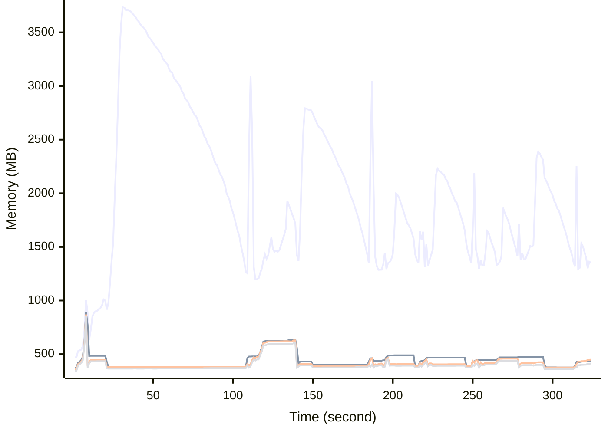

# Benchmark Report
> Generated by [`@nestia/benchmark`](https://github.com/samchon/nestia)

  - Specifications
    - CPU: AMD Ryzen 9 7940HS w/ Radeon 780M Graphics     
    - RAM: 31 GB
    - NodeJS Version: v20.10.0
    - Backend Server: 1 core / 1 thread
  - Arguments
    - Count: 4,096
    - Threads: 4
    - Simultaneous: 128
  - Time
    - Start: 2024-07-29T06:58:32.106Z
    - Complete: 2024-07-29T07:04:14.423Z
    - Elapsed: 342,317 ms

Type | Count | Success | Mean. | Stdev. | Minimum | Maximum
----|----|----|----|----|----|----
Total | 4,440 | 4,440 | 9,250.39 | 22,464.39 | 8 | 100,654

> Unit: milliseconds

## Memory Consumptions

> - 🟦 Resident Set Size
> - 🟢 Heap Total
> - 🔴 Heap Used + External
> - 🟡 Heap Used Only

## Endpoints
Type | Count | Success | Mean. | Stdev. | Minimum | Maximum
----|----|----|----|----|----|----
POST /studio/customers/repositories/:accountCode/:repositoryCode/releases | 555 | 555 | 63,732.17 | 24,958.04 | 1,734 | 100,654
POST /hub/customers/authenticate/join | 555 | 555 | 3,830.43 | 2,596.39 | 70 | 7,959
POST /studio/customers/repositories/:accountCode/:repositoryCode/releases/:releaseId/nodes/:id/execute | 555 | 555 | 2,331.44 | 1,439.39 | 133 | 8,708
POST /studio/customers/accounts | 555 | 555 | 1,239.1 | 1,513.52 | 10 | 5,210
POST /studio/customers/repositories/:accountCode/:repositoryCode/commits | 555 | 555 | 1,191.22 | 960.47 | 37 | 5,618
POST /studio/customers/repositories/:accountCode | 555 | 555 | 626.03 | 811.62 | 21 | 5,240
POST /hub/customers/authenticate | 555 | 555 | 588.03 | 471.84 | 8 | 3,164
POST /studio/customers/repositories/:accountCode/:repositoryCode/commits/:id/archive | 555 | 555 | 464.7 | 362.87 | 11 | 3,952

> Unit: milliseconds

## Failures
Method | Path | Count | Failures
-------|------|-------|----------