# Benchmark Report
> Generated by [`@nestia/benchmark`](https://github.com/samchon/nestia)

  - Specifications
    - CPU: AMD Ryzen 9 7940HS w/ Radeon 780M Graphics     
    - RAM: 31 GB
    - NodeJS Version: v20.10.0
    - Backend Server: 1 core / 1 thread
  - Arguments
    - Count: 4,096
    - Threads: 4
    - Simultaneous: 128
  - Time
    - Start: 2024-07-29T07:05:04.829Z
    - Complete: 2024-07-29T07:11:26.284Z
    - Elapsed: 381,455 ms

Type | Count | Success | Mean. | Stdev. | Minimum | Maximum
----|----|----|----|----|----|----
Total | 4,512 | 4,512 | 10,401.35 | 24,243.17 | 9 | 97,550

> Unit: milliseconds

## Memory Consumptions

```mermaid
xychart-beta
  x-axis "Time (second)"
  y-axis "Memory (MB)"
  line "Resident Set Size" [473, 488, 542, 546, 548, 594, 815, 927, 609, 701, 806, 850, 859, 892, 940, 979, 1029, 1079, 1126, 1174, 1311, 1318, 1490, 1780, 2260, 2661, 3027, 3378, 3508, 3700, 3686, 3670, 3672, 3660, 3652, 3639, 3626, 3609, 3590, 3573, 3559, 3542, 3522, 3507, 3460, 3444, 3423, 3400, 3382, 3339, 3316, 3296, 3279, 3258, 3209, 3186, 3172, 3148, 3110, 3089, 3063, 3029, 3012, 2970, 2951, 2937, 2894, 2878, 2842, 2814, 2782, 2779, 2720, 2700, 2663, 2621, 2604, 2560, 2522, 2501, 2463, 2424, 2379, 2349, 2327, 2284, 2250, 2209, 2169, 2129, 2086, 2034, 1989, 1961, 1892, 1852, 1791, 1729, 1670, 1614, 1553, 1469, 1409, 1333, 1209, 2171, 3226, 1811, 1288, 1277, 1279, 1280, 1313, 1239, 1253, 1249, 1261, 1307, 1356, 1403, 1453, 1501, 1550, 1599, 1555, 1817, 2267, 2804, 3312, 3257, 3228, 3224, 3223, 3224, 3194, 3177, 3139, 3127, 3109, 3077, 3066, 3031, 3018, 3000, 2967, 2947, 2923, 2905, 2877, 2861, 2832, 2817, 2785, 2752, 2743, 2706, 2678, 2660, 2633, 2596, 2581, 2556, 2526, 2496, 2463, 2453, 2423, 2390, 2372, 2322, 2296, 2263, 2243, 2215, 2188, 2157, 2128, 2084, 2056, 2011, 1983, 1938, 1892, 1868, 1821, 1776, 1728, 1661, 1618, 1547, 1484, 1421, 1405, 2618, 3214, 1903, 1315, 1329, 1336, 1337, 1337, 1337, 1340, 1293, 1346, 1330, 1357, 1405, 1456, 1638, 2097, 2125, 2089, 2062, 2033, 1990, 1973, 1933, 1896, 1843, 1795, 1747, 1693, 1650, 1579, 1531, 1498, 1495, 1497, 1539, 1550, 1480, 1445, 1447, 1749, 2320, 2295, 2654, 2644, 2654, 2624, 2611, 2588, 2552, 2523, 2508, 2477, 2448, 2416, 2381, 2357, 2327, 2292, 2263, 2217, 2191, 2157, 2128, 2096, 2063, 2030, 1985, 1957, 1908, 1854, 1798, 1767, 1714, 1673, 1609, 1561, 1494, 1466, 2431, 2631, 1325, 1330, 1376, 1776, 1939, 1997, 1985, 1962, 1942, 1944, 1898, 1872, 1823, 1774, 1743, 1689, 1645, 1600, 1550, 1530, 1477, 1381, 1860, 1342, 1377, 1429, 1494, 1547, 1600, 1916, 2097, 2451, 2499, 2498, 2509, 2495, 2482, 2454, 2433, 2422, 2391, 2364, 2340, 2323, 2298, 2271, 2177, 2132, 2111, 2082, 2046, 1992, 1968, 1918, 1872, 1839, 1791, 1751, 1711, 1688, 1641, 1584, 1536, 1495, 1443, 1384, 1795, 2620, 1397, 1443, 1513, 1744, 1896, 1869, 1844, 1798, 1752, 1743, 1721, 1692, 1683, 1639, 1568, 1528, 1489, 1438, 1418, 1869]
  line "Heap Total" [376, 390, 433, 436, 449, 493, 706, 739, 462, 463, 463, 463, 463, 463, 463, 463, 463, 463, 463, 463, 463, 463, 463, 463, 463, 463, 463, 463, 393, 382, 382, 382, 382, 382, 382, 382, 382, 382, 382, 382, 382, 382, 382, 382, 382, 382, 382, 382, 382, 382, 382, 382, 382, 382, 382, 382, 382, 382, 382, 382, 382, 382, 382, 382, 382, 382, 382, 382, 382, 382, 382, 382, 382, 382, 383, 383, 383, 383, 383, 383, 383, 383, 383, 383, 382, 382, 382, 382, 382, 382, 382, 382, 382, 382, 382, 382, 382, 382, 382, 382, 382, 382, 382, 382, 389, 461, 461, 439, 439, 439, 439, 439, 460, 494, 498, 498, 498, 498, 498, 498, 498, 498, 498, 498, 498, 498, 498, 498, 498, 435, 393, 390, 390, 390, 390, 390, 390, 390, 390, 390, 390, 389, 389, 389, 389, 389, 389, 389, 389, 389, 389, 389, 389, 389, 389, 389, 389, 389, 389, 389, 389, 389, 389, 389, 389, 389, 389, 389, 389, 389, 389, 389, 391, 391, 391, 391, 391, 391, 391, 391, 391, 391, 391, 391, 391, 391, 391, 391, 391, 391, 391, 391, 435, 463, 463, 437, 437, 437, 437, 437, 437, 437, 444, 448, 488, 490, 490, 490, 490, 490, 490, 490, 490, 490, 490, 490, 490, 490, 490, 490, 490, 490, 491, 491, 491, 491, 491, 491, 491, 491, 491, 491, 466, 466, 494, 503, 503, 503, 503, 503, 503, 503, 503, 503, 503, 503, 503, 503, 503, 503, 503, 503, 503, 503, 503, 503, 503, 503, 503, 503, 503, 503, 503, 503, 503, 503, 503, 503, 503, 503, 503, 503, 514, 501, 501, 465, 465, 465, 465, 465, 465, 466, 466, 466, 466, 466, 466, 466, 466, 466, 466, 466, 466, 466, 466, 466, 466, 440, 440, 442, 442, 469, 474, 477, 477, 477, 477, 477, 477, 477, 477, 477, 477, 477, 477, 477, 477, 477, 477, 477, 477, 435, 387, 387, 387, 387, 387, 387, 387, 387, 387, 387, 387, 387, 387, 387, 387, 387, 387, 387, 387, 447, 447, 449, 449, 449, 449, 449, 449, 449, 449, 449, 449, 449, 449, 449, 449, 449, 449, 449, 449, 449, 449]
  line "Heap Used + External" [359, 373, 411, 424, 429, 480, 688, 384, 388, 412, 412, 412, 412, 412, 412, 413, 413, 413, 413, 414, 414, 414, 414, 414, 414, 414, 414, 414, 381, 380, 380, 380, 380, 380, 380, 381, 381, 381, 381, 381, 381, 381, 381, 381, 381, 381, 381, 381, 381, 381, 381, 381, 381, 381, 381, 381, 381, 381, 381, 381, 381, 381, 381, 381, 381, 381, 381, 381, 381, 381, 381, 381, 381, 381, 381, 381, 381, 381, 381, 381, 382, 382, 382, 382, 381, 381, 381, 381, 381, 382, 382, 382, 382, 382, 382, 382, 382, 382, 382, 382, 382, 382, 382, 382, 388, 453, 470, 383, 399, 407, 400, 401, 450, 406, 450, 455, 455, 455, 455, 455, 455, 456, 456, 456, 447, 455, 455, 455, 455, 388, 388, 388, 388, 388, 388, 388, 388, 388, 388, 388, 388, 388, 388, 388, 388, 388, 388, 388, 388, 388, 388, 388, 388, 388, 388, 388, 388, 388, 388, 388, 388, 388, 388, 388, 388, 388, 389, 389, 389, 389, 389, 389, 391, 391, 391, 391, 392, 392, 392, 392, 392, 392, 392, 392, 392, 392, 392, 392, 392, 392, 392, 392, 418, 458, 478, 398, 405, 402, 408, 406, 406, 409, 394, 403, 464, 469, 474, 475, 475, 475, 475, 475, 475, 475, 475, 475, 475, 475, 475, 475, 476, 476, 476, 476, 476, 476, 476, 476, 476, 476, 477, 477, 468, 468, 503, 424, 423, 434, 438, 468, 466, 466, 475, 465, 466, 466, 466, 467, 467, 467, 467, 467, 467, 467, 467, 467, 467, 467, 467, 467, 467, 467, 475, 475, 475, 475, 475, 475, 475, 475, 475, 475, 535, 425, 440, 388, 386, 386, 391, 407, 439, 407, 407, 407, 407, 407, 407, 408, 408, 408, 408, 408, 408, 408, 408, 408, 408, 395, 416, 418, 422, 452, 463, 454, 455, 455, 455, 455, 455, 455, 455, 455, 455, 455, 455, 455, 456, 456, 456, 456, 456, 387, 387, 387, 387, 387, 387, 387, 387, 387, 387, 387, 387, 387, 387, 387, 387, 387, 387, 387, 387, 435, 441, 451, 453, 454, 454, 454, 454, 454, 454, 454, 454, 454, 454, 455, 455, 455, 455, 455, 455, 455, 377]
  line "Heap Used Only" [346, 360, 398, 410, 416, 466, 675, 371, 375, 398, 399, 399, 399, 399, 399, 400, 400, 400, 400, 400, 400, 400, 400, 400, 401, 401, 401, 401, 368, 367, 367, 367, 367, 367, 367, 367, 367, 367, 367, 368, 368, 368, 368, 368, 367, 367, 367, 367, 367, 368, 368, 368, 368, 368, 368, 368, 368, 368, 368, 368, 368, 368, 368, 368, 368, 368, 368, 368, 368, 368, 368, 368, 368, 368, 368, 368, 368, 368, 368, 368, 368, 368, 368, 368, 368, 368, 368, 368, 368, 368, 368, 368, 369, 369, 368, 368, 368, 368, 368, 369, 369, 369, 369, 369, 375, 381, 404, 370, 384, 392, 385, 386, 434, 393, 436, 440, 441, 441, 441, 441, 441, 441, 441, 441, 433, 440, 441, 441, 441, 375, 375, 375, 375, 375, 375, 375, 375, 375, 375, 375, 375, 375, 375, 375, 375, 375, 375, 375, 375, 375, 375, 375, 375, 375, 375, 375, 375, 375, 375, 375, 375, 375, 375, 375, 375, 375, 375, 375, 375, 375, 375, 376, 378, 378, 378, 378, 378, 378, 378, 378, 379, 378, 378, 378, 378, 378, 379, 379, 379, 379, 379, 379, 405, 388, 407, 383, 390, 386, 392, 390, 390, 393, 380, 390, 451, 455, 460, 460, 460, 461, 461, 461, 461, 461, 461, 461, 461, 461, 461, 461, 461, 461, 462, 462, 462, 462, 462, 462, 462, 462, 462, 462, 454, 454, 471, 403, 401, 412, 413, 446, 443, 443, 451, 442, 442, 442, 443, 443, 444, 444, 444, 444, 444, 444, 444, 444, 444, 444, 444, 444, 444, 444, 452, 452, 452, 452, 452, 452, 452, 452, 452, 452, 473, 385, 403, 375, 371, 372, 377, 392, 423, 393, 394, 394, 394, 394, 394, 394, 394, 394, 394, 394, 395, 395, 395, 395, 395, 380, 400, 402, 406, 437, 447, 439, 439, 439, 439, 439, 439, 439, 439, 440, 440, 440, 440, 440, 440, 440, 440, 440, 440, 374, 374, 374, 374, 374, 373, 373, 373, 373, 373, 374, 374, 374, 374, 374, 374, 374, 374, 374, 374, 382, 402, 411, 413, 414, 414, 414, 414, 414, 414, 414, 414, 414, 414, 414, 414, 414, 415, 415, 415, 415, 356]
```

> - 🟦 Resident Set Size
> - 🟢 Heap Total
> - 🔴 Heap Used + External
> - 🟡 Heap Used Only

## Endpoints
Type | Count | Success | Mean. | Stdev. | Minimum | Maximum
----|----|----|----|----|----|----
POST /studio/customers/repositories/:accountCode/:repositoryCode/releases | 564 | 564 | 71,814.79 | 19,232.55 | 1,887 | 97,550
POST /hub/customers/authenticate/join | 564 | 564 | 4,452.4 | 2,215.86 | 72 | 7,746
POST /studio/customers/repositories/:accountCode/:repositoryCode/releases/:releaseId/nodes/:id/execute | 564 | 564 | 2,644.75 | 1,077.51 | 146 | 9,862
POST /studio/customers/accounts | 564 | 564 | 1,290.61 | 1,244.75 | 9 | 4,939
POST /studio/customers/repositories/:accountCode/:repositoryCode/commits | 564 | 564 | 1,095.07 | 677.17 | 36 | 5,298
POST /studio/customers/repositories/:accountCode | 564 | 564 | 752.07 | 821.46 | 22 | 4,966
POST /hub/customers/authenticate | 564 | 564 | 720.57 | 601.12 | 9 | 3,024
POST /studio/customers/repositories/:accountCode/:repositoryCode/commits/:id/archive | 564 | 564 | 440.53 | 152.24 | 12 | 1,343

> Unit: milliseconds

## Failures
Method | Path | Count | Failures
-------|------|-------|----------