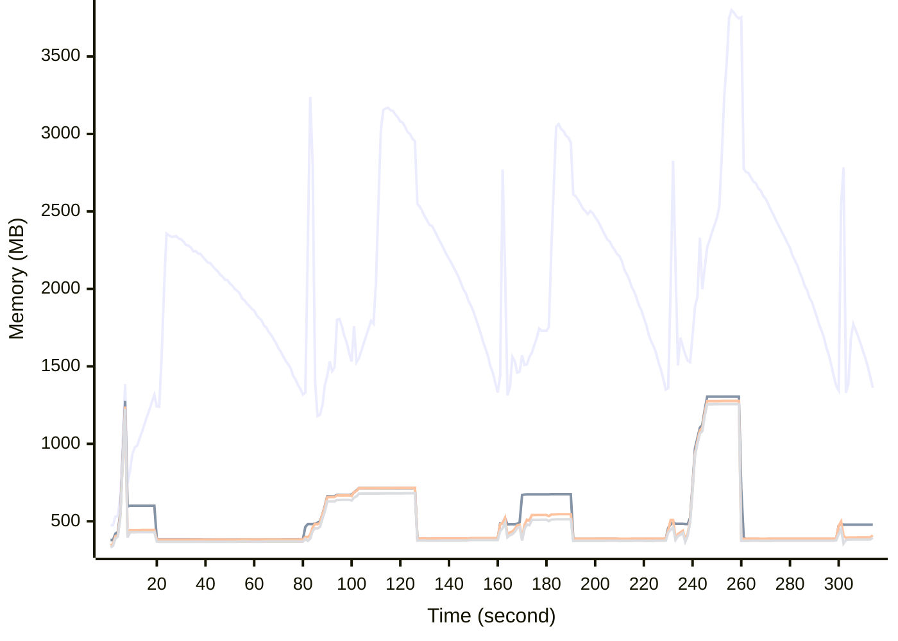

# Benchmark Report
> Generated by [`@nestia/benchmark`](https://github.com/samchon/nestia)

  - Specifications
    - CPU: AMD Ryzen 9 7940HS w/ Radeon 780M Graphics     
    - RAM: 31 GB
    - NodeJS Version: v20.10.0
    - Backend Server: 1 core / 1 thread
  - Arguments
    - Count: 4,096
    - Threads: 4
    - Simultaneous: 128
  - Time
    - Start: 2024-07-29T07:12:17.767Z
    - Complete: 2024-07-29T07:17:55.028Z
    - Elapsed: 337,261 ms

Type | Count | Success | Mean. | Stdev. | Minimum | Maximum
----|----|----|----|----|----|----
Total | 4,336 | 4,336 | 9,613.29 | 21,541.22 | 10 | 74,736

> Unit: milliseconds

## Memory Consumptions

> - 🟦 Resident Set Size
> - 🟢 Heap Total
> - 🔴 Heap Used + External
> - 🟡 Heap Used Only

## Endpoints
Type | Count | Success | Mean. | Stdev. | Minimum | Maximum
----|----|----|----|----|----|----
POST /studio/customers/repositories/:accountCode/:repositoryCode/releases | 542 | 542 | 64,753.94 | 14,535.22 | 1,820 | 74,736
POST /hub/customers/authenticate/join | 542 | 542 | 4,848.85 | 2,528.66 | 77 | 7,848
POST /studio/customers/repositories/:accountCode/:repositoryCode/releases/:releaseId/nodes/:id/execute | 542 | 542 | 2,823.22 | 1,251.07 | 136 | 10,630
POST /studio/customers/repositories/:accountCode/:repositoryCode/commits | 542 | 542 | 1,479.31 | 865.16 | 33 | 6,280
POST /studio/customers/accounts | 542 | 542 | 1,065.67 | 1,176.21 | 13 | 5,841
POST /studio/customers/repositories/:accountCode | 542 | 542 | 779.46 | 674.9 | 23 | 5,632
POST /hub/customers/authenticate | 542 | 542 | 667.48 | 646.05 | 10 | 3,408
POST /studio/customers/repositories/:accountCode/:repositoryCode/commits/:id/archive | 542 | 542 | 488.36 | 329.28 | 10 | 3,224

> Unit: milliseconds

## Failures
Method | Path | Count | Failures
-------|------|-------|----------