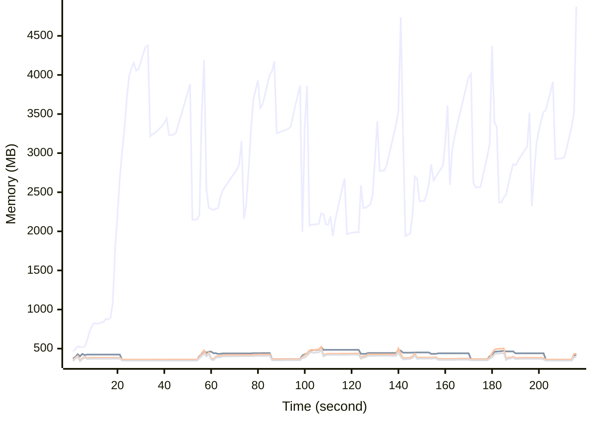

# Benchmark Report
> Generated by [`@nestia/benchmark`](https://github.com/samchon/nestia)

  - Specifications
    - CPU: AMD Ryzen 9 7940HS w/ Radeon 780M Graphics     
    - RAM: 31 GB
    - NodeJS Version: v20.10.0
    - Backend Server: 1 core / 1 thread
  - Arguments
    - Count: 4,096
    - Threads: 4
    - Simultaneous: 128
  - Time
    - Start: 2024-07-26T10:21:19.836Z
    - Complete: 2024-07-26T10:25:15.570Z
    - Elapsed: 235,734 ms

Type | Count | Success | Mean. | Stdev. | Minimum | Maximum
----|----|----|----|----|----|----
Total | 4,564 | 4,564 | 6,338.91 | 13,131.22 | 10 | 52,996

> Unit: milliseconds

## Memory Consumptions

> - 🟦 Resident Set Size
> - 🟢 Heap Total
> - 🔴 Heap Used + External
> - 🟡 Heap Used Only

## Endpoints
Type | Count | Success | Mean. | Stdev. | Minimum | Maximum
----|----|----|----|----|----|----
POST /studio/customers/repositories/:accountCode/:repositoryCode/commits/:commitId/workflows/:id/execute | 652 | 652 | 36,887.18 | 10,023.56 | 1,542 | 52,996
POST /hub/customers/authenticate/join | 652 | 652 | 4,080.17 | 2,206.06 | 70 | 7,436
POST /studio/customers/accounts | 652 | 652 | 1,246.22 | 1,299.22 | 12 | 5,139
POST /hub/customers/authenticate | 652 | 652 | 622.73 | 635.28 | 10 | 2,769
POST /studio/customers/repositories/:accountCode | 652 | 652 | 621.92 | 709.48 | 18 | 4,039
POST /studio/customers/repositories/:accountCode/:repositoryCode/commits | 652 | 652 | 585.76 | 462.92 | 23 | 5,288
POST /studio/customers/repositories/:accountCode/:repositoryCode/commits/:id/archive | 652 | 652 | 328.41 | 193.84 | 10 | 4,144

> Unit: milliseconds

## Failures
Method | Path | Count | Failures
-------|------|-------|----------