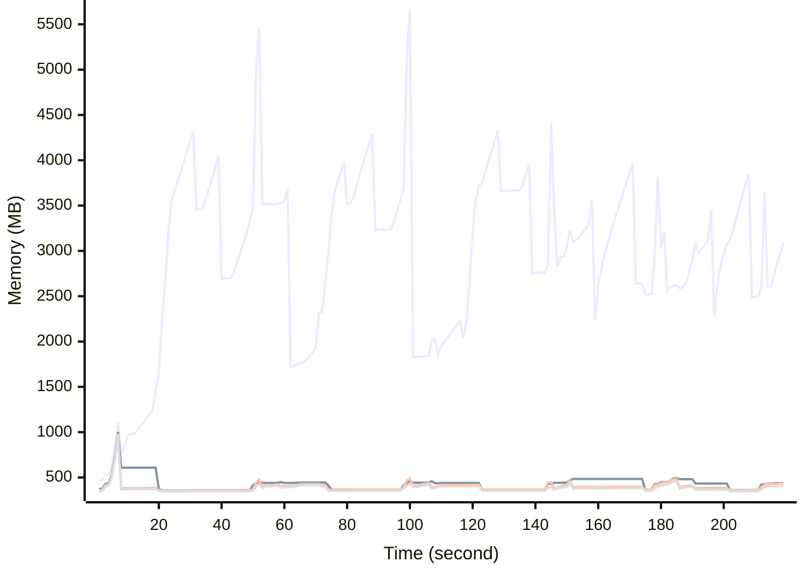

# Benchmark Report
> Generated by [`@nestia/benchmark`](https://github.com/samchon/nestia)

  - Specifications
    - CPU: AMD Ryzen 9 7940HS w/ Radeon 780M Graphics     
    - RAM: 31 GB
    - NodeJS Version: v20.10.0
    - Backend Server: 1 core / 1 thread
  - Arguments
    - Count: 4,096
    - Threads: 4
    - Simultaneous: 128
  - Time
    - Start: 2024-07-26T10:26:02.871Z
    - Complete: 2024-07-26T10:30:02.483Z
    - Elapsed: 239,612 ms

Type | Count | Success | Mean. | Stdev. | Minimum | Maximum
----|----|----|----|----|----|----
Total | 4,382 | 4,382 | 6,606.84 | 13,287.31 | 9 | 46,999

> Unit: milliseconds

## Memory Consumptions

> - 🟦 Resident Set Size
> - 🟢 Heap Total
> - 🔴 Heap Used + External
> - 🟡 Heap Used Only

## Endpoints
Type | Count | Success | Mean. | Stdev. | Minimum | Maximum
----|----|----|----|----|----|----
POST /studio/customers/repositories/:accountCode/:repositoryCode/commits/:commitId/workflows/:id/execute | 626 | 626 | 37,917.68 | 8,463.23 | 2,564 | 46,999
POST /hub/customers/authenticate/join | 626 | 626 | 4,583.17 | 2,191.44 | 71 | 7,781
POST /studio/customers/accounts | 626 | 626 | 1,481.3 | 1,352.12 | 11 | 5,606
POST /studio/customers/repositories/:accountCode/:repositoryCode/commits | 626 | 626 | 716.38 | 452.48 | 23 | 1,743
POST /studio/customers/repositories/:accountCode | 626 | 626 | 616.54 | 628.28 | 21 | 3,515
POST /hub/customers/authenticate | 626 | 626 | 532.99 | 478.07 | 9 | 2,410
POST /studio/customers/repositories/:accountCode/:repositoryCode/commits/:id/archive | 626 | 626 | 399.84 | 224.64 | 9 | 1,127

> Unit: milliseconds

## Failures
Method | Path | Count | Failures
-------|------|-------|----------