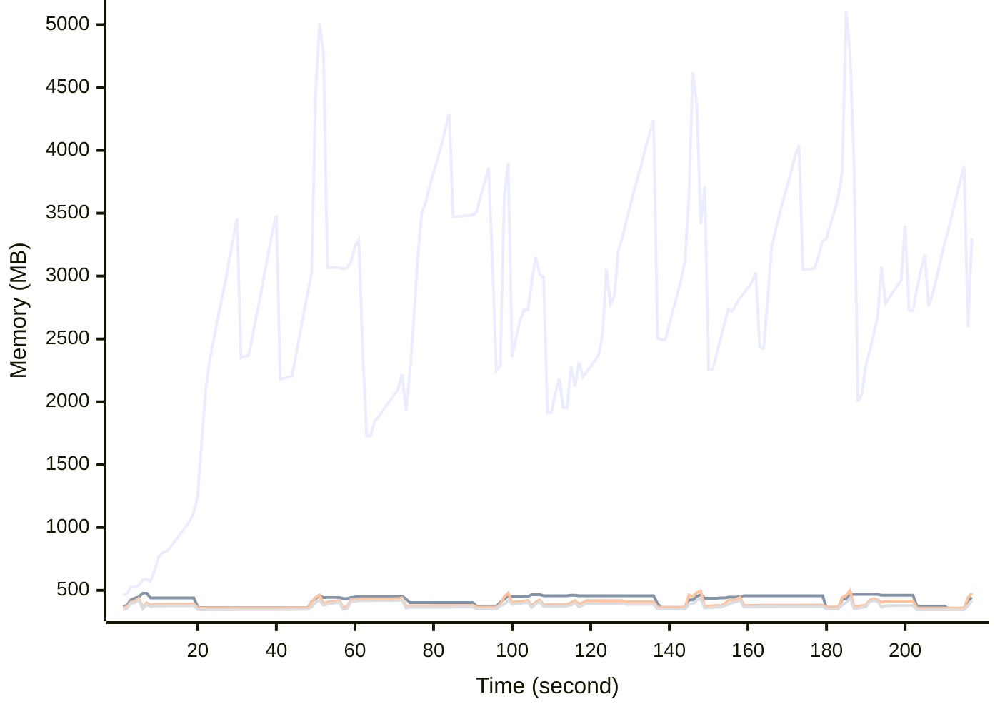

# Benchmark Report
> Generated by [`@nestia/benchmark`](https://github.com/samchon/nestia)

  - Specifications
    - CPU: AMD Ryzen 9 7940HS w/ Radeon 780M Graphics     
    - RAM: 31 GB
    - NodeJS Version: v20.10.0
    - Backend Server: 1 core / 1 thread
  - Arguments
    - Count: 4,096
    - Threads: 4
    - Simultaneous: 128
  - Time
    - Start: 2024-07-26T10:30:51.160Z
    - Complete: 2024-07-26T10:34:46.324Z
    - Elapsed: 235,164 ms

Type | Count | Success | Mean. | Stdev. | Minimum | Maximum
----|----|----|----|----|----|----
Total | 4,529 | 4,529 | 6,304.95 | 13,005.28 | 10 | 47,507

> Unit: milliseconds

## Memory Consumptions

> - 🟦 Resident Set Size
> - 🟢 Heap Total
> - 🔴 Heap Used + External
> - 🟡 Heap Used Only

## Endpoints
Type | Count | Success | Mean. | Stdev. | Minimum | Maximum
----|----|----|----|----|----|----
POST /studio/customers/repositories/:accountCode/:repositoryCode/commits/:commitId/workflows/:id/execute | 647 | 647 | 36,533.81 | 9,926.36 | 1,498 | 47,507
POST /hub/customers/authenticate/join | 647 | 647 | 4,145.54 | 2,468.2 | 72 | 7,782
POST /studio/customers/accounts | 647 | 647 | 1,222.83 | 1,342.62 | 11 | 6,396
POST /studio/customers/repositories/:accountCode/:repositoryCode/commits | 647 | 647 | 642.13 | 520.6 | 25 | 4,368
POST /hub/customers/authenticate | 647 | 647 | 615.38 | 589.3 | 10 | 2,522
POST /studio/customers/repositories/:accountCode | 647 | 647 | 588.33 | 631.48 | 23 | 3,823
POST /studio/customers/repositories/:accountCode/:repositoryCode/commits/:id/archive | 647 | 647 | 386.65 | 314.42 | 13 | 3,952

> Unit: milliseconds

## Failures
Method | Path | Count | Failures
-------|------|-------|----------